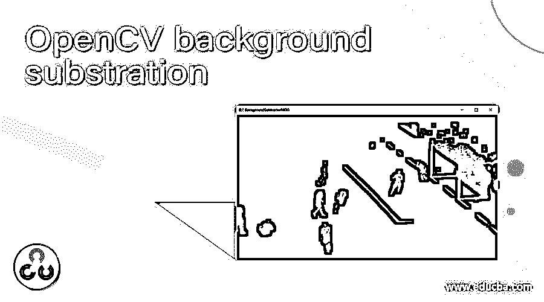
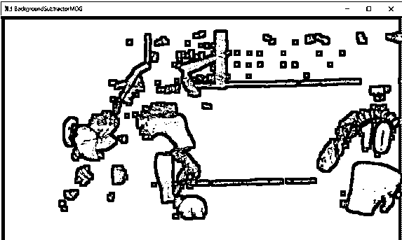
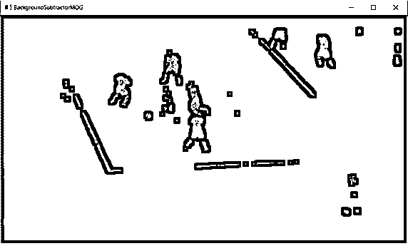
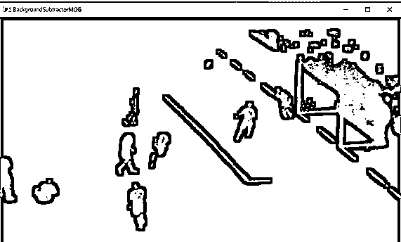
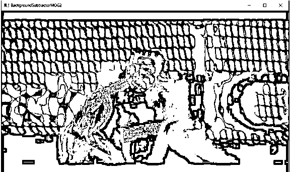
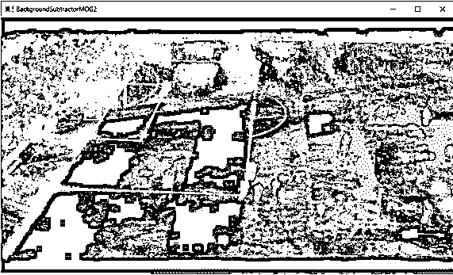
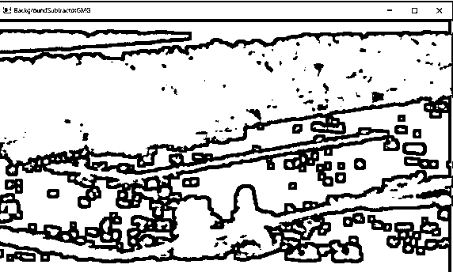
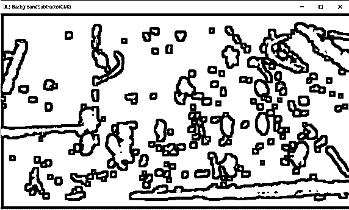
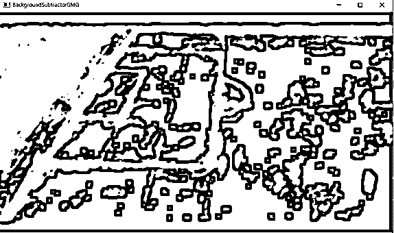

# opencv 背景减法

> 原文：<https://www.educba.com/opencv-background-substration/>

## opencv 背景减法简介

在 OpenCV 中，从给定图像中移除背景并仅显示前景对象的过程被称为背景减法。为了执行背景减法的操作，我们使用了三种算法，即 BackgroundSubtractorMOG、BackgroundSubtractorMOG2 和 backgroundsubtractormg。为了在给定图像上实现这些算法中的任何一种，我们必须创建算法的相应对象，然后在图像上使用 backgroundsubtractor.apply()函数，以从给定图像和 backgroundsubtractor 中的前景中减去背景。apply()函数返回给定图像中只有前景对象的图像。

实现 BackgroundSubtractorMOG 算法以在 OpenCV 中执行背景减法的语法如下:

<small>网页开发、编程语言、软件测试&其他</small>

`object = bgsegm.createBackgroundSubtractorMOG()
background_subtracted_image = object.apply(source_image)`

其中 bgsegm . createbackgroundsubtractormog()是 BackgroundSubtractorMOG 算法的实现，
object 表示 BackgroundSubtractorMOG 算法的对象，
source_image 是前景中要减去背景的图像。

OpenCV 中实现 BackgroundSubtractorMOG2 算法进行背景减法的语法如下:

`object1 = createBackgroundSubtractorMOG2()
background_subtracted_image = object1.apply(source_image)`

其中 createBackgroundSubtractorMOG2()是 backgroundsubtractomog 2 算法的实现，
object1 表示 backgroundsubtractomog 2 算法的对象，
source_image 是要从前景中减去其背景的图像。

实现 BackgroundSubtractorGMG 算法以在 OpenCV 中执行背景减法的语法如下:

`object2 = bgsegm.createBackgroundSubtractorGMG()
background_subtracted_image = object2.apply(source_image)`

其中 createBackgroundSubtractorGMG()是 BackgroundSubtractorGMG2 算法的实现，
object2 表示 backgroundsubtractormgm 算法的对象，
source_image 是要从前景中减去其背景的图像。

### OpenCV 中如何做背景减法？

OpenCV 中背景减除的工作如下:

在 OpenCV 中，将背景与前景对象分离的过程称为背景减法。

可用于在 OpenCV 中执行背景减法的三种算法是 BackgroundSubtractorMOG 算法、BackgroundSubtractorMOG2 算法和 backgroundsubtractormgm 算法。

该算法通过遍历给定图像中的所有像素来工作。

如果图像中的像素与和算法相关联的阈值匹配，那么它们被分类为匹配分量，否则它们被分类为非匹配分量。

该算法将非匹配分量声明为图像中的背景，并将其从图像中移除。

为了实现这些算法中的任何一个来执行给定图像的背景减除，必须创建相应算法的对象。

然后使用相应算法的对象，必须使用 apply()函数。

函数的作用是:从图像中移除背景，并返回只有前景对象的图像。

### 例子

让我们讨论 OpenCV 背景减法的例子。

#### 示例#1

python 中的 OpenCV 程序，通过实现 BackgroundSubtractorMOG 算法对给定视频执行背景减除，然后在屏幕上显示减去背景的图像作为输出:

`#importing the required module
import cv2
#reading the video whose background is to be subtracted using BackgroundSubtractorMOG algorithm
videoread = cv2.VideoCapture('C:/Users/admin/Desktimg/sports.mp4')
#implementing BackgroundSubtractorMOG algorithm by creating an object of the algorithm
object1 = cv2.bgsegm.createBackgroundSubtractorMOG();
while(1):
#reading the individual frames from the video
ret, imageframe = videoread.read()
#using backgroundsubtractor.apply() function to remove the background from the frame
bg_subtracted_video = object1.apply(imageframe);
#displaying the background subtracted video as the output on the screen
cv2.imshow('BackgroundSubtractorMOG', bg_subtracted_video);
cv2.waitKey(0)
videoread.release()
cv2.destroyAllWindows()`

给定程序的输出显示在下面的快照中:

在上面的程序中，我们正在导入所需的模块。然后我们正在读取使用 BackgroundSubtractorMOG 算法减去其背景的视频。然后，我们通过创建算法的对象来实现 BackgroundSubtractorMOG 算法。然后我们从视频中读取单个帧。然后我们使用 backgroundsubtractor.apply()函数从帧中移除背景。然后我们在屏幕上显示减去背景的视频作为输出。

#### 实施例 2

python 中的 OpenCV 程序，通过实现 BackgroundSubtractorMOG2 算法对给定视频执行背景减除，然后在屏幕上显示减去背景的图像作为输出:

`#importing the required module
import cv2
#reading the video whose background is to be subtracted using BackgroundSubtractorMOG2 algorithm
videoread = cv2.VideoCapture('C:/Users/admin/Desktimg/sports.mp4')
#implementing BackgroundSubtractorMOG2 algorithm by creating an object of the algorithm
object1 = cv2.createBackgroundSubtractorMOG2();
while(1):
#reading the individual frames from the video
ret, imageframe = videoread.read()
#using backgroundsubtractor.apply() function to remove the background from the frame
bg_subtracted_video = object1.apply(imageframe);
#displaying the background subtracted video as the output on the screen
cv2.imshow('BackgroundSubtractorMOG2', bg_subtracted_video);
cv2.waitKey(0)
videoread.release()
cv2.destroyAllWindows()`

给定程序的输出显示在下面的快照中:

在上面的程序中，我们正在导入所需的模块。然后我们正在读取使用 BackgroundSubtractorMOG2 算法减去其背景的视频。然后，我们通过创建算法的对象来实现 BackgroundSubtractorMOG2 算法。然后我们从视频中读取单个帧。然后我们使用 backgroundsubtractor.apply()函数从帧中移除背景。然后我们在屏幕上显示减去背景的视频作为输出。

#### 实施例 3

python 中的 OpenCV 程序，通过实现 BackgroundSubtractorGMG 算法对给定视频执行背景减法，然后将减去背景的图像作为输出显示在屏幕上:

`#importing the required module
import cv2
#reading the video whose background is to be subtracted using BackgroundSubtractorGMG algorithm
videoread = cv2.VideoCapture('C:/Users/admin/Desktimg/sports.mp4')
#implementing BackgroundSubtractorGMG algorithm by creating an object of the algorithm
object1 = cv2.bgsegm.createBackgroundSubtractorGMG();
while(1):
#reading the individual frames from the video
ret, imageframe = videoread.read()
#using backgroundsubtractor.apply() function to remove the background from the frame
bg_subtracted_video = object1.apply(imageframe);
#displaying the background subtracted video as the output on the screen
cv2.imshow('BackgroundSubtractorGMG', bg_subtracted_video);
cv2.waitKey(0)
videoread.release()
cv2.destroyAllWindows()`

给定程序的输出显示在下面的快照中:

在上面的程序中，我们正在导入所需的模块。然后我们正在读取使用 BackgroundSubtractorGMG 算法减去其背景的视频。然后，我们通过创建算法的对象来实现 BackgroundSubtractorGMG 算法。然后我们从视频中读取单个帧。然后我们使用背景减法器。应用()函数从框架中移除背景。然后我们在屏幕上显示减去背景的视频作为输出。

### 结论–opencv 背景扣除

在本文中，我们通过实现 BackgroundSubtractorMOG、BackgroundSubtractorMOG2 和 backgroundsubtractormgm 算法以及相应的编程示例和演示它们的输出，学习了背景减法的概念。

### 推荐文章

这是一个 OpenCV 背景减法的指南。在这里，我们讨论的介绍，语法，如何在 OpenCV 工作背景减法？还有例子。您也可以看看以下文章，了解更多信息–

1.  [OpenCV kmeans](https://www.educba.com/opencv-kmeans/)
2.  [Python 字符串包含](https://www.educba.com/python-string-contains/)
3.  [Python 创建目录](https://www.educba.com/python-create-directory/)
4.  [Python 列表扩展](https://www.educba.com/python-list-extend/)

