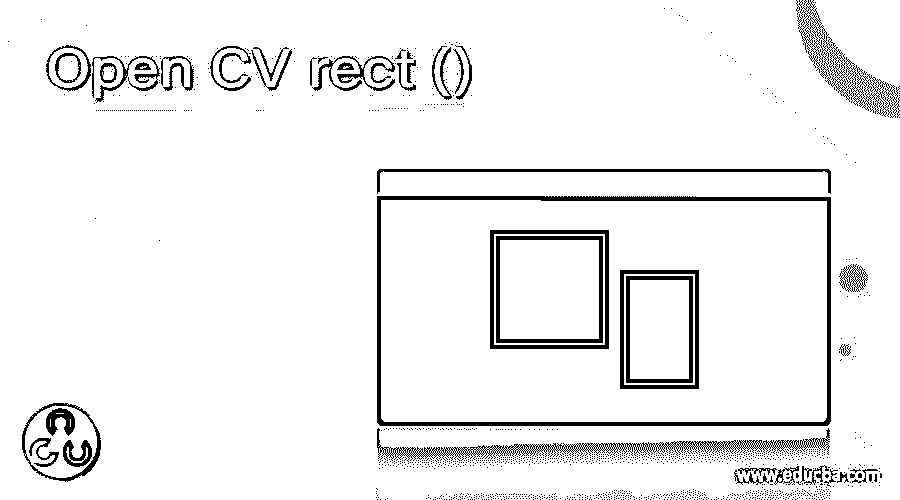
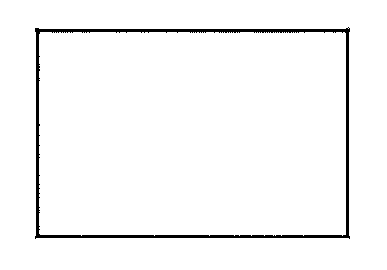

# Open CV rect ()

> 原文：<https://www.educba.com/open-cv-rect/>

## 打开 CV rect()简介

Open CV rect()是一个内置函数，存在于 Open CV 公共库中。该功能被设计为提供图像中给出的矩形形状的绘制，以将该矩形投影到屏幕上。该矩形形状应该基本上包含边，两条边彼此平行，并且应该与每条边成 90 度角。对于由矩形的相对两端所表示的平行位置，直接角度杀手应该在长度上相等。如果系统在屏幕上投影的结构类似于平行四边形(所制作的结构不包含 90 度边之间的角度)，则它不是 Open CV rect()函数的正确表示。

**用于 Open CV rect()操作的语法和函数**

<small>网页开发、编程语言、软件测试&其他</small>

以下是用于实现 Open CV rect()函数的语法:

`rect * (* x *, * y *, * w *, * h *, * tl *, * tr *, * br *, * bl *) *
or
rect * (* x *, * y *, * w *, * h *, * detail * X *, * detail * Y *) *`

**参数:**

Open CV rect 函数接受以下参数:

参数描述参数

x *:该参数表示必须在屏幕画布上绘制的矩形的 x 坐标。y *:该参数代表必须在屏幕画布上绘制的矩形的 y 坐标。
w *:该参数表示根据用户的输入或指定，必须在屏幕画布上绘制的矩形的宽度。
h *:该参数表示根据用户的输入或指定，在屏幕画布上绘制的矩形的高度。
tl *:该参数表示矩形左上角的半径，该半径必须根据用户的输入或指定为要在屏幕画布上绘制的矩形进行设置。此参数是可选参数。
tr *:该参数表示矩形右上角的半径，该半径必须根据用户的输入或指定为要在屏幕画布上绘制的矩形进行设置。此参数是可选参数。
br *:该参数表示矩形右下角的半径，该半径必须根据用户的输入或指定，为要在屏幕画布上绘制的矩形进行设置。此参数是可选参数。
bl *:该参数代表矩形左下角的半径，该半径必须根据用户的输入或指定，为必须在屏幕画布上绘制的矩形进行设置。此参数是可选参数。
detailX *:该参数表示 x 方向上出现的线段数，必须根据用户的输入或指定，为必须在屏幕画布上绘制的进行设置。
detailY *:该参数表示根据用户的输入或指定，必须为必须在屏幕画布上绘制的设置的 y 方向上的线段数。

### 打开 CV rect 函数的示例

`# command used to import the Open CV library to utilize the the histogram equalizer function
import cv2
# command used to import the Numpy library for utilization of the function in the below code
import numpy as np1
// function setup called to initiate the drawing of a rectangle
function setup() {
// Creating the canvas of given size
create *Canvas *( *4000 *, *3000 *) *; *
} * * * * * * * *
function draw() {
background(2200);
// Using the function color() to choose a specific colour
let c1 = color('gray');
// Using the function fill() in order to fill color in the rectangle drawn
fill(c1);
// Drawing the rectangle on the canvas
rect * (*50 *, * * *50 *, * * *300 * *, *200 *) *; *
}
# the resultant image are displayed which are showed together show the difference in the images
cv2.imshow(\'image\', res1)
cv2.waitKey(0)
cv2.destroyAllWindows()`

**输出:**

**注意:**具有开放 CV 库的函数 rect()通常被视为假设由该函数绘制的矩形的顶角和左侧边界是全包含的，而我们看到右侧边界和底部边界不包括在内。

### 结论

Open CV rect 函数负责读取用户输入的指令，然后进行分析并将其反映在屏幕的画布上。背景是在呈现矩形的基础上设置的。此外，还向用户呈现颜色选项，以选择矩形需要成形的指定颜色，并且还给出填充选项，以便填充为矩形制造的内部空间。该功能专门用于发生人脸检测或物体检测以及取景对抗操作的图像检测程序。使用 rect()函数可以减少实现该函数的程序的冗长性，并提高程序执行的效率和交付时间。

### 推荐文章

这是打开 CV rect()的指南。在这里，我们讨论的介绍，语法，代码实现的例子。您也可以看看以下文章，了解更多信息–

1.  [打开 CV resize()](https://www.educba.com/open-cv-resize/)
2.  [OpenCV cvtColor](https://www.educba.com/opencv-cvtcolor/)
3.  [opencv approexpoldp](https://www.educba.com/opencv-approxpolydp/)
4.  [OpenCV HSV](https://www.educba.com/opencv-hsv/)

