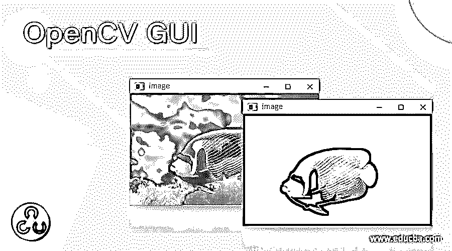
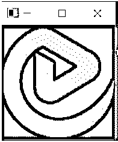
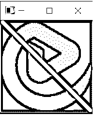
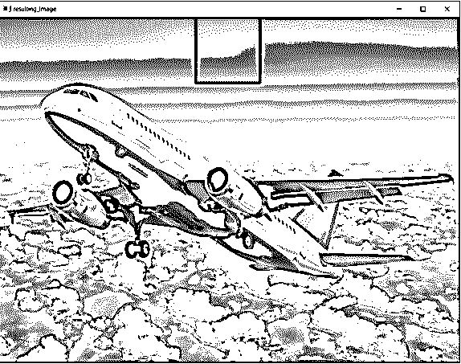
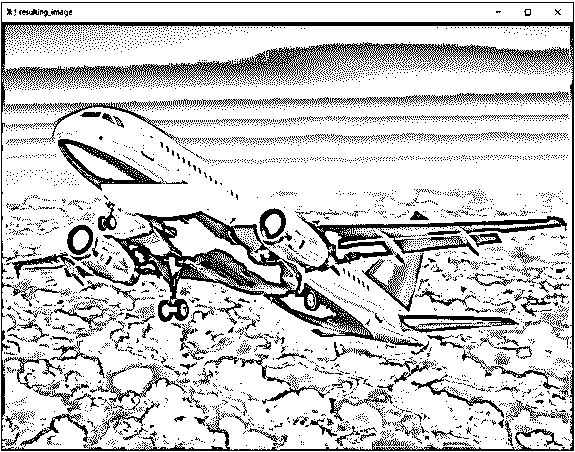
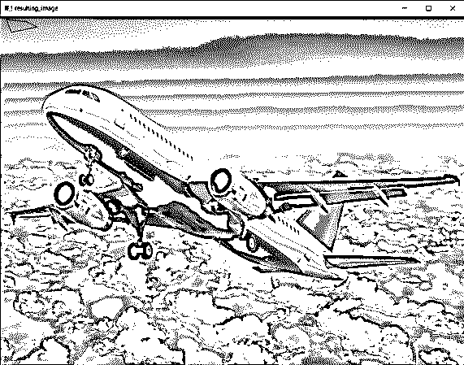

# OpenCV 图形用户界面

> 原文：<https://www.educba.com/opencv-gui/>

## OpenCV GUI 简介

OpenCV 中的交互式视觉组件被称为图形用户界面或 GUI，OpenCV GUI 中的特征是读取图像、显示图像、将图像写入文件、画线、画圆、画矩形、画椭圆、画文本等。使用 imread()函数、imwrite()函数、imshow()函数、line()函数、rectangle()函数、ellipse()函数和 polylines()函数，所有这些功能都可以作为处理函数使用，并且可以从图形用户界面或 GUI 访问。

OpenCV 中定义 imread()函数的语法如下:

<small>网页开发、编程语言、软件测试&其他</small>

`imread(‘path_to_the_file’, flag)`

其中 path_to_the_file 指定要读取的文件所在位置的路径，而
标志指定文件必须读取的模式。有三种模式可以读取文件，即彩色模式、灰度模式和图像原样。该参数是可选的。

OpenCV 中定义 imshow()函数的语法如下:

`imshow(window_name, image)`

其中 window_name 是必须在其中显示给定图像的窗口的名称，而
image 是要在窗口中显示的图像。

OpenCV 中定义 imwrite()函数的语法如下:

`returnvalue = imwrite(file_path, image)`

其中 file_path 是要写入或保存图像的文件的位置，
image 是要写入或保存到文件的图像，
returnvalue 是由 imwrite()函数返回的布尔值。

OpenCV 中定义 line()函数的语法如下:

`line(input_image, start_point, end_point, color, thickness)`

其中输入图像是必须在其上画线的图像，

start_point 表示直线的 x 坐标，

end_point 表示直线的 y 坐标，

颜色表示要绘制的线条的颜色

粗细表示要绘制的线条的粗细。

OpenCV 中定义 rectangle()函数的语法如下:

`rectangle(input_image, int left, int top, int right, int bottom)`

其中 input_image 是必须绘制矩形的图像，
left 表示左上角的 x 坐标，
top 表示左上角的 y 坐标，
right 表示右下角的 x 坐标，
bottom 表示右下角的坐标。

OpenCV 中定义 ellipse()函数的语法如下:

`ellipse(input_image, center_coordinates, axeslength, angle, startangle, endangle, color, thickness)`

其中输入图像是必须在其上绘制椭圆的图像，

center_coordinates 表示椭圆的中心，

axeslength 是代表椭圆长轴和短轴的两个变量的元组，

角度表示椭圆的旋转角度，单位为度，

startangle 是椭圆角的起始角度，单位为度，

endangle 是椭圆角的结束角，单位为度

color 是要绘制的椭圆的颜色

厚度是要绘制的椭圆的厚度。

OpenCV 中定义折线()函数的语法如下:

`polylines(input_image, array, isclosed, color, thickness)`

其中输入图像是必须在其上绘制多边形的图像，

数组是多边形曲线数组，

isclosed 是一个布尔值，如果要绘制的多边形是闭合的，则该值为 true 如果要绘制的多边形不是闭合的，则该值为 false。

color 是要绘制的多边形的颜色

厚度是要绘制的多边形的厚度。

### OpenCV 中 GUI 功能的使用

OpenCV 中 GUI 功能的工作方式如下:

*   函数的作用是:从给定的文件中读取图片。
*   imshow()函数用于显示给定的文件。
*   函数的作用是:将给定的图片保存到一个文件中。
*   line()函数用于绘制一条直线
*   rectangle()函数用于绘制矩形。
*   ellipse()函数用于绘制椭圆。
*   函数的作用是:画一个多边形。

### 例子

让我们讨论 OpenCV GUI 的例子。

#### 例 1:用 python 编写 OpenCV 程序，演示 imread()、imwrite()和 imshow()函数。

`import cv2
readimage = cv2.imread('C:/Users/admin/Desktimg/logo.png', cv2.IMREAD_GRAYSCALE)
cv2.imwrite('C:/Users/admin/Desktimg/results/logo.png', readimage)
cv2.imshow("resulting_image", readimage)
cv2.waitKey(0)`

上面程序的输出显示在下面的快照中:

在上面的程序中，我们使用 imread()函数读取图像，然后使用 imwrite()函数将图像写入文件，最后使用 imshow()函数显示图像。输出显示在上面的快照中。

#### 示例 2:用 python 编写 OpenCV 程序来演示 line()函数

`import cv2
readimage = cv2.imread('C:/Users/admin/Desktimg/logo.png', cv2.IMREAD_GRAYSCALE)
result = cv2.line(readimage,(0,0),(511,511),(255,0,0),5)
cv2.imshow("resulting_image", readimage)
cv2.waitKey(0)`

上面程序的输出显示在下面的快照中:

在上面的程序中，我们使用 imread()函数读取图像，然后使用 line()函数在图像上画一条线，最后使用 imshow()函数显示图像。输出显示在上面的快照中。

#### 示例 3:用 python 编写 OpenCV 程序来演示 rectangle()函数:

`import cv2
readimage = cv2.imread('C:/Users/admin/Desktimg/plane.jpg', cv2.IMREAD_GRAYSCALE)
result = cv2.rectangle(readimage,(384,0),(510,128),(0,255,0),3)
cv2.imshow("resulting_image", readimage)
cv2.waitKey(0)`

上面程序的输出显示在下面的快照中:

在上面的程序中，我们使用 imread()函数读取图像，然后使用 rectangle()函数在图像上绘制矩形，最后使用 imshow()函数显示图像。输出显示在上面的快照中。

#### 示例 4:用 python 编写 OpenCV 程序来演示 ellipse()函数

`import cv2
readimage = cv2.imread('C:/Users/admin/Desktimg/plane.jpg', cv2.IMREAD_GRAYSCALE)
result = cv2.ellipse(readimage,(256,256),(100,50),0,0,180,255,-1)
cv2.imshow("resulting_image", readimage)
cv2.waitKey(0)`

上面程序的输出显示在下面的快照中:

在上面的程序中，我们使用 imread()函数读取图像，然后使用 ellipse()函数在图像上绘制椭圆，最后使用 imshow()函数显示图像。输出显示在上面的快照中。

#### 例 5:用 python 编写的 OpenCV 程序演示了折线()函数:

`import cv2
import numpy as np
readimage = cv2.imread('C:/Users/admin/Desktimg/plane.jpg', cv2.IMREAD_GRAYSCALE)
arraypoints = np.array([[10,5],[20,30],[70,20],[50,10]], np.int32)
arraypoints = arraypoints.reshape((-1,1,2))
result = cv2.polylines(readimage,[arraypoints],True,(0,255,255))
cv2.imshow("resulting_image", readimage)
cv2.waitKey(0)`

上面程序的输出显示在下面的快照中:

在上面的程序中，我们使用 imread()函数读取图像，然后使用折线()函数在图像上绘制多边形，最后使用 imshow()函数显示图像。输出显示在上面的快照中。

### 结论

在本文中，我们已经学习了 OpenCV 中 GUI 特性的概念，并通过相应的编程示例和输出来演示它们。

### 推荐文章

这是一个 OpenCV GUI 的指南。在这里，我们讨论的介绍，语法，代码实现的例子。您也可以看看以下文章，了解更多信息–

1.  [OpenCV cvtColor](https://www.educba.com/opencv-cvtcolor/)
2.  [opencv approexpoldp](https://www.educba.com/opencv-approxpolydp/)
3.  [OpenCV ORB](https://www.educba.com/opencv-orb/)
4.  [OpenCV HSV](https://www.educba.com/opencv-hsv/)

