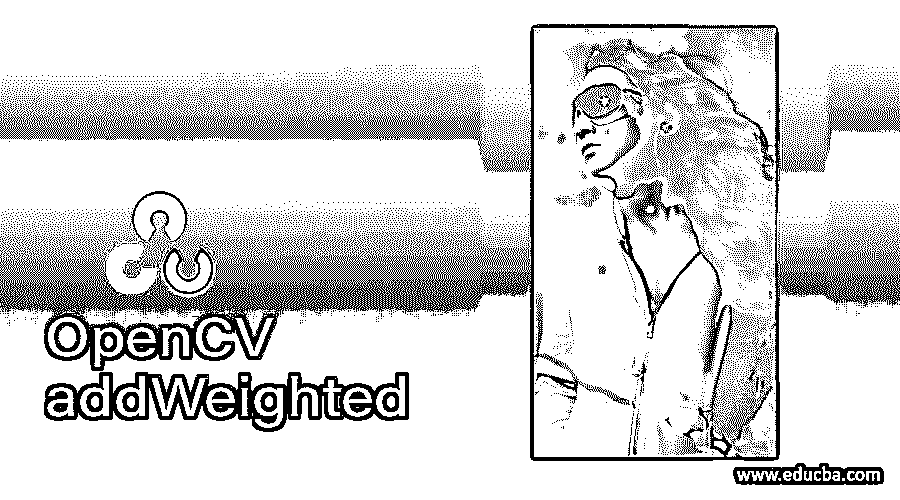
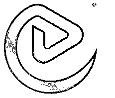
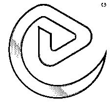
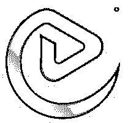
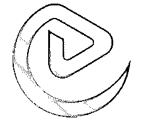

# OpenCV addWeighted

> 原文：<https://www.educba.com/opencv-addweighted/>

## OpenCV addWeighted 简介

下面的文章提供了 OpenCV addWeighted 的概要。OpenCV 是 Python 中使用的一种技术，用于处理图像，然后进一步用于分析目的。它还可以用来解决计算机视觉中的问题。在这个库提供的所有函数中，addWeighted 是一个帮助图像进行 alpha 混合的函数。Alpha 混合有助于在前景图像上覆盖一个透明的外观，同时在该图像上覆盖一个背景图像。透明度通常是任何图像的第四通道。这种透明遮罩被称为 alpha 遮罩。前景图像位于左上角，而灰度是位于右上角的 alpha 蒙版。

**语法:**

<small>网页开发、编程语言、软件测试&其他</small>

addweighted 函数有助于将图像过渡到另一个图像。为了融合这个图像，我们可以添加权重来定义图像的透明度和半透明度。

其通用语法如下:

`img = cv2.addWeighted(source1, alpha, source2, beta, gamma[, dst[, dtype]])`

这里我们添加图像，然后添加像素值。新图像是我们将把 alpha 值和第二个源与 beta 值相乘的源。gamma 值将被添加到这个值中，并帮助处理和 alpha 混合图像。

### addWeighted 函数是如何工作的？

Python 中的 OpenCV 库帮助我们添加两幅图像。这些图像可以被添加并一起用于进一步的分析。添加图像的一种方式是通过混合它们，这样它们可以一起显示。我们可以给不同的图像赋予不同的权重，可以根据添加的权重使图像透明或半透明。

可以使用以下公式添加图像:

G(x)= (1 – alpha) f0 (x) + alpha * f1(x)

通过改变 alpha 值(范围从 0 到 1 ),我们可以轻松地从一个图像转换到另一个图像。这些权重的值范围从 0 到 1，然后我们可以根据我们的需要得到想要的图像视图。过渡会很平稳，会融合得很好。

这里，我们考虑的图像，比如图像一的权重为 0.4，第二个图像的权重为 0.6。cv . add weighted 图像将使我们形成以下等式。

Image= alpha * image1 + beta * image2 + y

这里我们将 y 的值视为 0。这个公式有助于渐变图像，然后将它们混合在一起。该值越高，图像越清晰可见。这意味着它不会是透明的。

### OpenCV addWeighted 示例

下面是提到的例子:

首先，我们将使用 beta 值 0.5 添加图像。这不会对图像的输出有太多的改变。

**代码:**

`import cv2
# Reading the images that are present
source1 = cv2.imread('eduCBA.JPG', cv2.IMREAD_COLOR)
source2 = cv2.imread('eduCBA.JPG', cv2.IMREAD_COLOR)
# blending the image by adding necessary weights
dest = cv2.addWeighted(source1, 0.5, source2, 0.5, 0.0)
# saving the output of the image
cv2.imwrite('img.png', dest)
cv2.imshow('img.png', dest)
# Wait for a key
cv2.waitKey(0)
# Distroy all the window open
cv2.destroyAllWindows()`

上面的代码帮助我们理解如何混合图像。它让我们使用阿尔法和贝塔值，用于混合图像。在上面的代码中，我们首先导入 cv2 库，该库用于 Python 中的图像处理。接下来，我们定义两个有助于存储图像的源变量。当我们使用 imread()函数读取图像时，Source 1 正在存储图像。以类似的方式，源 2 帮助存储第二图像。我们再次使用 imread 函数读取图像，该函数读取图像并将其存储在 source2 变量中。一旦图像被读取，我们现在可以使用 addWeighted 函数，它将帮助我们根据需要用 alpha、beta 和 gamma 值混合图像。

这里，我们将处理后的图像存储在 dest 变量中。这里我们指定 alpha 值为 0.5，beta 值保持不变。这里的伽玛值是 0。由于 alpha 和 beta 值相同，我们可以看到如下输出，其中我们会看到图像混合得很好，没有太大的差异。写入图像后的输出返回 true。然后，我们使用 imshow 函数来显示图像。

**输出:**

**混合前:**

**混合后:**

这里你不会观察到图像有太大的变化，因为它们混合了相等的 alpha 和 gamma 值。

让我们看看现在值是什么时候变成 1 的。

**代码:**

`import cv2
# readin the two images
source1 = cv2.imread('eduCBA.JPG', cv2.IMREAD_COLOR)
source2 = cv2.imread('eduCBA.JPG', cv2.IMREAD_COLOR)
# blending the image with alpha and beta values as 1
dest = cv2.addWeighted(source1, 1, source2, 1, 0.0)
# Saving the output image
cv2.imwrite('img.png', dest)
cv2.imshow('img.png', dest)
# Wait for a key
cv2.waitKey(0)
# Destroy the window which is open
cv2.destroyAllWindows()`

以类似的方式，我们读取两幅图像，然后对它们应用 addWeighted 函数。然后我们使用 imwrite 函数，它在图像处理后返回一个真值。为了显示图像，我们使用了 imshow 函数，它给出了下面的输出。请注意，我们在这里已经将 alpha 和 beta 值更改为 1，这向我们显示了图像中的变化。

**输出:**

**混合前:**

**混合后:**

There is a considerate change in the images when the values are changed to one. The image becomes more transparent and blended in the shade.

### 结论

addWeighted 函数有助于添加两幅图像，并通过传递 alpha、beta 和 gamma 值来混合这些图像。为了分析图像，这有助于调整梯度和图像处理。图像的混合取决于作为参数传递给该函数的 alpha 和 beta 值。

### 推荐文章

这是一个 OpenCV addWeighted 的指南。这里我们讨论引言；addWeighted 函数是如何工作的？和示例。您也可以看看以下文章，了解更多信息–

1.  [OpenCV kmeans](https://www.educba.com/opencv-kmeans/)
2.  [Python 断言错误](https://www.educba.com/python-assertionerror/)
3.  [Python 数组长度](https://www.educba.com/python-array-length/)
4.  [Python 索引错误](https://www.educba.com/python-indexerror/)

