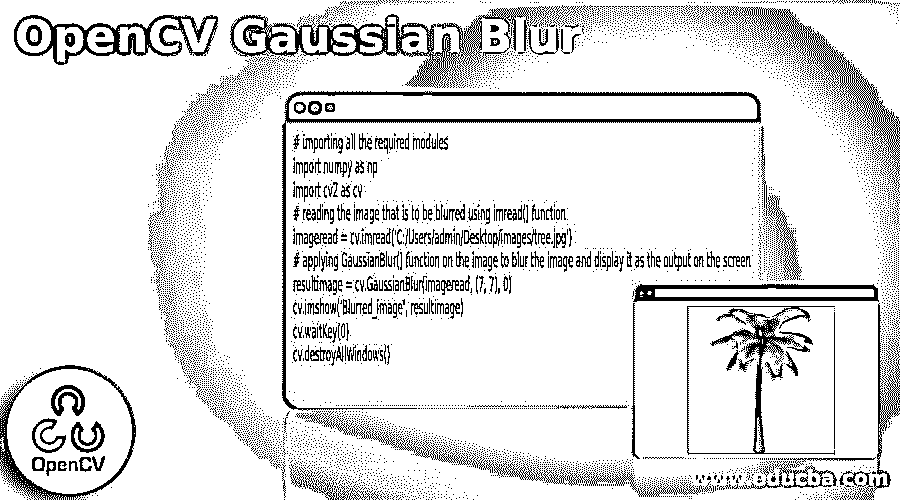
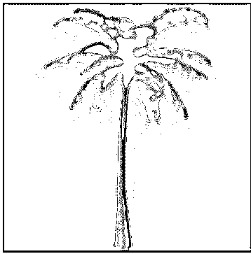
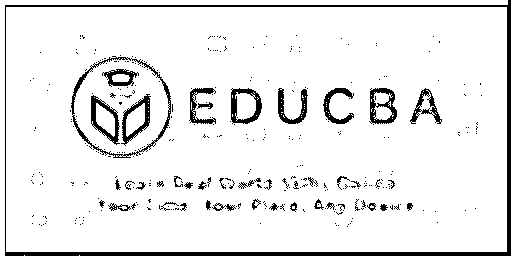
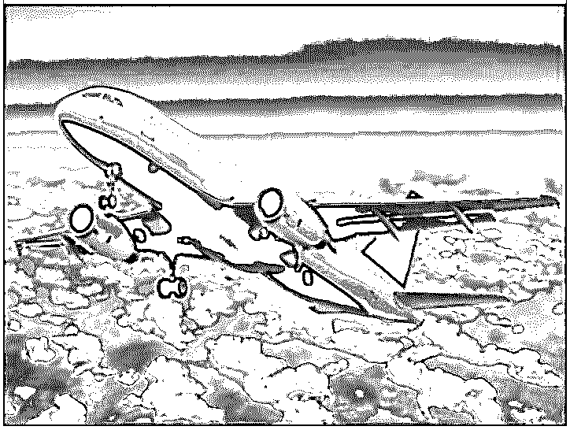
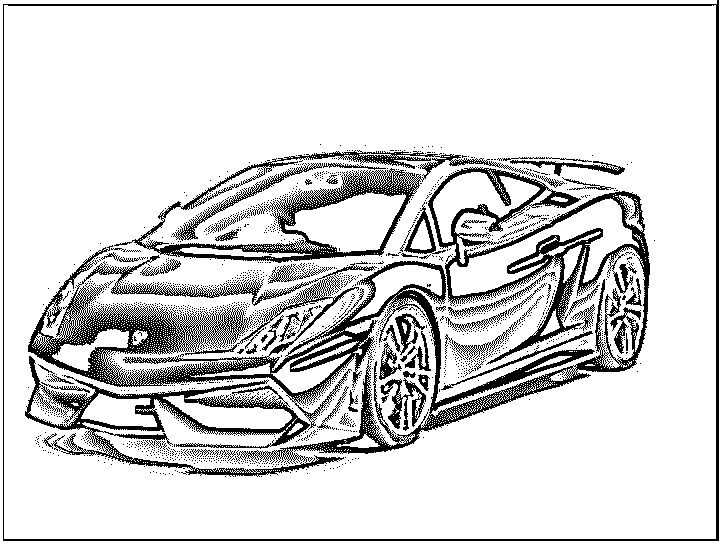

# OpenCV 高斯模糊

> 原文：<https://www.educba.com/opencv-gaussian-blur/>

## OpenCV 高斯模糊简介

以下文章提供了 OpenCV 高斯模糊的概要。在处理与计算机视觉相关的问题时， 有时有必要降低图像的清晰度或使图像清晰，这可以使用低通滤波器核来完成，其中高斯模糊是其中之一，它利用称为高斯模糊()函数的函数来从图像中去除噪声或减少图像的细节，高斯模糊()函数返回模糊的图像，高斯模糊广泛用于在机器学习或深度学习以及图形软件中建立模型之前的预处理阶段。

**OpenCV 中定义高斯模糊()函数的语法:**

<small>网页开发、编程语言、软件测试&其他</small>

`GaussianBlur(source_image, kernel_size, sigmaX)`

在哪里，

*   source_image 是要使用高斯模糊()函数进行模糊的图像。
*   kernel_size 是表示内核大小的矩阵。
*   sigmaX 是表示高斯核在 X 方向上的标准偏差的变量，并且它是 double 类型。

### OpenCV 中高斯模糊()的工作原理

*   为了能够降低图像的清晰度或者使图像清晰或者从图像中去除噪声或者减少图像的细节，我们利用高斯模糊。
*   高斯模糊利用称为高斯模糊()函数的函数来降低图像的清晰度，或者使图像清晰，或者从图像中去除噪声，或者减少图像的细节。
*   使用 imread()函数读取要模糊的图像。
*   然后，图像以及表示高斯核的大小和高斯核的标准偏差的矩阵作为参数被传递给高斯模糊()函数。
*   Gaussian Blur()函数使图像变得模糊，并将模糊的图像作为输出返回。

### OpenCV 高斯模糊示例

以下是 OpenCV 高斯模糊的示例:

#### 示例#1

python 中的 OpenCV 程序，演示 Gaussian Blur()函数读取输入图像并对图像应用高斯模糊，然后将模糊的图像作为输出显示在屏幕上。

**代码:**

`# importing all the required modules
import numpy as np
import cv2 as cv
# reading the image that is to be blurred using imread() function
imageread = cv.imread('C:/Users/admin/Desktimg/tree.jpg')
# applying GaussianBlur() function on the image to blur the image and display it as the output on the screen
resultimage = cv.GaussianBlur(imageread, (7, 7), 0)
cv.imshow('Blurred_image', resultimage)
cv.waitKey(0)
cv.destroyAllWindows()`

**输出:**

在上面的程序中，我们正在导入所需的模块。然后我们使用 imread()函数读取要模糊的图像。然后，我们在图像上应用高斯模糊()函数来模糊图像，并将其作为输出显示在屏幕上。

#### 实施例 2

python 中的 OpenCV 程序，演示 Gaussian Blur()函数读取输入图像并对图像应用高斯模糊，然后将模糊的图像作为输出显示在屏幕上。

**代码:**

`# importing all the required modules
import numpy as np
import cv2 as cv
# reading the image that is to be blurred using imread() function
imageread = cv.imread('C:/Users/admin/Desktimg/educba.jpg')
# applying GaussianBlur() function on the image to blur the image and display it as the output on the screen
resultimage = cv.GaussianBlur(imageread, (7, 7), 0)
cv.imshow('Blurred_image', resultimage)
cv.waitKey(0)
cv.destroyAllWindows()`

**输出:**

在上面的程序中，我们正在导入所需的模块。然后我们使用 imread()函数读取要模糊的图像。然后，我们在图像上应用高斯模糊()函数来模糊图像，并将其作为输出显示在屏幕上。

#### 实施例 3

python 中的 OpenCV 程序，演示 Gaussian Blur()函数读取输入图像并对图像应用高斯模糊，然后将模糊的图像作为输出显示在屏幕上。

**代码:**

`# importing all the required modules
import numpy as np
import cv2 as cv
# reading the image that is to be blurred using imread() function
imageread = cv.imread('C:/Users/admin/Desktimg/plane.jpg')
# applying GaussianBlur() function on the image to blur the image and display it as the output on the screen
resultimage = cv.GaussianBlur(imageread, (7, 7), 0)
cv.imshow('Blurred_image', resultimage)
cv.waitKey(0)
cv.destroyAllWindows()`

**输出:**

在上面的程序中，我们正在导入所需的模块。然后我们使用 imread()函数读取要模糊的图像。然后，我们在图像上应用高斯模糊()函数来模糊图像，并将其作为输出显示在屏幕上。

#### 实施例 4

python 中的 OpenCV 程序，演示 Gaussian Blur()函数读取输入图像并对图像应用高斯模糊，然后将模糊的图像作为输出显示在屏幕上。

**代码:**

`# importing all the required modules
import numpy as np
import cv2 as cv
# reading the image that is to be blurred using imread() function
imageread = cv.imread('C:/Users/admin/Desktimg/car.jpg')
# applying GaussianBlur() function on the image to blur the image and display it as the output on the screen
resultimage = cv.GaussianBlur(imageread, (7, 7), 0)
cv.imshow('Blurred_image', resultimage)
cv.waitKey(0)
cv.destroyAllWindows()`

**输出:**

在上面的程序中，我们正在导入所需的模块。然后我们使用 imread()函数读取要模糊的图像。然后，我们在图像上应用高斯模糊()函数来模糊图像，并将其作为输出显示在屏幕上。

### 结论

在本文中，我们已经看到了使用 Gaussian Blur()函数的 Gaussian Blur 的概念，以及相应的编程示例和演示它们的输出。

### 推荐文章

这是一个 OpenCV 高斯模糊指南。这里我们分别讨论 OpenCV 中 Gaussian Blur()的介绍、工作原理和例子。您也可以看看以下文章，了解更多信息–

1.  [OpenCV kmeans](https://www.educba.com/opencv-kmeans/)
2.  [Python 断言错误](https://www.educba.com/python-assertionerror/)
3.  [Python 数组长度](https://www.educba.com/python-array-length/)
4.  [Python 索引错误](https://www.educba.com/python-indexerror/)

