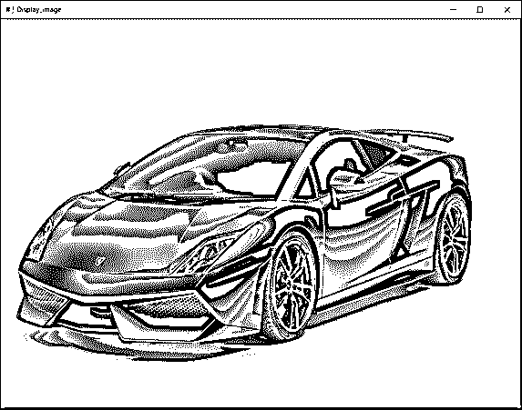
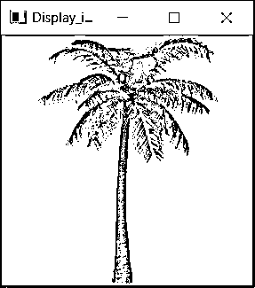
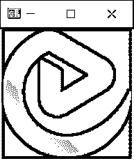

# OpenCV namedWindow

> 原文：<https://www.educba.com/opencv-namedwindow/>


## OpenCV namedWindow 简介

在处理与计算机视觉相关的问题时，我们可能需要在处理完图像或视频后显示图像或视频，因此需要一个窗口来显示图像或视频。为了创建显示图像或视频的窗口，我们使用 OpenCV 中称为 namedWindow()函数的函数，使用该函数可以创建具有适当名称和大小的窗口来显示图像或视频，并且使用 waitKey()函数使该窗口在特定时间段内可见，并且可以使用 OpenCV 中的 destroywindow()函数来销毁该窗口。

**OpenCV 中定义 namedWindow()函数的语法如下:**

<small>网页开发、编程语言、软件测试&其他</small>

```
namedWindow(window_name, flag)
```

其中窗口名称表示显示图像或视频的窗口的名称，

该标志表示窗口大小是手动可调还是自动设置。

### OpenCV 中 namedWindow()函数的使用

*   在 OpenCV 中处理图像和视频后，必须显示图像和视频。
*   需要一个窗口来显示处理过的图像或视频。
*   我们有一个名为 namedWindow()的函数来创建一个显示图像或视频的窗口。
*   namedWindow()函数将显示在窗口中的图像作为输入，并带有指定窗口大小的标志。
*   有两个标志可以传递给 namedWindow()函数，即 WINDOW_NORMAL 和 WINDOW_AUTOSIZE。
*   将标志指定为 WINDOW_NORMAL 允许我们手动调整窗口的大小。
*   将标志指定为 WINDOW_AUTOSIZE 会自动设置窗口的大小。
*   函数的作用是:在指定名称的窗口中显示图像或视频。

### OpenCV 命名窗口示例

下面举几个例子

#### 示例#1

python 中的 OpenCV 程序演示 namedWindow()函数读取输入图像，然后使用 namedWindow()函数在窗口中显示图像作为屏幕上的输出:

```
#importing all the required modules
import cv2 as cv
#reading the image that is to be displayed in a window using imread() function
imageread = cv.imread('C:/Users/admin/Desktimg/educba.jpg')
#using namedWindow() function to display the image in a window as the output on the screen
cv.namedWindow("Display_image", cv.WINDOW_AUTOSIZE)
cv.imshow('Display_image', imageread)
cv.waitKey(0)
cv.destroyAllWindows()
```

给定程序的输出显示在下面的快照中:


在上面的程序中，我们正在导入所需的模块。然后，我们使用 imread()函数读取要在窗口中显示的图像。然后我们使用 namedWindow()函数将图像显示为屏幕上的输出。

#### 实施例 2

python 中的 OpenCV 程序演示 namedWindow()函数读取输入图像，然后使用 namedWindow()函数在窗口中显示图像作为屏幕上的输出:

```
#importing all the required modules
import cv2 as cv
#reading the image that is to be displayed in a window using imread() function
imageread = cv.imread('C:/Users/admin/Desktimg/plane.jpg')
#using namedWindow() function to display the image in a window as the output on the screen
cv.namedWindow("Display_image", cv.WINDOW_AUTOSIZE)
cv.imshow('Display_image', imageread)
cv.waitKey(0)
cv.destroyAllWindows()
```

给定程序的输出显示在下面的快照中:


在上面的程序中，我们正在导入所需的模块。然后，我们使用 imread()函数读取要在窗口中显示的图像。然后我们使用 namedWindow()函数将图像显示为屏幕上的输出。

#### 实施例 3

python 中的 OpenCV 程序演示 namedWindow()函数读取输入图像，然后使用 namedWindow()函数在窗口中显示图像作为屏幕上的输出:

```
#importing all the required modules
import cv2 as cv
#reading the image that is to be displayed in a window using imread() function
imageread = cv.imread('C:/Users/admin/Desktimg/car.jpg')
#using namedWindow() function to display the image in a window as the output on the screen
cv.namedWindow("Display_image", cv.WINDOW_AUTOSIZE)
cv.imshow('Display_image', imageread)
cv.waitKey(0)
cv.destroyAllWindows()
```

给定程序的输出显示在下面的快照中:




在上面的程序中，我们正在导入所需的模块。然后，我们使用 imread()函数读取要在窗口中显示的图像。然后我们使用 namedWindow()函数将图像显示为屏幕上的输出。

#### 实施例 4

python 中的 OpenCV 程序演示 namedWindow()函数读取输入图像，然后使用 namedWindow()函数在窗口中显示图像作为屏幕上的输出:

```
#importing all the required modules
import cv2 as cv
#reading the image that is to be displayed in a window using imread() function
imageread = cv.imread('C:/Users/admin/Desktimg/tree.jpg')
#using namedWindow() function to display the image in a window as the output on the screen
cv.namedWindow("Display_image", cv.WINDOW_AUTOSIZE)
cv.imshow('Display_image', imageread)
cv.waitKey(0)
cv.destroyAllWindows()
```

给定程序的输出显示在下面的快照中:




在上面的程序中，我们正在导入所需的模块。然后，我们使用 imread()函数读取要在窗口中显示的图像。然后我们使用 namedWindow()函数将图像显示为屏幕上的输出。

#### 实施例 5

python 中的 OpenCV 程序演示 namedWindow()函数读取输入图像，然后使用 namedWindow()函数在窗口中显示图像作为屏幕上的输出:

```
#importing all the required modules
import cv2 as cv
#reading the image that is to be displayed in a window using imread() function
imageread = cv.imread('C:/Users/admin/Desktimg/logo.png')
#using namedWindow() function to display the image in a window as the output on the screen
cv.namedWindow("Display_image", cv.WINDOW_AUTOSIZE)
cv.imshow('Display_image', imageread)
cv.waitKey(0)
cv.destroyAllWindows()
```

给定程序的输出显示在下面的快照中:




在上面的程序中，我们正在导入所需的模块。然后，我们使用 imread()函数读取要在窗口中显示的图像。然后我们使用 namedWindow()函数将图像显示为屏幕上的输出。

### 推荐文章

这是一个名为 Window 的 OpenCV 指南。在这里，我们讨论使用 namedWindow()函数创建一个窗口来显示图像的概念，并给出相应的编程示例及其输出来演示它们。您也可以阅读以下文章，了解更多信息——

1.  [打开 CV resize()](https://www.educba.com/open-cv-resize/)
2.  [OpenCV kmeans](https://www.educba.com/opencv-kmeans/)
3.  [Matlab fopen](https://www.educba.com/matlab-fopen/)
4.  [JavaFX 字体](https://www.educba.com/javafx-font/)


