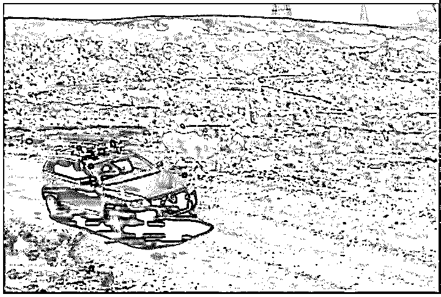
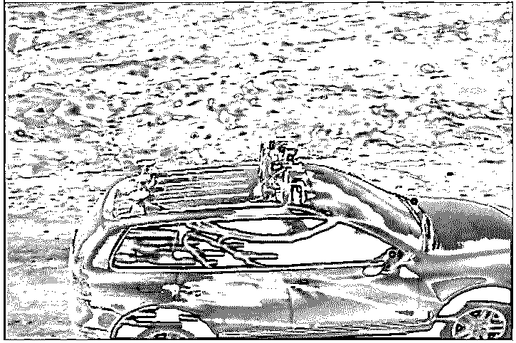
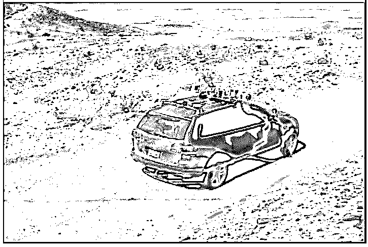
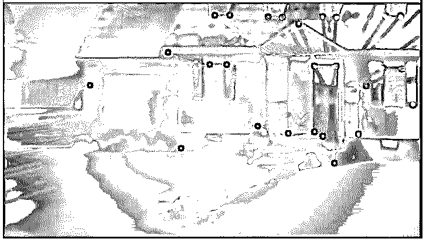
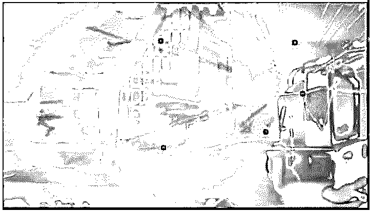
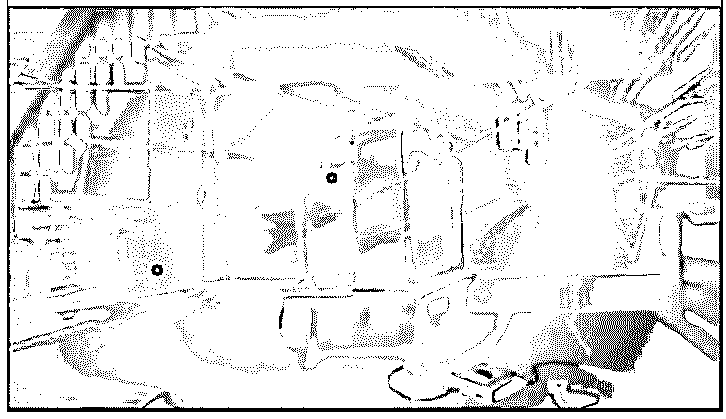

# OpenCV 光流

> 原文：<https://www.educba.com/opencv-optical-flow/>

## OpenCV 光流简介

下面的文章提供了 OpenCV 光流的概要。由于照相机的移动或者由于物体的移动，图像物体从一帧移动到连续帧的模式被称为光流，并且光流由二维矢量表示，该二维矢量是从一帧到连续帧的位移矢量，并且光流的工作基于两个假设，即图像物体中的像素的强度在两个帧之间不变 两个连续帧和相邻像素的运动是相同的，我们利用两个函数 goodFeaturesToTrack()和 calcOpticalFlowPyrLK()来实现光流。

**OpenCV 中定义 calcOpticalFlowPyrLK()函数的语法:**

<small>网页开发、编程语言、软件测试&其他</small>

`calcOpticalFlowPyrLK(first_image, second_image, first_image_points, window_size, pyramid_level_number, criteria)`

在哪里，

*   first_image 是第一个输入图像。
*   second_image 是第二个输入图像。
*   first_image_points 是使用 goodFeaturesToTrack()函数在第一幅图像中检测到的特征点。
*   window_size 表示积分窗口的大小。
*   金字塔等级数代表金字塔，允许我们在不同的图像分辨率下寻找光流。如果该值设置为 0，则不使用金字塔，如果该值设置为 1，则使用两个金字塔，依此类推。

### OpenCV 中 calcOpticalFlowPyrLK()函数的使用

*   由于摄像机的运动或物体的运动，图像物体从一帧到连续帧的运动模式称为光流。
*   光流由二维矢量表示，也称为位移矢量。
*   光流可以通过执行 Lucas Kanade 算法来找出。
*   基于 Lucas Kanade 算法的光流的工作从在输入视频中寻找特征点开始。
*   我们使用一个名为 goodFeaturesToTrack()的函数来跟踪输入视频中的特征点。
*   通过使用 calcOpticalFlowPyrLK()函数实现 Lucas Kanade 算法，将使用 goodFeaturesToTrack()函数检测的特征点作为位移矢量进行跟踪。
*   calcOpticalFlowPyrLK()函数返回一个图像，该图像由表示光流的二维输出向量点组成。

### OpenCV 光流示例

以下是 OpenCV 光流的示例:

#### 示例#1

python 中的 OpenCV 程序，演示 calcOpticalFlowPyrLK()函数，根据 Lucas Kanade 算法为给定的输入视频确定光流，并在屏幕上显示输出。

**代码:**

`#importing the required modules
import numpy as np
import cv2
#reading the input video whose optical flow is to be determined
videoread = cv2.VideoCapture("C:/Users/admin/Desktimg/optical_flow_input.avi")
#defining the parameters to pass to the goodFeaturesToTrack() function as a dictionary
feature_points = dict(maxCorners=100,
qualityLevel=0.3,
minDistance=7,
blockSize=7)
#defining the parameters to pass to the calcOpticalFlowPyrLK() function as a dictionary
parameters = dict(winSize=(15, 15),
maxLevel=2,
criteria=(cv2.TERM_CRITERIA_EPS | cv2.TERM_CRITERIA_COUNT,
10, 0.03))
#generating random colors to apply to the resulting 2D vectors
resultingvectorcolor = np.random.randint(0, 255, (100, 3))
#finding the feature points in the first frame using goodFeaturesToTrack() function
first, first_frame = videoread.read()
first_gray = cv2.cvtColor(first_frame,
cv2.COLOR_BGR2GRAY)
points = cv2.goodFeaturesToTrack(first_gray, mask=None,
**feature_points)
#mask image is created for drawing the vectors
resmask = np.zeros_like(first_frame)
while (1):
second, second_frame = videoread.read()
second_gray = cv2.cvtColor(second_frame,
cv2.COLOR_BGR2GRAY)
#optical flow is calculated using calcOpticalFlowPyrLK() function
respoints, status, errors = cv2.calcOpticalFlowPyrLK(first_gray,
second_gray,
points, None,
**parameters)
#choosing the good points
good_second = respoints[status == 1] good_first = points[status == 1] #drawing the tracks
for i, (first, second) in enumerate(zip(good_second,
good_first)):
A, B = second.ravel()
C, D = first.ravel()
resmask = cv2.line(resmask, (A, B), (C, D),
resultingvectorcolor[i].tolist(), 2)
second_frame = cv2.circle(second_frame, (A, B), 5,
resultingvectorcolor[i].tolist(), -1)
resvideo = cv2.add(second_frame, resmask)
cv2.imshow('Result', resvideo)
k = cv2.waitKey(25)
if k == 27:
break
#the previous frame and points are updated
first_gray = second_gray.copy()
points = good_second.reshape(-1, 1, 2)
cv2.destroyAllWindows()
videoread.release()`

**输出:**

在上面的程序中，我们正在导入所需的模块。然后，我们正在读取要确定其光流的输入视频。然后，我们定义参数以作为字典传递给 goodFeaturesToTrack()函数。那我们就是。然后我们生成随机的颜色来应用到最终的 2D 矢量上。然后我们使用 goodFeaturesToTrack()函数在第一帧中寻找特征点。然后创建用于绘制矢量的掩模图像。然后使用 calcOpticalFlowPyrLK()函数计算光流。然后选择好的点来绘制轨迹。然后更新前一帧和前一点。

#### 实施例 2

python 中的 OpenCV 程序，演示 calcOpticalFlowPyrLK()函数，根据 Lucas Kanade 算法为给定的输入视频确定光流，并在屏幕上显示输出。

**代码:**

`#importing the required modules
import numpy as np
import cv2
#reading the input video whose optical flow is to be determined
videoread = cv2.VideoCapture("C:/Users/admin/Desktimg/Tom and jerry.mp4")
#defining the parameters to pass to the goodFeaturesToTrack() function as a dictionary
feature_points = dict(maxCorners=100,
qualityLevel=0.3,
minDistance=7,
blockSize=7)
#defining the parameters to pass to the calcOpticalFlowPyrLK() function as a dictionary
parameters = dict(winSize=(15, 15),
maxLevel=2,
criteria=(cv2.TERM_CRITERIA_EPS | cv2.TERM_CRITERIA_COUNT,
10, 0.03))
#generating random colors to apply to the resulting 2D vectors
resultingvectorcolor = np.random.randint(0, 255, (100, 3))
#finding the feature points in the first frame using goodFeaturesToTrack() function
first, first_frame = videoread.read()
first_gray = cv2.cvtColor(first_frame,
cv2.COLOR_BGR2GRAY)
points = cv2.goodFeaturesToTrack(first_gray, mask=None,
**feature_points)
#mask image is created for drawing the vectors
resmask = np.zeros_like(first_frame)
while (1):
second, second_frame = videoread.read()
second_gray = cv2.cvtColor(second_frame,
cv2.COLOR_BGR2GRAY)
#optical flow is calculated using calcOpticalFlowPyrLK() function
respoints, status, errors = cv2.calcOpticalFlowPyrLK(first_gray,
second_gray,
points, None,
**parameters)
#choosing the good points
good_second = respoints[status == 1] good_first = points[status == 1] #drawing the tracks
for i, (first, second) in enumerate(zip(good_second,
good_first)):
A, B = second.ravel()
C, D = first.ravel()
resmask = cv2.line(resmask, (A, B), (C, D),
resultingvectorcolor[i].tolist(), 2)
second_frame = cv2.circle(second_frame, (A, B), 5,
resultingvectorcolor[i].tolist(), -1)
resvideo = cv2.add(second_frame, resmask)
cv2.imshow('Result', resvideo)
k = cv2.waitKey(25)
if k == 27:
break
#the previous frame and points are updated
first_gray = second_gray.copy()
points = good_second.reshape(-1, 1, 2)
cv2.destroyAllWindows()
videoread.release()`

**输出:**

在上面的程序中，我们正在导入所需的模块。然后，我们正在读取要确定其光流的输入视频。然后，我们定义参数以作为字典传递给 goodFeaturesToTrack()函数。那我们就是。然后我们生成随机的颜色来应用到最终的 2D 矢量上。然后我们使用 goodFeaturesToTrack()函数在第一帧中寻找特征点。然后创建用于绘制矢量的掩模图像。然后使用 calcOpticalFlowPyrLK()函数计算光流。然后选择好的点来绘制轨迹。然后更新前一帧和前一点。

### 结论

在本文中，我们已经看到了基于 Lucas kanade 算法的光流概念，以及相应的编程示例和演示它们的输出。

### 推荐文章

这是一个 OpenCV 光流指南。这里我们讨论一下 OpenCV 中 calcOpticalFlowPyrLK()函数的介绍、工作原理以及实例。您也可以看看以下文章，了解更多信息–

1.  [OpenCV kmeans](https://www.educba.com/opencv-kmeans/)
2.  [Python 断言错误](https://www.educba.com/python-assertionerror/)
3.  [Python 数组长度](https://www.educba.com/python-array-length/)
4.  [Python 索引错误](https://www.educba.com/python-indexerror/)

