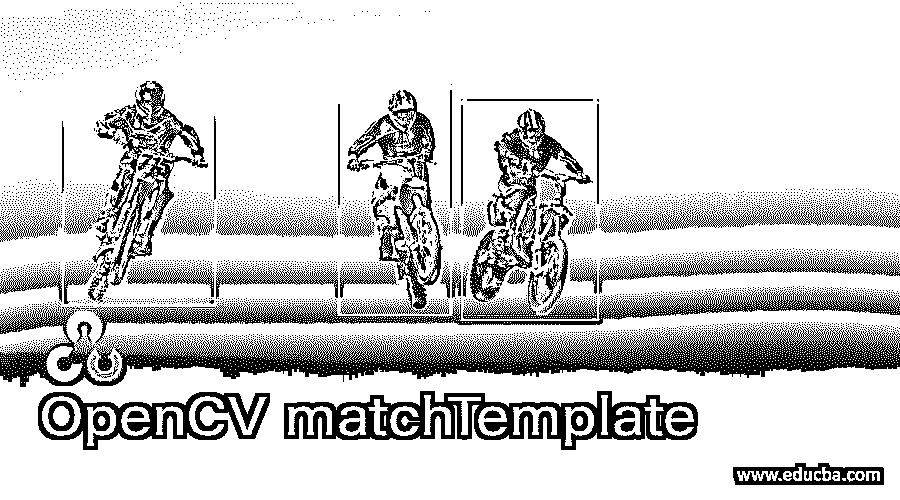
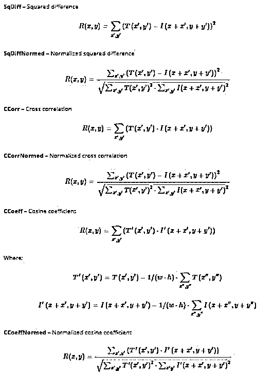
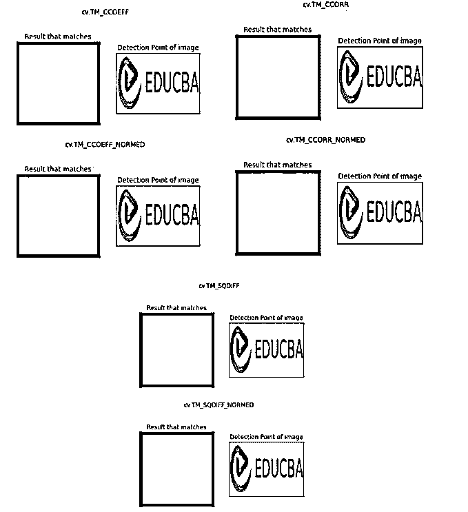

# OpenCV 匹配板

> 原文：<https://www.educba.com/opencv-matchtemplate/>

## opencv cvmatchtemplate 简介

以下文章提供了 OpenCV matchTemplate 的概要。OpenCV 是一种帮助处理图像的机器学习算法。这是 Python 中的一个库，用于图像分析。它用于解决计算机视觉中的问题。在这个库提供的所有不同的函数中，matchTemplate()函数用于匹配不同的图像模板。这意味着它搜索不同图像补片和将要提供的输入图像之间的匹配。它搜索并找到一个更大的图像中的任何模板图像的位置。该函数将获取底层图像，并简单地将模板图像滑动到输入图像上。然后，它将使用模板图像修补输入图像。

**语法:**

<small>网页开发、编程语言、软件测试&其他</small>

使用 matchTemplate 的语法如下。

为了查看图像是否匹配，我们在 matchTemplate 中有不同类型的函数。

`res = cv.matchTemplate(img,template,method)`

上面的 res 变量是存储图像结果的结果变量。然后我们有了 matchTemplate 的关键字。

传递给该图像的参数是:

*   **img:** 这将存储需要与模板图像匹配的输入。
*   **模板:**这将存储模板图像，它将向我们显示比较的基础。
*   **方法:**这里需要传递可以使用的不同方法。

### OpenCV 中 matchTemplate 函数是如何工作的？

Python 中的 OpenCV 库用于图像匹配，以一幅图像为基础，寻找两幅图像的相似性。这些图像可以被匹配并用于进一步的分析。该函数的工作方式是简单地将模板图像滑动到作为输入传递的图像上。该图像将是 2D 图像，其将是卷积图像。然后，它会将模板与补丁形式的输入图像进行比较。然后，输入图像被放置在模板图像下。一旦模板图像与输入图像进行比较，那么最终结果将是灰度图像。该灰度图像将表示像素的邻域与模板图像匹配的程度。

可以作为参数传递给函数的方法如下:

*   **SQDIFF:** 平方差
*   **SqDiffNormed:** 归一化平方差
*   互相关
*   **归一化:**归一化互相关
*   **CCoeff:** 余弦系数
*   **归一化余弦系数:**

这些方法有助于根据需要匹配图像。模板图像将在输入图像上滑动。那么将为存在的每个像素位置计算度量。该计算的度量将显示模板和特定输入图像之间的相似性指数。对于图像 I 中像素 P 的每个位置，度量将被存储在结果 r 中。结果中的每个位置将具有匹配的度量。该过程类似于卷积，其中给定输入图像的输出收缩。

上图显示了用于匹配图像并获得模板和输入图像之间的匹配度量的不同公式。

### opencv cvmatchtemplate 示例

下面给出的是 OpenCV matchTemplate 的例子:

**代码:**

`import cv2 as cv
import numpy as np
from matplotlib import pyplot as pltimg
image_rgb = cv.imread('edulogo.png',0)
image_gray = img.copy()
img_template = cv.imread('edulogo.png',0)
#We store the width and height of the template image
w, h = img_template.shape[::-1] # We will use all six methods in order to check how they work
methods = ['cv.TM_CCOEFF', 'cv.TM_CCOEFF_NORMED', 'cv.TM_CCORR',
'cv.TM_CCORR_NORMED', 'cv.TM_SQDIFF', 'cv.TM_SQDIFF_NORMED'] for match_method in methods:
image = image_gray.copy()
method = eval(match_method)
# Here we will perform the match operation with template image
res = cv.matchTemplate(image_rgb,img_template,method)
minval, maxval, minloc, maxloc = cv.minMaxLoc(res)
# When we use method as TM_SQDIFF or TM_SQDIFF_NORMED then take minimum of the metric value
if method in [cv.TM_SQDIFF, cv.TM_SQDIFF_NORMED]:
topleft = minloc
else:
topleft = maxloc
btm_right = (topleft[0] + w, topleft[1] + h)
cv.rectangle(image_rgb,top_left, btm_right, 255, 2)
pltimg.subplot(121),pltimg.imshow(res,cmap = 'gray')
pltimg.title('Result that matches'), pltimg.xticks([]), pltimg.yticks([])
pltimg.subplot(122),pltimg.imshow(image_rgb,cmap = 'gray')
pltimg.title('Detection Point of image'), pltimg.xticks([]), pltimg.yticks([])
pltimg.suptitle(match_method)
pltimg.show()`

这里我们将导入 cv 库，也就是 OpenCV 库。我们还导入了 numpy 库和 matplotlob 库。然后，我们使用 imread 函数读取图像。这将是将要匹配的输入图像。第二个图像是一个模板图像，存储在 temp 变量中。之后，我们将所有想要使用的方法存储在“methods”变量中。我们将尝试上面提到的所有六种方法。然后我们有用户定义的函数方法来评估和应用 matchTemplate 函数。我们存储像素的最小值、最大值和位置，并为 SQDIFF 和 SQDIFF_NORMED 函数取最小值。我们取 min_loc 和 max_loc 的像素值。

完成后，我们将存储左上角的宽度和高度值。然后，我们将像素更改为矩形，并将图像更改为灰度。然后我们使用 matplotlib 绘制这些图像。我们显示了匹配频率以及匹配的检测点。

**输出:**

从上面的输出可以看出，我们得到了六个结果。根据上述公式，取平方差和归一化平方差。我们还有互相关和归一化互相关。余弦和归一化余弦系数图像也被匹配和存储。图像显示了匹配的像素以及图像中的检测点。所有图像都以灰度格式存储。因此，您可以看到黑色是找到匹配的像素值；可以说，补丁是匹配的。

### 结论

OpenCV 库具有许多图像处理功能，有助于从图像中分析和获取信息。matchTemplate 函数有助于比较两幅图像，其中一幅图像是比较的基础，而另一幅图像是输入。通过匹配图像中的不同补丁，您可以找到匹配并比较两幅图像。因此，该功能有助于检测图像中的相似性。这些方法还有助于以不同的方式处理图像，并提供准确的结果。

### 推荐文章

这是一个 OpenCV matchTemplate 的指南。这里我们讨论一下入门，OpenCV 中 matchTemplate 函数是如何工作的？和示例。您也可以看看以下文章，了解更多信息–

1.  [OpenCV 行](https://www.educba.com/opencv-line/)
2.  [OpenCV 正文](https://www.educba.com/opencv-text/)
3.  [OpenCV 筛选](https://www.educba.com/opencv-sift/)
4.  [OpenCV 直方图](https://www.educba.com/opencv-histogram/)

