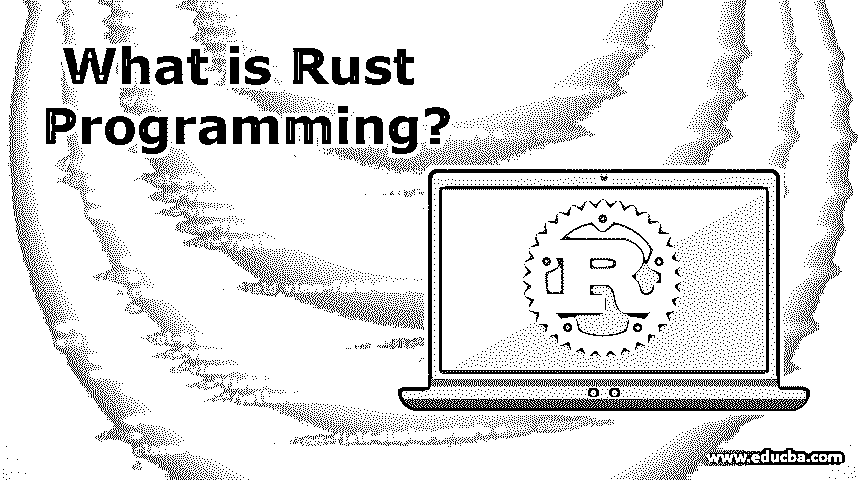

# 什么是 Rust 编程？

> 原文：<https://www.educba.com/what-is-rust-programming/>

## Rust 编程语言简介

一种语法类似于 C++的更侧重于安全性和并发性的通用编程语言被称为 Rust 编程语言。与其他编程语言相比，它具有很高的性能，并且保持了内存安全特性。它还提供了高度的系统完整性。Rust 是一种新的编程语言，打字风格是静态的。这种语言有很多特性，比如安全性、内存和并发性。这种语言效率高，风格简单。内置宏效率很高。这种语言是为编写系统软件而设计的。Rust 是为系统程序员设计的。

### 为什么选择 Rust 编程？

*   Rust 语言最近的更新有很多改进，因为它变得更像 C++。此外，它还更新了设计功能。因此开发人员发现用 Rust 语言编程很容易。
*   很多公司比如 Dropbox，Yelp 等。，都在使用 Rust 语言，因此用户群与日俱增。因此语言类的工作机会也更多。
*   嵌入式编程很容易用 Rust 语言编写，因为它的开销很低。受限制的资源与微控制器一起使用，因此语言很贴切。运行时间更少，编译语言并不难。该语言中的交叉编译也是可能的。
*   这种语言有一个稳定的渠道，因此开发人员无需费力地利用第三方资源。
*   如果脚本语言不是应用程序的解决方案，Rust 用于开发 web 应用程序。大多数情况下，JavaScripts 无法编译应用程序，因为编码部分变得令人厌烦，应用程序可能会在两者之间中断。在这种情况下，铁锈就像救世主一样出现了。
*   大多数 web 浏览器都有 web 程序集，可以更快地编译应用程序，因此 web 应用程序的编译很容易，也不那么令人担忧。
*   由于在[编程语言](https://www.educba.com/what-is-a-programming-language/)的多线程中最小的内存占用和内存安全，使用 Rust 语言很容易构建分布式在线服务。它不会向其他资源泄漏内存，因此它的服务器成本很低；因此，负担也减轻了。
*   Rust 有 async/await 命令，因此可以很容易地从不同的在线资源中提取数据。异步代码可以轻松编写，不会出现代码等待的情况。
*   使用 Rust 语言可以轻松编写跨平台命令行工具。目标是单个二进制文件，输出是从同一个。
*   有了新的更新，集成开发环境得到了很好的支持，Rust 语言为 IDE 提供了很好的开发工具。
*   bug 很容易被展示出来，所以用 Rust 平台很容易解决。
*   代码是内存安全的，语言的薄弱环节更少，保证了语言的安全性。

### Rust 编程对程序员好吗？

*   Rust 语言的功能特性不错，程序员可以用该语言做很多实验。这使得语言更容易使用，零级抽象使得语言更加透明。
*   该语言的泛型和语法简单易懂。逻辑应该对用户非常清楚，因为程序依赖于 90%的逻辑和 10%的语法。编码没有那么难，开发人员发现编写语言代码很容易。
*   一旦编译完成，开发人员会因为其生产力和自然的感觉而对编码感到满意。一旦编码完成，开发者的满足感是无价的。
*   如果编译器理解代码，即使语法错误，代码也会给出输出。这取决于机器的编译能力。开发人员发现查找错误和修复 bug 很容易，因为这种语言的编译能力很强。编译器有能力得到代码并很好地破译它，因此我们可以说编译器是语言中最强大的。
*   如果开发人员理解了语言中要调用的函数，那么语法对开发人员来说就很容易了。和 C++差不多，语法很基础。
*   因为它是一种通用编程语言，所以功能部分得到了很好的照顾，尽管没有适当的函数式语言那么好。它有许多功能特性，作为函数式语言的编码比语法编码更有助于开发人员使用函数。
*   内存是在编码的[开始分配的，开发人员不需要在最后努力将代码映射到服务器的不同部分。考虑到安全性和并发性，代码写得很好。](https://www.educba.com/what-is-coding/)
*   代码的性能真的很好，在任何情况下都不打折扣。开发人员可以看到代码运行得很快，甚至对于更大的 web 应用程序也是如此。
*   Rust 语言被称为安全的编程语言，因为在这种语言中没有使用不安全的关键字，而且它也不允许与编码有关。

### 优势

下面是提到的优点:

<small>网页开发、编程语言、软件测试&其他</small>

*   这种语言保护自己的抽象，因此被认为是一种安全的编程语言。
*   Rust 设计得很好，因为它使用表达式更好地构建了自己。
*   自动垃圾收集做得非常好，无论如何编码都更快。
*   数据类型、特征、泛型在语言中更有表现力，联系也更紧密。
*   我们在语言中看不到任何与内存相关的错误，因为它是内存安全的。
*   并发性是用语言中的所有更新来维护和开发的。
*   Cargo、内置依赖和管理负责语言中的代码依赖。
*   通用语言可以在机器中用于任何目的，这取决于开发者的用法。
*   与其他语言相比，社区对这种语言的支持更多。

Rust 社区的友好氛围、通用用法和逻辑使得这种语言在开发人员中很受欢迎。那些需要改变 C++的人可以很容易地转向 Rust 语言。这种语言介于低级语言[和高级语言](https://www.educba.com/high-level-languages-vs-low-level-languages/)之间。

### 推荐文章

这是一个什么是 Rust 编程的指南？这里我们讨论为什么 rust 是最好的编程语言，以及它的优点。您也可以浏览我们推荐的其他文章，了解更多信息——

1.  [Linux 中 Raid 是什么？](https://www.educba.com/what-is-raid-in-linux/)
2.  [Rust vs Golang](https://www.educba.com/rust-vs-golang/)
3.  [Rust vs C++](https://www.educba.com/rust-vs-c/)
4.  [LXD vs 码头](https://www.educba.com/lxd-vs-docker/)

