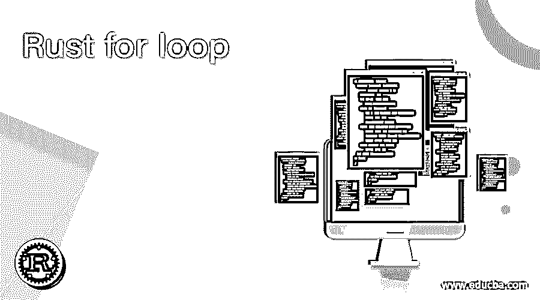
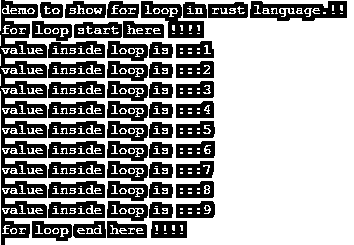
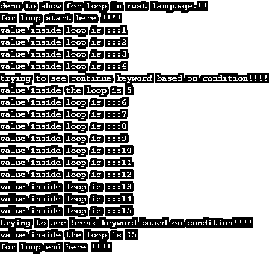

# 回路生锈

> 原文：<https://www.educba.com/rust-for-loop/>

## 回路生锈介绍

当我们想多次执行我们的代码时，程序中可能会有一个要求；然后，我们有各种流量控制。在本教程中，我们将讨论 Rust 中的 for 循环。rust 中的 for 循环用于执行代码的行数或逻辑被迭代的次数。我们可以定义这个逻辑在我们的代码中执行的次数。在 for 循环中，我们可以使用 break and continue 关键字来中断它或跳过当前的执行。通过使用它，我们可以执行一个语句或一组语句任意次。在本教程的下一节，我们将更详细地讨论 for 循环，以便更好地理解它在程序中的用法。

**语法**

<small>网页开发、编程语言、软件测试&其他</small>

正如我们所讨论的，Rust 中的 for 循环用于迭代代码行数。让我们看看它的语法，以便在编程时更好地使用 for 循环(见下文);

`for your_tem_variable in start_point..upperend_point_bound {
// your logic will go here
}`

正如你在上面几行语法中看到的，我们在 rust 中使用' for '关键字来定义我们的 for 循环。在这之后，我们给一个临时变量赋值，后跟我们希望它执行的次数。现在让初学者练习一下语法，以便更好地理解它，并在程序中实现它，以便更好地使用，见下文；

**举例:**

`for a in 0..10 {
// our logic  goes here ..
}`

在接下来的部分中，我们将更多地讨论它的内部工作以及它在实际程序中的实现。

### 流程图

在每一种编程语言中，它都以相同的方式工作。我们将讨论 Rust 中循环的流程图。让我们来看看详细的步骤，见下文；

1.它的入口点是它开始的“开始”点。

2.之后，它对表达式求值，表达式是我们在 for 语句中指定的。

3.在考虑了这个表达之后，结果是真或假。

4.一旦表达式的演化结果为真，它就进入循环并执行其余的逻辑。

5.如果表达式的求值结果为假，那么它返回假，它不会进入循环，任何逻辑都不会被进一步执行。

下面的流程图可以让你更好的理解流程。见下文；

### Rust 中的 for 循环是如何工作的？

正如我们已经讨论过的，for 循环是编程语言中的控制流语句。它的工作方式和其他任何编程语言一样。Rust 提供了如此多不同的控制流语句，但这里我们将针对一个循环来讨论它。在循环内部，我们也可以使用 break and continue 关键字来控制它的流程。如果您想要迭代数组或列表元素，那么 for loop 是一个不错的选择，因为 for loop 被设计为在编程语言中提供这种功能。让我们举一个例子来说明如何在 rust 语言中使用 for 循环(见下文);

**举例:**

`fn main(){
for temp in 1..5{
println!("{}",temp);
}
}`

正如你在上面几行代码中看到的，我们试图打印从 1 到 4 的元素。但是正如你所看到的，我们提到的数字是 5；它将是包容性的。为了做到这一点，我们在这里使用了“for”关键字；在此之后，我们只将值保存到名为“temp”的临时变量中。在 for 循环中，我们试图打印 temp 变量。但是在 rust 中打印变量时要非常小心；遵循上面的语法。一旦值因为 5，循环将被终止，并且内部逻辑将不会被执行。

在 rust 中使用 for 循环时需要记住的要点如下:

*   我们必须在声明语句之前使用 for loop 关键字。
*   这主要用于将 iterable 对象迭代一定的次数。
*   此外，在循环内部，我们可以编写自己的逻辑，我们希望执行的次数或重复次数。
*   我们还可以在 Rust 编程语言中使用 break 和 continue stamen 来控制循环的流程。它的工作方式和其他任何编程语言一样。

### 环路生锈的例子

1.在上面的例子中，我们试图在 rust 中使用 for 循环从 1 到 10 迭代数字。这是一个示例，便于初学者理解并在程序中实现。

**举例:**

`fn main(){
println!("demo to show for loop in rust language.!!");
println!("for loop start here !!!!");
for temp in 1..10{
print!("value inside loop is :::");
println!("{}",temp);
}
println!("for loop end here !!!!");
}`

**输出:**

2.在这个例子中，我们试图使用 break and continue 语句来展示 rust 中 for 循环的流控制；这是基于条件，如果它匹配，它就会开始工作。

**举例:**

`fn main(){
println!("demo to show for loop in rust language.!!");
println!("for loop start here !!!!");
for temp in 1..20{
if temp==5 {
println!("trying to see continue keyword based on condition!!!!");
println!("value inside the loop is {}",temp);
continue;
}
print!("value inside loop is :::");
println!("{}",temp);
if temp==15 {
println!("trying to see break keyword based on condition!!!!");
println!("value inside the loop is {}",temp);
break;
}
}
println!("for loop end here !!!!");
}`

**输出:**

### 结论

通过使用 for 循环，我们可以在任何编程语言中迭代数组、列表或集合。当我们想看到数组的所有元素时，它们就出现了。在 rust 编程语言中，循环属于控制流语句，在 rust 编程语言中，我们有 while 循环和 for 循环。

### 推荐文章

这是一个指南生锈的循环。在这里，我们讨论了 Rust 中的 for 循环是如何工作的，给出了流程图和例子以及输出。您也可以看看以下文章，了解更多信息–

1.  [熊猫换圈](https://www.educba.com/pandas-for-loop/)
2.  [C 语言中的无限循环](https://www.educba.com/infinite-loop-in-c/)
3.  [Perl for 循环](https://www.educba.com/perl-for-loop/)
4.  [红宝石直到循环](https://www.educba.com/ruby-until-loop/)

