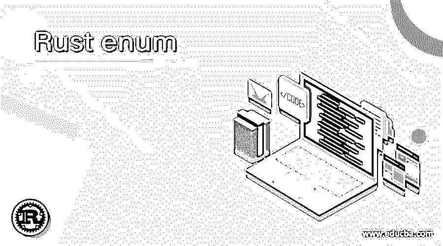
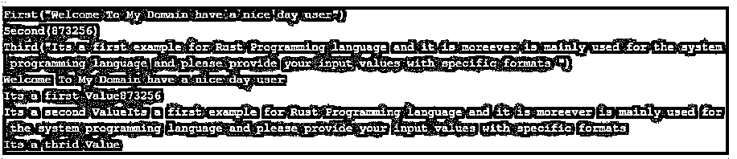
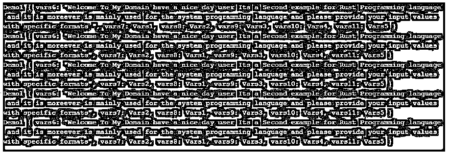
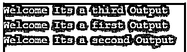

# 铁锈枚举

> 原文：<https://www.educba.com/rust-enum/>

## Rust enum 简介

Rust enum 是其中一个功能，它是一个自定义数据类型，包含一些用户定义或预定义的值，具体取决于需求，它是用于枚举类型名称之前的关键字。它包含一些默认的方法来利用枚举属性和它在代码中的元素，rust enum 更类似于 struct 关键字和概念。它有一些预定义的枚举列表，每个枚举都有不同类型的选项和语句，用于比较 Rust 语言中不同数据类型的值。

**语法:**

<small>网页开发、编程语言、软件测试&其他</small>

在 rust 语言中，我们使用不同的关键字、变量和方法来利用基于 rust 的更复杂的应用程序，它主要用于系统编程语言。它主要用于内存空间分配、错误消息，并且主要支持内存安全和执行任务所需的最短时间。

`enum enumName {
values;
}
fn main()
{
variable name = enumName:: values;
---some logics depends upon the requirement -----
}`

以上代码是创建和使用 Rust 语言枚举的基本语法。取决于我们需要在不同的地区和不同的时间使用枚举的要求。

### Rust 中的 enum 函数是如何工作的？

*   Rust 枚举是一种特性，它与我们用于命名枚举类型的特性是相同的，并且是并行的，类似于在语言中创建对象的构造函数集。在枚举端我们可以用来为用户创建或匹配一些模式输入值的相应枚举类型。虽然我们使用了枚举构造函数，但它可以用于变量的命名或未命名字段。当我们在 Rust 中编译枚举时，它看起来和其他编译语言如 C，C++等一样。
*   但当我们与其他语言相比时，它有一些其他的不同之处，如编译时间比其他任何编译语言都要长。我们还使用 Rust 语言中的一些调用，我们通常称之为数学函数，如代数特征，可以与后台编程语言支持的数据类型相关联。如果假设我们没有提及或声明枚举中的值，那么可以选择直接在字段上访问判别式。它可用于强制转换的枚举，以使用运算符(如“as ”)转换整数类型，并按数值类型转换输入值。

### Rust enum 的示例

以下是 Rust enum 的示例:

#### 示例#1

**代码:**

`#[derive(Debug)] enum Demo {
First(String),Second(i32), Third(String),
}
fn main() {
let vars1 = Demo::First(String::from("Welcome To My Domain have a nice day user"));
let vars2 = Demo::Second(873256);
let vars3 = Demo::Third(String::from("Its a first example for Rust Programming language and it is moreever is mainly used for the system programming language and please provide your input values with specific formats "));
println!("{:?}",vars1);
println!("{:?}",vars2);
println!("{:?}",vars3);
match vars1 {
Demo::First(val)=> {
println!("{}",val);
print!("Its a first Value");
}
Demo::Second(val)=> {
println!("{}",val);
print!("Its a second Value");
}
Demo::Third(val)=> {
println!("{}",val);
print!("Its a third Value");
}
}
match vars2 {
Demo::First(val)=> {
println!("{}",val);
print!("Its a first Value");
}
Demo::Second(val)=> {
println!("{}",val);
print!("Its a second Value");
}
Demo::Third(val)=> {
println!("{}",val);
print!("Its a third Value");
}
}
match vars3 {
Demo::First(val)=> {
println!("{}",val);
print!("Its a first Value");
}
Demo::Second(val)=> {
println!("{}",val);
print!("Its a second Value");
}
Demo::Third(val)=> {
println!("{}",val);
print!("Its a thrid Value");
}
}
}`

**输出:**

在上面的例子中，我们在语言中使用了单个枚举。在 main 函数的帮助下，我们可以访问枚举变量，也可以使用 match 函数来匹配值。

#### 实施例 2

**代码:**

`#[derive(Debug)] enum Demo {
Vars1,Vars2, Vars3,Vars4,Vars5,
}
#[derive(Debug)] struct Demo1 {
vars6:String,
vars7:Demo,
vars8:Demo,
vars9:Demo,
vars10:Demo,
vars11:Demo,
}
fn main() {
let vars12 = Demo1 {
vars6:String::from("Welcome To My Domain have a nice day user Its a Second example for Rust Programming language and it is moreever is mainly used for the system programming language and please provide your input values with specific formats "),
vars7:Demo::Vars1,
vars8:Demo::Vars2,
vars9:Demo::Vars3,
vars10:Demo::Vars4,
vars11:Demo::Vars5,
};
let vars13 = Demo1 {
vars6:String::from("Welcome To My Domain have a nice day user Its a Second example for Rust Programming language and it is moreever is mainly used for the system programming language and please provide your input values with specific formats"),
vars7:Demo::Vars2,
vars8:Demo::Vars1,
vars9:Demo::Vars3,
vars10:Demo::Vars4,
vars11:Demo::Vars5,
};
let vars14 = Demo1 {
vars6:String::from("Welcome To My Domain have a nice day user Its a Second example for Rust Programming language and it is moreever is mainly used for the system programming language and please provide your input values with specific formats"),
vars7:Demo::Vars2,
vars8:Demo::Vars1,
vars9:Demo::Vars3,
vars10:Demo::Vars4,
vars11:Demo::Vars5,
};
let vars15 = Demo1 {
vars6:String::from("Welcome To My Domain have a nice day user Its a Second example for Rust Programming language and it is moreever is mainly used for the system programming language and please provide your input values with specific formats"),
vars7:Demo::Vars2,
vars8:Demo::Vars1,
vars9:Demo::Vars3,
vars10:Demo::Vars4,
vars11:Demo::Vars5,
};
let vars16 = Demo1 {
vars6:String::from("Welcome To My Domain have a nice day user Its a Second example for Rust Programming language and it is moreever is mainly used for the system programming language and please provide your input values with specific formats"),
vars7:Demo::Vars2,
vars8:Demo::Vars1,
vars9:Demo::Vars3,
vars10:Demo::Vars4,
vars11:Demo::Vars5,
};
println!("{:?}",vars12);
println!("{:?}",vars13);
println!("{:?}",vars14);
println!("{:?}",vars15);
println!("{:?}",vars16);
}`

**输出:**

在第二个例子中，我们使用 enum 和 struct(结构)以不同的方式利用用户输入。结构也像枚举一样，当我们使用多个枚举时，它是更好的选择。

#### 实施例 3

**代码:**

`enum Demo {
First,
Second,
Third
}
fn demo1(vars:Demo) {
match vars {
Demo::First => {
println!("Welcome Its a first Output");
},
Demo::Second => {
println!("Welcome Its a second Output");
},
Demo::Third =>{
println!("Welcome Its a third Output");
}
}
}
fn main(){
demo1(Demo::Third);
demo1(Demo::First);
demo1(Demo::Second);
}`

**输出:**

在最后一个例子中，我们使用了单个 enum 和函数来访问应用程序。我们可以创建自定义的函数来存储和检索数据。

### 结论

Rust 语言使用默认的标准库来集中应用程序中的模块数量。对于每个模块都有不同的特性集，方法带有关键字。Enum 是其中一个特性，它用于声明具有不同数据类型(如原始和非原始类型)的变量。通过使用 function 和 main 函数，我们可以在任何需要的地方调用和利用枚举类型。

### 推荐文章

这是一个指南锈枚举。这里我们讨论一下 rust 中的 enum 函数是如何工作的？和示例。您也可以看看以下文章，了解更多信息–

1.  [什么是 Rust 编程？](https://www.educba.com/what-is-rust-programming/)
2.  [戈朗原子](https://www.educba.com/golang-atomic/)
3.  [Golang 接口](https://www.educba.com/golang-interfaces/)
4.  [Golang 选择](https://www.educba.com/golang-select/)

