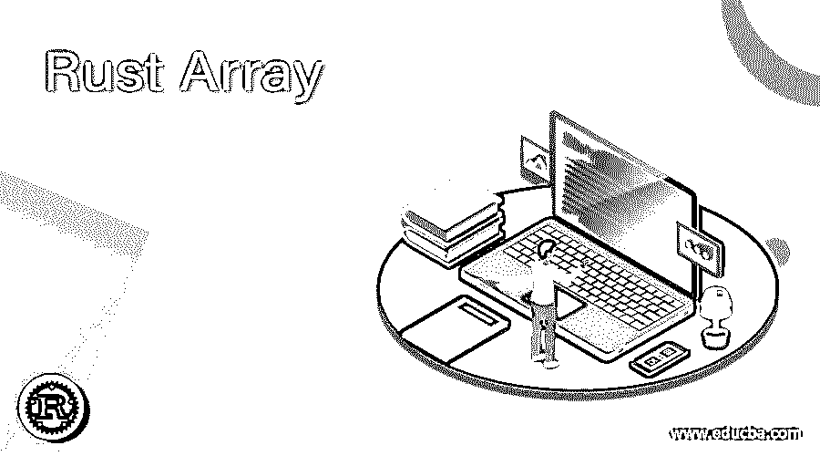
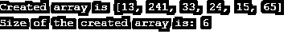
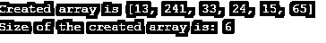
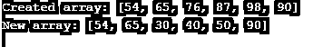

# 铁锈阵列

> 原文：<https://www.educba.com/rust-array/>

## 铁锈阵列的定义

Rust 是由 Mozilla 开发的几种编程语言之一。这种语言关注高度并发和高度安全的系统。通常情况下，存在一些变量来存储这些值。在数组的情况下，它们被认为是在连续的内存位置存储相同类型的值的集合。Rust 中的数组是使用[]方括号创建的。此外，在编译时应该知道数组的大小。如果数组大小没有定义，那么它被称为切片。在本文中，我们将关注 Rust 编程语言中数组的使用。

**语法:**

<small>网页开发、编程语言、软件测试&其他</small>

下面是 Rust 语言中数组的语法。有三种方法可以创建一个数组。它们是:

`1\. let varname = [ val1 , val2 , val3 ] ;`

`2\. let varname:[ dType ; size ] =[ val1 ,val2 , val3 ] ;`

`3\. let varname:[ dType ; size ] = [def_val, size ] ;`

这里，varname 是数组名，dType 是数据类型，def_val 是元素的默认值。

### Rust Array 是如何工作的？

众所周知，数组以顺序方式分配内存块，它们是静态的。数组可以是可变的和不可变的。在 Rust 中，有三种方法可以创建不可变数组。让我们详细地看看他们中的每一个。

#### 1.没有数据类型的数组

不提及数据类型也可以创建数组。让我们看看如何写。假设有六个元素，我们不想提及数据类型。然后，我们将编写如下所示的程序。

`let arry = [ 13 , 241 , 33 , 24 , 15 , 65 ] ;`

#### 2.具有数据类型和大小的数组

在上面的例子中，我们看到了一个没有数据类型的数组。现在我们将看到如何创建一个既有数据类型又有大小的数组。假设有六个元素，元素是 32 位整数。然后，我们将编写如下所示的程序。

`let arry:[i32;6] = [ 13 , 241 , 33 , 24 , 15 , 65 ] ;`

#### 3.默认值数组

除了上述两种类型，我们还可以在所有项目只有一个值时创建一个数组。可以写成如下图。

`let arry:[i32;6] = [0;6];
println!("Size of the created array is: {}", arry.len());
}`

现在，我们将看到可变数组的情况。由于上述数组是不可变的，所以内容不能改变。为了在这种编程语言中创建可变数组，必须使用关键字 mut，如下所示。

`let mut arry:[ i32;6 ] = [ 54 , 65, 76, 87, 98, 90 ];`

### 例子

到目前为止，我们已经看到了什么是 Rust 数组，什么是语法，它是如何工作的，等等。现在，我们将看到 Rust array 程序的示例输出。

#### 程序#1:创建没有数据类型的 Rust 数组的程序

`fn main() {
let arry = [ 13 , 241 , 33 , 24 , 15 , 65 ] ;
println!("Created array is {:?}", arry);
println!("Size of the created array is: {}", arry.len()); }`

**输出:**

在这个程序中，将创建一个没有数据类型的六元素数组。此外，函数 len()也用于获取数组的大小。在执行代码时，所有的数组元素和数组的大小都会显示出来，如上所示。

#### 程序#2:用默认值创建 Rust 数组的程序

`fn main() {
let arry:[i32;6] = [ 13 , 241 , 33 , 24 , 15 , 65 ] ;
println!("Created array is {:?}", arry);
println!("Size of the created array is: {}", arry.len());
}`

**输出:**

在这个程序中，用数据类型和大小创建了一个包含六个元素的数组。程序中的 i32 表示数组中的整数为 32 位，数组大小为 6。函数 len()也用于获取数组的大小以验证数组的大小。在执行代码时，所有的数组元素和数组的大小都会显示出来，如上所示。

#### 程序#3:创建具有数据类型和大小的 Rust 数组的程序

`fn main() {
let arry:[i32;6] = [0;6];
println!("Size of the created array is: {}", arry.len());
}`

**输出:**

与上面的程序类似，用数据类型和大小创建了一个包含六个元素的数组。程序中的 i32 表示数组中的整数为 32 位，数组大小为 6。除此之外，语法中还提供了默认值 0。函数 len()也用于获取数组的大小以验证数组的大小。在执行代码时，数组的大小将如上所示。

#### 程序#4:创建 Rust 可变数组的程序

`fn main() {
let mut arry:[i32;6] = [54, 65, 76, 87, 98, 90 ];
println!("Created array: {:?}",arry);
arry[2] = 30;
arry[3] = 40;
arry[4] = 50;
println!("New array: {:?}",arry); }`

**输出:**

与上面的程序不同，在这个程序中创建了一个可变数组。用数据类型和大小创建了一个包含六个元素的数组。还有一个关键字 but，表示创建的数组是可变的。程序中的 i32 表示数组中的整数为 32 位，数组大小为 6。在执行代码时，数组的大小将如上所示。

### 结论

Rust 中的数组是使用[]方括号创建的，在编译时应该知道数组的大小。在这篇文章中，不同的方面，如介绍，语法，工作，并举例说明了锈数组详细。

### 推荐文章

这是锈阵指南。在这里，我们讨论定义，数组如何在 Rust 中工作，以及代码实现的例子。您也可以看看以下文章，了解更多信息–

1.  [JavaScript 实例 of](https://www.educba.com/javascript-instanceof/)
2.  [Java 关机挂钩](https://www.educba.com/java-shutdown-hook/)
3.  [Java 中的静态同步](https://www.educba.com/static-synchronization-in-java/)
4.  [Java GUI 框架](https://www.educba.com/java-gui-framework/)

