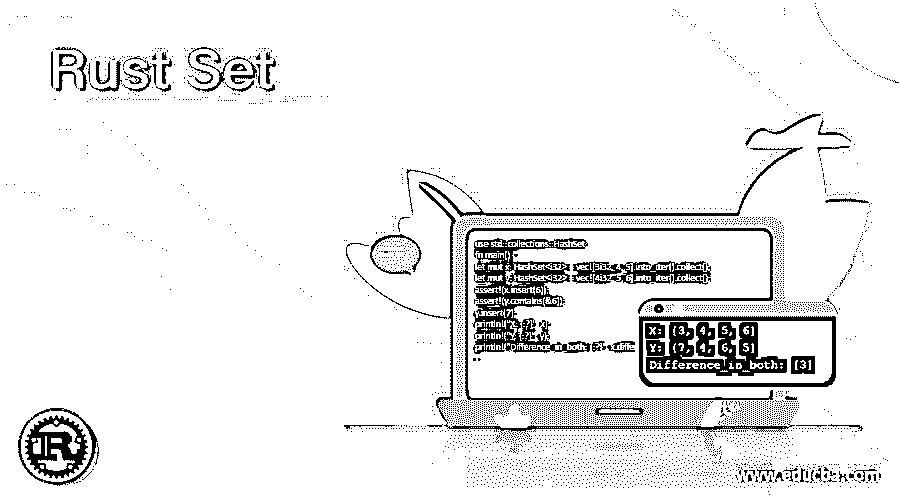
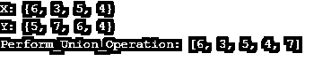
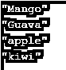
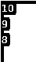

# 铁锈色

> 原文：<https://www.educba.com/rust-set/>

## 锈集的定义

Rust 集合是 rust 程序设计语言的一种非常重要的数据结构，它有助于识别集合中具有所需元素的关键字。rust 编程语言中的集合主要围绕键而不是值，因为通常与元素相关联的键足以检索关于任何元素的信息。集合可以执行各种操作，如并集、差集、对称差集、可用数据的交集，因此它最常被程序员采用。集合主要由 HashSet 和 BTreeSet 组成，它们在 rust 中有自己的意义。

**语法:**

<small>网页开发、编程语言、软件测试&其他</small>

Rust Set 的语法流程如下:

`use std::collections : : HashSet;
let mut var_0 = HashSet : : new ();
var_0.insert(“some_val”);
{
Logic to be implemented
}
Functional calls ;
Where,`

HashSet 作为 rust 中标准库和集合的一部分被导入，后跟常规变量，其中使用 new 关键字完成元素插入的准备，然后创建值，以便实现逻辑并从包含元素的集合中执行进一步的功能调用。

### set 在 Rust 中是如何工作的？

*   Rust 中 set 的工作被用于和执行各种操作和活动，使得该数据结构在程序员的适应方面非常有用。
*   Sets in Rust 的独特之处在于以适当的方式包装键和映射，从而保证不拥有重复的元素。
*   Hash 集合和 B 树集合是 rust 中集合的一部分，rust 也是 hashmap 的一部分，它的值并不重要，但是键的存在起着非常关键的作用。
*   如果存在的两个密钥相等，那么它们的散列也将相同或相等，本质上不应该是唯一的。
*   如果在某个场景中发生了一些逻辑错误，那么在这种情况下，出现的 eq 和 hash 值可能会变得不同，并且会在执行方面造成很多混乱，因此，记住等式特征或 hash 特征以在它出现在该集合中时正确地确定它是很重要的。
*   到目前为止，提到的场景仅在不相等的代码的情况下出现，或者在 rust 编程语言中实现代码时遵循错误的实践。
*   此外，可能会出现这样的情况，即与密钥相关的哈希实现有所不同，在这种情况下，其中的内容可能会受到阻碍和破坏，进而变得无用，可能需要删除。
*   可以从已定义的数组中创建一个固定元素列表的 HashSet，并对其进行初始化和实现。
*   如果需要显示数组中的元素，执行对称、差分、并集和交集等操作，则需要导入标准集合中的 hashbrown 和 HashSet。
*   最初需要导入由 HashSet 组成的标准 inbuild 库，以便执行与集合和具有关联值的键相关的任何操作，否则执行将不会正确，并且可能会被扭曲，从而引发异常和错误。
*   一些内置的哈希函数，如 hash drain 和 hash brown，以及许多其他函数需要版本兼容性，因为每个版本的标准集合可能会有所不同，或者库也可能已经过时。
*   集合可以执行很可能被程序员采用的操作，以增加和加快对集合的运算能力，如并集、交集、差集和对称集。

### 例子

让我们讨论生锈的例子。

这个程序演示了 Rust hash 集，它通过插入元素并在输出中显示它们来演示 union 操作。

**代码:**

`use std::collections::HashSet;
fn main()
{
let mut x: HashSet<i32> = vec![3i32, 4, 5].into_iter().collect();
let mut y: HashSet<i32> = vec![4i32, 5, 6].into_iter().collect();
assert!(x.insert(6));
assert!(y.contains(&6));
y.insert(7);
println!("X: {:?}", x);
println!("Y: {:?}", y);
println!("Perform_Union_Operation: {:?}", x.union(&y).collect::<Vec<&i32>>());
}`

**输出:**

**例 2:** 这个程序演示了 rust 中的 hash 集合，其中考虑了两个集合中的差异，并显示在下面的输出中。

**代码:**

`use std::collections::HashSet;
fn main() {
let mut x: HashSet<i32> = vec![3i32, 4, 5].into_iter().collect();
let mut y: HashSet<i32> = vec![4i32, 5, 6].into_iter().collect();
assert!(x.insert(6));
assert!(y.contains(&6));
y.insert(7);
println!("X: {:?}", x);
println!("Y: {:?}", y);
println!("Difference_in_both: {:?}", x.difference(&y).collect::<Vec<&i32>>());
}`

**输出:**

例 3: 这个程序演示了一组固定元素的表示，在这个例子中是输出中显示的一组已定义数组的结果。

**代码:**

`use std::collections::HashSet;
fn main() {
let fruits: HashSet<&'static str> =
[ "apple", "kiwi", "Mango", "Guava" ].iter().cloned().collect();
for x_0 in &fruits {
println!("{:?}", x_0);
}
}`

**输出:**

**Example #4** :这个程序演示了散列集合，set_08 的散列集合中的元素将被迭代，并按照输出中所示的任意顺序打印。

**代码:**

`use std::collections::HashSet;
fn main()
{
let mut set_08: HashSet<_> = [8, 9, 10].iter().cloned().collect();
assert!(!set_08.is_empty());
for i_0 in set_08.drain() {
println!("{}", i_0);
}
assert!(set_08.is_empty());
}`

**输出:**

这个程序演示了 Rust set，它被用来返回集合中元素的数量，用于测量和插入断言以及元素的相等。

**代码:**

`use std::collections::HashSet;
fn main()
{
let mut v_l_0 = HashSet::new();
assert_eq!(v_l_0.len(), 0);
v_l_0.insert(1);
assert_eq!(v_l_0.len(), 1);
println!("{:?}", v_l_0);
}`

**输出:**

### 结论

Rust 是一种编程语言，在 C 语言出现后被大多数程序员使用，作为 Rust 的一部分，它作为一种数据结构，在执行各种操作和操纵方面增加了很多灵活性和适应性。它在本质上是非常通用的，因为它有助于使整个 rust 编程成为一种有趣的语言来学习和提高技能。

### 推荐文章

这是生锈的指南。这里我们讨论定义，set 在 Rust 中如何工作，以及代码实现的例子。您也可以看看以下文章，了解更多信息–

1.  [Rust vs C++](https://www.educba.com/rust-vs-c/)
2.  [打字稿设置](https://www.educba.com/typescript-set/)
3.  [CSS 偏移](https://www.educba.com/css-offset/)
4.  [MySQL 更新集](https://www.educba.com/mysql-update-set/)

