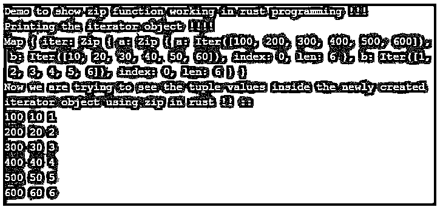

# 铁锈色拉链

> 原文：<https://www.educba.com/rust-zip/>

## Rust zip 简介

顾名思义，它用于压缩 rust 中两个不同迭代器的值。这是 rust 中的一个内置函数，所以我们可以直接使用它，而不需要在程序中包含任何外部库。如果你想压缩两个或三个迭代器值，你可以使用 zip()函数。如果我们在 rust 中使用 zip()函数，它将总是返回给我们一个新的迭代器，其中包含一个元组，这个元组将依次保存来自迭代器的值，并继续迭代，直到到达最后一个元素。

**语法:**

<small>网页开发、编程语言、软件测试&其他</small>

正如我们看到的，我们使用 zip()函数将多个迭代器值压缩在一起，这为我们形成了一个元组序列。

`let variable_name = iterator_name1.iter()
.zip(b.iterator_name2())
.zip(c.iterator_name1()) .. and so on ..`

正如你在上面几行语法中看到的，我们在这里使用了 zip()函数。它可以在 rust 中任何迭代器对象上调用。我们也可以在里面传递多个迭代器。

**举例:**

`let demoitr = x.iter()
.zip(y.iter())
.zip(z.iter())`

### Rust 中的 zip 函数是如何工作的？

正如我们现在已经知道，zip()函数是一个普通函数，就像 rust 中的其他函数一样，zip 函数返回给我们一个新的迭代器，这个迭代器包含以元组形式传递给它的所有元素的 zip。从 zip 函数成功创建新的迭代器后，我们可以打印我们的值来理解输出，以及它如何在 rust 中将多个迭代器合并在一起以形成一个新的迭代器。

让我们先看看它的内部工作原理，然后是示例，以转移 rust 中的用法:

#### zip()

它以元组的形式给出值，但这些元组是通过使用不同迭代器中的几个值创建的，我们在 rust 中使用 zip()函数。例如，我们有三个迭代器，分别命名为 ite1、itr2 和 itr3，我们想将这个迭代器合并在一起，在 rust 中形成一个新的迭代器。

了他为了更加形象化而采用虚拟值:

**代码:**

`itr1 = [1, 2, 3, 4] itr2 = [11, 12, 13 , 14] itr3 = [21, 22, 23, 24]`

因此，如果我们试图在 rust 中压缩这三个不同的迭代器，我们必须对它们调用 zip 函数，在我们的例子中，它将从第一个迭代器中选取第一个值，在我们的例子中是“1 ”,在我们的例子中，它将从第二个迭代器中选取第一个值，在我们的例子中是“11 ”,然后考虑第三个迭代器，并将从第三个迭代器中选取“21 ”,因此，这样，它将从上述迭代器的每个值中创建元组。向前移动时，它将从第一个迭代器中获取第二个值，这将帮助它使用 rust 中的 zip 函数逐个创建元组。这些值的数量应该相等，以便使用 zip 形成一个元组。

让我们看看它的输出会给我们带来什么:

**输出:**

1, 11, 21

2, 12, 22

3, 13, 23

4, 14, 24

正如你在上面的输出中看到的，我们有了包含新值的新迭代器，它是通过使用 rust 中 zip 函数使用的不同迭代器中的几个值形成的。

**返回类型:**

如果我们谈论它的返回类型，它将总是返回我们新的迭代器，它将包含通过使用 zip 函数和各种迭代器值的序列形成的元组。

**在 rust 中使用 zip 函数时要记住的规则:**

*   zip()将总是返回给我们新的迭代器对象，如果你想看到它的值，那么我们必须对它进行迭代器，以便看到通过使用迭代器值形成的元组值。
*   它是 rust 语言的内置功能，所以我们不需要在配置中包含任何依赖项就可以使用它。
*   zip()函数可以在迭代器对象 ant 中调用，我们可以传递我们想要压缩的迭代器对象和 rust 中的另一个迭代器对象。

### Rust zip 示例

下面是提到的例子:

在这个例子中，我们尝试使用带有多个迭代器的 zip 函数，我们还打印了迭代器值，其中包含来自所有三个迭代器值的新元组。

**代码:**

`fn main(){
println!("Demo to show zip function working in rust programming !!!");
let itr1 = [100, 200, 300, 400, 500, 600];
let itr2 = [10 , 20, 30, 40, 50 ,60];
let itr3 = [1, 2, 3, 4 ,5 , 6];
let iter = itr1.iter()
.zip( itr2.iter())
.zip( itr3.iter())
.map(|((x, y), z)| (x, y, z));
println!("Printing the iterator object !!!!");
println!("{:?}", iter);
println!("Now we are trying to see the tuple values inside the newly created iterator object using zip in rust !! ::");
for (itr1, itr2, itr3) in iter {
println!("{} {} {}", itr1, itr2, itr3);
}
}`

**输出:**

### 结论

通过使用 rust 中的 zip 函数，我们可以将几个迭代器的值合并在一起，形成一个新的迭代器。我们仍然可以在新创建的迭代器上调用 zip 函数来再次压缩它，没有限制每个迭代器对象只能使用一次。此外，它易于使用和阅读的开发人员可以清楚地理解它。

### 推荐文章

这是一个生锈的拉链指南。这里我们讨论一下入门，rust 中的 zip 函数是如何工作的？并分别给出了示例。您也可以看看以下文章，了解更多信息–

1.  [什么是 Rust 编程？](https://www.educba.com/what-is-rust-programming/)
2.  [戈朗原子](https://www.educba.com/golang-atomic/)
3.  [Golang 接口](https://www.educba.com/golang-interfaces/)
4.  [Golang 选择](https://www.educba.com/golang-select/)

