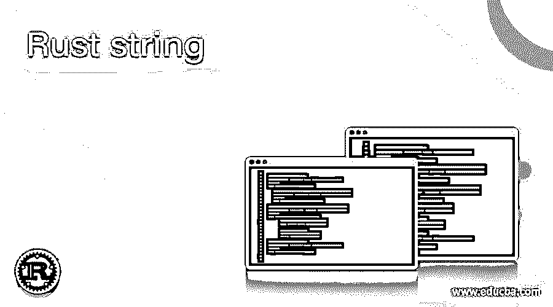
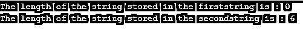
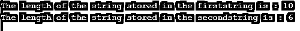

# 生锈的绳子

> 原文：<https://www.educba.com/rust-string/>

## 锈弦简介

string 是 Rust 中的一种数据类型，可以分为两种类型，即写成&str 的字符串文字，也称为 string slice，和写成 string 的 string 对象，而&str 的表示是由指向 UTP 8 序列的&[u8]来完成的，字符串中出现的数据可以用&str 来查看。&str 的大小是固定的，这意味着它不能调整大小。相比之下，字符串对象在 UTF 8 序列中编码，并且为字符串对象进行堆内存分配，并且字符串对象的大小是可变的；也就是说，它一直在增长，它不是一个以空值终止的序列。

**在 Rust 中声明字符串文字或& str 的语法如下:**

<small>网页开发、编程语言、软件测试&其他</small>

`let variable_name:&str=”string_to_be_stored”;`

其中，变量名称表示存储字符串的变量的名称，

string_to_be_stored 是将要存储在变量中的字符串文字。

**Rust 中声明字符串对象或字符串的语法如下:**

`String::new()`

可以使用上面的语法创建一个空字符串

或者

`String::from()`

创建一个具有默认值的字符串。默认值作为参数从()方法传递给。

### 锈线加工

*   当字符串的值在编译时已知时，我们使用字符串或&str。
*   硬编码到变量中的一组字符称为字符串文字。
*   模块 std::str 由字符串文字组成。
*   默认情况下，字符串文字本质上是静态的；也就是说，只要程序在运行，它们就是有效的。
*   标准库由字符串对象类型组成。
*   标准库发布结构字符串定义了字符串对象类型。
*   String 对象类型的大小是可增长的，并且可以调整大小。
*   字符串对象类型是可变的。
*   字符串对象类型在 UTF 8 序列中编码。
*   运行时的字符串值可以用 string 对象来表示。
*   堆用于存储字符串对象。

### 锈线的例子

下面举几个例子

#### 示例#1

Rust 程序演示字符串文字，其中创建了两个字符串文字，值存储在字符串文字中，然后作为输出显示在屏幕上:

`fn main()
{
//defining a string literal to store the value of first string
let firststring:&str="Welcome to";
//defining a string literal to store the value of second string
let secondstring:&str = "EDUCBA";
//displaying the value of string literals as the output on the screen
println!("The string stored using string literal is : {} {}",firststring,secondstring);
}`

上述程序的输出如下面的快照所示:

在上面的程序中，我们创建了一个名为 firststring 的字符串来存储一个字符串值。然后，我们创建另一个名为 secondstring 的字符串文字来存储另一个字符串值。

然后，我们将存储在两个字符串中的两个字符串值作为输出显示在屏幕上。

#### 实施例 2

Rust 程序演示 string 对象，其中使用 new()方法创建一个空字符串，使用 from()方法创建另一个字符串对象，并且要存储在第二个字符串对象中的字符串作为参数传递给 from()方法，然后使用 len()方法将两个字符串的长度显示为屏幕上的输出:

`fn main()
{
//defining a string object to create an empty string
let firststring = String::new();
//defining a string object to store the value of a string
let secondstring = String::from("EDUCBA");
//displaying the length of the string objects in the two strings as the output on the screen
println!("The length of the string stored in the firststring is : {} ",firststring.len());
println!("The length of the string stored in the secondstring is : {} ",secondstring.len());
}`

上述程序的输出如下面的快照所示:

在上面的程序中，我们使用 new()方法创建了一个名为 firststring 的空字符串。因此，我们使用()方法创建了另一个名为 secondstring 的字符串。要存储在 secondstring 中的字符串值作为参数传递给 from()方法。然后，我们使用 len()函数来查找每个字符串的长度。第一个字符串的长度和第二个字符串的长度作为输出显示在屏幕上。

#### 实施例 3

Rust 程序演示 string 对象，其中使用 from()方法创建了两个 string 对象，要存储在这两个 string 对象中的字符串作为参数传递给 from()方法，然后使用 len()方法将这两个字符串的长度显示为屏幕上的输出:

`fn main()
{
//defining a string object to store the value of a string
let firststring = String::from("Welcome to");
//defining a string object to store the value of another string
let secondstring = String::from("EDUCBA");
//displaying the length of the string objects in the two strings as the output on the screen
println!("The length of the string stored in the firststring is : {} ",firststring.len());
println!("The length of the string stored in the secondstring is : {} ",secondstring.len());
}`

上述程序的输出如下面的快照所示:

在上面的程序中，我们使用()方法创建了两个名为 firststring 和 secondstring 的字符串对象。要存储在 firststring 和 secondstring 中的字符串值作为参数传递给 from()方法。然后，我们使用 len()函数来查找每个字符串的长度。第一个字符串的长度和第二个字符串的长度作为输出显示在屏幕上。

### 结论

在本文中，我们通过 Rust 中的定义、语法、工作字符串文字和字符串对象以及相应的编程示例及其输出来演示它们，了解了 Rust 中的字符串文字和字符串对象的概念。

### 推荐文章

这是锈弦指南。在这里，我们通过定义、语法和工作字符串来讨论 Rust 中字符串文字和字符串对象的概念。您也可以看看以下文章，了解更多信息–

1.  [什么是 Rust 编程？](https://www.educba.com/what-is-rust-programming/)
2.  [C++子串](https://www.educba.com/c-plus-plus-substring/)
3.  [Java 字符串等于](https://www.educba.com/java-string-equals/)
4.  [Perl 连接字符串](https://www.educba.com/perl-concatenate-string/)

