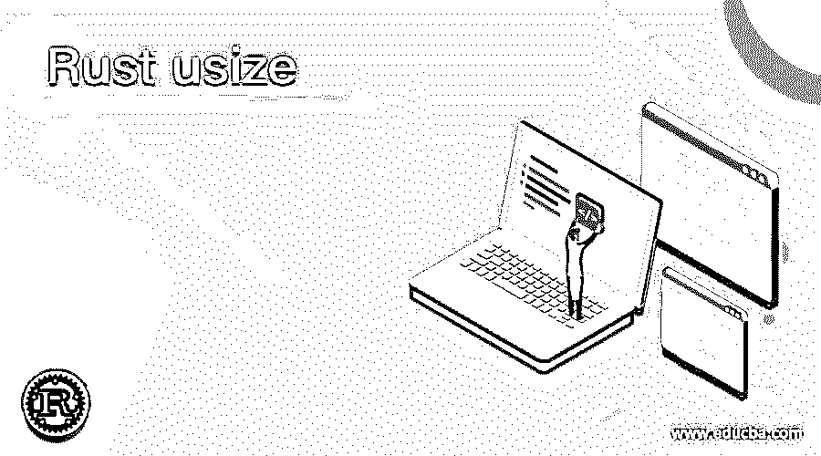
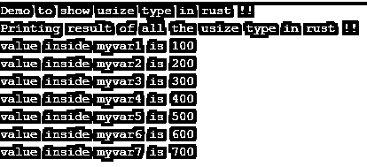

# 生锈使用

> 原文：<https://www.educba.com/rust-usize/>

## Rust usize 简介

它是 rust 的一种原始类型，是基于类似 C 编程语言的指针。如果我们有一个没有确定大小的类型，我们在 rust 中将这些原始类型称为“usize ”,或者在 rust 中称为动态大小的类型。它在 rust 中表示为指针大小的无符号类型。如果我们想知道这种类型的大小，我们可以参考它需要多少字节来表示任何一个内存位置。这在编译时无法预测；这只能在运行时完成，因为它不知道需要多少位或字节，因为也被称为动态大小整数。在接下来的章节中，我们将详细讨论 rust 中的 usize 如何工作以及如何在程序中实现它们。

**语法**

<small>网页开发、编程语言、软件测试&其他</small>

正如我们已经讨论过的，usize 用于表示变量的整数值。让我们来看看它的语法如何在 Rust 中定义 using，以便初学者更好地理解见下文；

`let variable_name:usize = integer_value;`

正如你在上面几行语法中看到的，我们声明了 usize 变量；为此，我们使用 rust 中的类型来定义一个变量。让我们来练习一下语法，以便初学者更好地理解，见下文；

**举例:**

`let demo:usize = 10;`

只需在这里将值赋给 usize 变量；在下一节中，我们将讨论 rust 中 usize 类型的内部工作；这将有助于初学者在高效编程时看到这一点，以便更好地使用。

### usize 函数在 Rust 中是如何工作的？

usize 是 rust 中无符号整数的类型；他们打算在 rust 中处理整数。此外，它们只允许正整数。我们有几种类型的无符号整数，usize 是其中之一，它存储整数，或者我们可以说它的大小是拱形的。这仅仅意味着字体的大小取决于机器的结构。这意味着我们可以说动态大小的类型。让我们详细讨论各种类型的无符号整数，以便更好地理解，见下文；

**1。usize:**usize 的大小由足弓大小决定；它是基于指针的整数类型。下面我们可以看到在 rust 中编程时定义和使用它们的语法。

**举例:**

`let demo:usize = 10;`

**2。u8:** 这个无符号整数类型大小代表 8 位。下面我们可以看到在 rust 中编程时定义和使用它们的语法。

**举例:**

`let demo:u8 = 10;`

**3。u16:** 这个无符号整数类型的大小代表 16 位。下面我们可以看到在 rust 中编程时定义和使用它们的语法。

**举例:**

`let demo:u16 = 10;`

**4。u32:** 这个无符号整数类型大小代表 32 位。下面我们可以看到在 rust 中编程时定义和使用它们的语法。

**举例:**

`let demo:u32 = 10;`

**5。u64:** 这个无符号整数类型大小代表 64 位。下面我们可以看到在 rust 中编程时定义和使用它们的语法。

**举例:**

`let demo:u64 = 10;`

**6。u128:** 这个无符号整数类型大小代表 128 位。下面我们可以看到在 rust 中编程时定义和使用它们的语法。

**举例:**

`let demo:u128 = 10;`

对于 rust 中的 usize 类型，我们有几个常数和运算；让我们详细讨论它们，以便更好地理解和实现，同时在下面的代码中使用它们；

**a. MIN:** 这个常数用来表示 a 使用 integer 所能表示的最小值。下面我们将看到它的语法，看到它的实现见；

**举例:**

`assert_eq!(usize::MIN, your_value);`

**b. MAX:** 这个常数用来表示一个 usize 整数所能表示的最大值。下面我们将看到它的语法，看到它的实现见；

**举例:**

`assert_eq!(usize::MAX, your_value);`

**c. min_value():** 该操作可用于返回整数所能表示的最小值。下面，我们将看到它的语法，看到它的实现见下文；

**举例:**

`(usize::min_value(), 0);`

**d. maz_value():** 该运算可用于返回整数所能表示的最大值。下面，我们将看到它的语法，看到它的实现见下文；

**举例:**

`(usize::max_value(), 0);`

e. count_ones(self): 这将返回二进制表示中 1 的个数。下面，我们将看到它的语法，看到它的实现见下文；

**举例:**

`let variable_name = binary_representationusize;
(variable_name.count_ones(), 3);`

**f. leading_zeros(self):** 这将返回二进制表示中前导零的数量。下面，我们将看到它的语法，看到它的实现见下文；

**举例:**

`let variable_name = binary_representationusize;
(variable_name.leading_zeros(), 3);`

**g. trailing_zeros(self):** 这将返回二进制表示中尾随零的数量。下面，我们将看到它的语法，看到它的实现见下文；

**例:**

`let variable_name = binary_representationusize;
(variable_name.trailing_zeros(), 3);`

### 使用铁锈的例子

1.在这个例子中，我们试图在 rust 中创建 usize 类型变量，并试图使用 println！生锈的方法。我们给它们分配了不同的值来查看输出。这是一个简单的例子，让初学者理解 usize type 如何工作，并在 rust 中实现它。

**举例:**

`fn main() {
println!("Demo to show usize type in rust !!");
let myvar1 :usize = 100;
let myvar2 :usize = 200;
let myvar3 :usize = 300;
let myvar4 :usize = 400;
let myvar5 :usize = 500;
let myvar6 :usize = 600;
let myvar7 :usize = 700;
println!("Printing result of all the usize type in rust !!");
println!("value inside myvar1 is {}",myvar1);
println!("value inside myvar2 is {}",myvar2);
println!("value inside myvar3 is {}",myvar3);
println!("value inside myvar4 is {}",myvar4);
println!("value inside myvar5 is {}",myvar5);
println!("value inside myvar6 is {}",myvar6);
println!("value inside myvar7 is {}",myvar7);
}`

**输出:**

### 结论

因为我们已经了解了如何在编程时使用它，以及它在 rust 中的意义。在 rust 中，它们通常是动态调整大小的整数类型，总是表示正值。但是它们的大小，或者我们可以说是 usize 类型的大小，主要取决于机器的结构；我们不能在编译时决定这一点。

### 推荐文章

这是使用铁锈的指南。这里我们讨论它在 rust 中的意义，以及 usize 函数在 Rust 中是如何工作的，还有例子和输出。您也可以看看以下文章，了解更多信息–

1.  [什么是 Rust 编程？](https://www.educba.com/what-is-rust-programming/)
2.  [网络编程语言](https://www.educba.com/web-programming-languages/)
3.  [Java 中的函数式编程](https://www.educba.com/functional-programming-in-java/)
4.  [R 编程职业](https://www.educba.com/careers-in-r-programming/)

