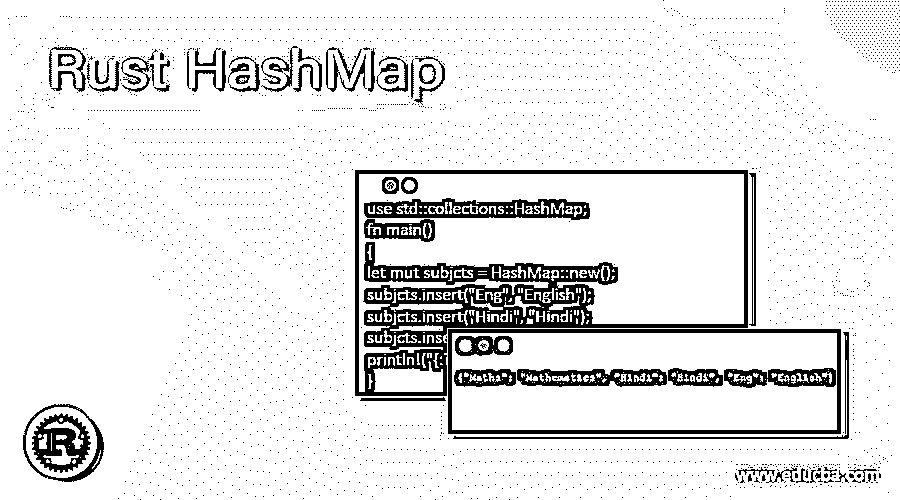
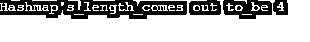
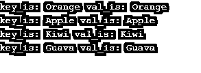

# Rust 散列表

> 原文：<https://www.educba.com/rust-hashmap/>

## Rust 散列表的定义

rust 上的 Hashmap 是一个集合，它利用了一个拥有键-值对的查找表，用于连续存储和检索数据。rust 中的 Hashmap 在程序中使用之前必须遵循一些条件，就像它必须显式导入 inbuild 库集合一样。存储在哈希表中的值或数据称为哈希表。Rust 中的 Hash map 被认为是一种结构，只需在程序开始执行时将集合的名称包含在程序中就可以使用。

**语法:**

<small>网页开发、编程语言、软件测试&其他</small>

Rust hashmap 的语法流程如下:

`let mut name_of_map: HashMap<Type_Of_Key, Type_Of_Value> = HashMap::new();`

在哪里，

*   name_of_map 表示散列表的名称，
*   键的类型表示键的类型。
*   Type_Of_Value 表示 HashMap 的值。

### Rust 中 HashMap 是如何工作的？

*   rust 中的 Hashmap 是一种由查找表和其中的数据组成的结构，这些数据以键和值对的形式存在，用于连续存储和检索数据。
*   Hashmap 需要从 rust 内置库集合中显式导入，然后才能在程序中使用。
*   散列表中的键和值有它们自己的意义，键代表指向散列表中原始数据的指针，值代表散列表中相应的值。
*   整个 hashmap 结构在程序中应用实现逻辑之前导入 std::collections 模块。
*   然后，一旦为 hashmap 实现导入了整个库，就会创建一个实例。
*   Hashmap 函数应用于 hashmap 表，用于执行一些必需的操作，如插入、删除、iter 等。
*   最后，执行程序中列出的操作和函数。
*   Rust HashMap 的执行有很多操作，比如插入、删除、迭代、添加等等。
*   哈希表中的键和值以某种方式帮助做出关于元素可访问性的决定。
*   HashMap 使用哈希算法，选择哈希算法是为了抵抗 HashDos 攻击。
*   该算法主要是随机散列的，然后用于生成一些高质量的种子，以由主机提供安全的随机性，而不妨碍程序的执行。
*   使用的默认哈希算法是 SipHash 1-3，它与实际实现的算法完全不同。
*   这种散列算法的性能在中等大小的密钥和其他算法的竞争力方面不同于实际的散列算法，这些算法将优于字符串中具有整数的小密钥，这些小密钥不会保护任何攻击，例如散列操作。
*   这些散列算法也可以使用 default、with_hasher 和 with_capacity_and_hasher 方法根据 HashMap 进行替换。
*   存在一个逻辑，如果两个键相等，那么它们的散列值和键也必须相等。

### 例子

让我们讨论 Rust 散列表的例子。

#### 示例#1

这个程序演示了 rust hash map，其中创建了一些主题，并在它的顶部给出了一些要插入或添加到给定的 hash map 集合中的值，如输出中所示。

**代码:**

`use std::collections::HashMap;
fn main()
{
let mut subjcts = HashMap::new();
subjcts.insert("Eng", "English");
subjcts.insert("Hindi", "Hindi");
subjcts.insert("Maths", "Mathematics");
println!("{:?}", subjcts);
}`

**输出:**

#### 实施例 2

这个程序演示了输出中显示的给定 hashmap 的字符串长度。

**代码:**

`use std::collections::HashMap;
fn main() {
let mut fruits = HashMap::new();
fruits.insert("Apple", "Apple");
fruits.insert("Guava", "Guava");
fruits.insert("Orange", "Orange");
fruits.insert("Kiwi", "Kiwi");
println!("Hashmap's_length_comes out to_be {:?}",fruits.len());
}`

**输出:**

#### 实施例 3

这个程序演示了 hashmap，其中对应于实际值的值一旦匹配就被检索，并返回与输出中所示相同的值。

**代码:**

`use std::collections::HashMap;
fn main() {
let mut fruits = HashMap::new();
fruits.insert("Apple", "Apple");
fruits.insert("Guava", "Guava");
fruits.insert("Orange", "Orange");
fruits.insert("Kiwi", "Kiwi");
let num = fruits.get( & "Kiwi");
println!("{:?}", num);
}`

**输出:**

#### 实施例 4

这个程序演示了 hashmap，其中哈希表中的所有值都被迭代，并分别显示在一组键和值上，如输出所示。

**代码:**

`use std::collections::HashMap;
fn main()
{
let mut fruits = HashMap::new();
fruits.insert("Apple", "Apple");
fruits.insert("Guava", "Guava");
fruits.insert("Orange", "Orange");
fruits.insert("Kiwi", "Kiwi");
for (key, val) in fruits.iter() {
println!("key_is: {} val_is: {}", key, val);
}
}`

**输出:**

#### 实施例 5

这个程序演示了检查值是否实际上存在于集合的 hashmap 中，如输出所示。

**代码:**

`use std::collections::HashMap;
fn main() {
let mut fruits = HashMap::new();
fruits.insert("Apple", "Apple");
fruits.insert("Guava", "Guava");
fruits.insert("Orange", "Orange");
fruits.insert("Kiwi", "Kiwi");
if fruits.contains_key( & "Orange")
{
println!("This fruits is based on hashmap_fruits.");
}
}`

**输出:**

#### 实施例 6

这个程序演示了 hashmap，其中的值来自一个特定的 hashmap，带有相应的键，如输出所示。

**代码:**

`use std::collections::HashMap;
fn main() {
let mut fruits = HashMap::new();
fruits.insert("Guava", "Guava");
fruits.insert("Apple", "Apple");
fruits.insert("Banana", "Banana");
match fruits.get( & "Banana") {
Some(vl_0) => {
println!("Value by Banana is: {}", vl_0);
}
None => {
println!("no much to_be found.");
}
}
}`

**输出:**

#### 实施例 7

这个程序演示了 hashmap 中存在的水果或元素的引用，如果它们不匹配并且没有被找到，但是既然找到了，它就显示在输出中。

**代码:**

`use std::collections::HashMap;
fn main() {
let mut fruits = HashMap::new();
fruits.insert("Apple", "Apple");
fruits.insert("Mango", "Mango ");
fruits.insert("Banana", "Banana");
let reference = fruits.get( & "Mango");
println!("{:?}", reference);
}`

**输出:**

#### 实施例 8

这个程序演示了 Rust Hashmap，其中对水果集合的引用不匹配，因此不能提供输出中显示的确切引用。

**代码:**

`use std::collections::HashMap;
fn main()
{
let mut fruits = HashMap::new();
fruits.insert("Apple", "Apple");
fruits.insert("Mango", "Mango ");
fruits.insert("Banana", "Banana");
let reference = fruits.get( & "Orange");
println!("{:?}", reference);
}`

**输出:**

### 结论

Rust 中的 Hashmap 起着非常关键和强大的作用，因为它有助于使散列过程与相应的键和值交互。从程序员的角度来看，在实现和执行包括 hashmap 在内的整个程序时，插入、删除和遍历迭代等操作的整体性能是一种很好的体验。

### 推荐文章

这是一个 Rust 散列表的指南。这里我们讨论定义，HashMap 在 Rust 中是如何工作的？以及代码实现的例子。您也可以看看以下文章，了解更多信息–

1.  [Java 字符串等于](https://www.educba.com/java-string-equals/)
2.  [C++哈希表](https://www.educba.com/c-plus-plus-hash-table/)
3.  [C++ free()](https://www.educba.com/c-plus-plus-free/)
4.  [Java GUI 框架](https://www.educba.com/java-gui-framework/)

