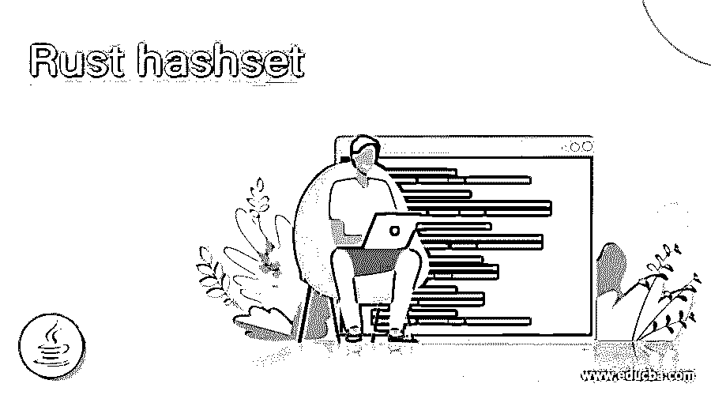
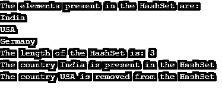

# 休息一下哈希

> 原文：<https://www.educba.com/rust-hashset/>

## Rust hashset 简介

一个集合用来保存一个唯一的值，同时不允许集合中有重复的值，这个集合称为 Rust 上的 HashSet。它与 HashMap 的不同之处在于，它在集合中不包含任何键-值对，并且必须直接访问集合中的元素。HashSet 的结构是在 Rust 的 std::collections 中定义的，它将在程序开始时被导入，以便能够利用 HashSet 结构，我们利用静态方法 new()来创建一个 HashSet。

**在 Rust 中创建 HashSet 的语法如下:**

<small>网页开发、编程语言、软件测试&其他</small>

`let mut HashSet_name= HashSet::new();
where mut is a keyword to define mutable variable,
HashSet_name is the variable representing the name of the HashSet and
new() is the static method used to create a HashSet`

### 锈中哈希特的加工

*   HashSet 是一个集合，用于保存惟一的值，同时不允许 Rust 中有重复的值。
*   HashSet 中的值必须直接访问，HashSet 不包含任何键值对。
*   HashSet 的结构是在 Rust 的 std::collections 中定义的，为了能够在程序中使用 HashSet 结构，一开始就要将它导入到程序中。
*   我们利用静态方法 new()来创建一个 HashSet。
*   HashSet 的实现可以使用 Rust 库中的几个函数来完成。
*   Rust 库中可用的函数有 insert()函数、len()函数、get()函数、iter()函数、contains()函数、remove()函数。
*   insert()函数用于将数据插入到 HashSet 中。
*   len()函数用于获取 HashSet 的长度或 HashSet 中的元素数量。
*   如果 HashSet 中有与该值匹配的值，get()函数将返回对该值的引用。
*   iter()函数用于按照我们选择的随机顺序访问 HashSet 的所有元素。
*   如果哈希表中有值，contains()函数将返回值。
*   remove()函数用于从 HashSet 中删除一个元素，

### 铁锈集示例

以下是下面提到的例子:

#### 示例#1

要生成的 Rust 程序，用于创建一个 HashSet 并将元素插入到 HashSet 中，并将 HashSet 中的元素显示为程序的输出:

`//importing std::collections to be able to make use of HashSet in the program
use std::collections::HashSet;
fn main()
{
//defining a mutable variable called country to store the created HashSet
let mut country = HashSet::new();
//using insert() function to insert the elements in the HashSet
country.insert("India");
country.insert("USA");
country.insert("Germany");
//displaying the elements of the HashSet as the output on the screen
println!("The elements present in the HashSet are:");
println!("{:?}", country);
}`

上述程序的输出如下面的快照所示:

在上面的程序中，我们导入了集合 std::collections，以便能够在程序中使用 HashSet。然后我们创建一个新的 HashSet，并定义一个名为 country 的可变变量来存储创建的 HashSet。然后我们使用 insert()函数在 HashSet 中插入元素。然后 HashSet 的元素作为输出显示在屏幕上。

#### 实施例 2

Rust 程序创建一个 HashSet 并演示 insert()函数、len()函数、get()函数、remove()函数并包含()函数，将数据插入到 HashSet 中，确定 HashSet 的长度，确定 HashSet 中是否存在某个元素，然后删除某个元素并确认它是否被删除，然后将结果作为输出显示在屏幕上:

`//importing std::collections to be able to make use of HashSet in the program
use std::collections::HashSet;
fn main()
{
//defining a mutable variable called country to store the created HashSet
let mut country = HashSet::new();
//using insert() function to insert the elements in the HashSet
country.insert("India");
country.insert("USA");
country.insert("Germany");
//displaying the elements of the HashSet using iter() function as the output on the screen
println!("The elements present in the HashSet are:");
for coun in country.iter(){
println!("{}", coun);
}
//displaying the length of the HashSet
println!("The length of the HashSet is: {}", country.len());
//using get function to determine if a given element is present in the HashSet or not
match country.get(& "India") {
Some(value) =>  {
println!("The country {} is present in the HashSet", value);
}
None => {
println!("The country is not present in the HashSet");
}
}
//using remove() function to remove an element from the HashSet and checking if the    element is removed or not using contains() function
country.remove( & "USA");
if country.contains( & "USA") {
println!("The country USA is not removed from the HashSet");
}
else {
println!("The country USA is removed from the HashSet");
}
}`

上述程序的输出如下面的快照所示:

在上面的程序中，我们导入了集合 std::collections，以便能够在程序中使用 HashSet。然后我们创建一个新的 HashSet，并定义一个名为 country 的可变变量来存储创建的 HashSet。然后我们使用 insert()函数在 HashSet 中插入元素。然后，使用 iter()函数将 HashSet 元素显示为屏幕上的输出。然后我们使用 len()函数在屏幕上显示 HashSet 的长度作为输出。然后，我们使用 get()函数来确定一个元素是否存在于 HashSet 中。然后我们使用 remove()函数从 HashSet 中删除一个元素，然后我们使用 contains()函数确认是否使用 remove()函数删除了该元素。

### 结论

在本文中，我们已经通过 Rust 中 HashSet 的定义、语法和工作方式了解了 Rust 中 HashSet 的概念，并使用相应的编程示例及其输出来演示它们。

### 推荐文章

这是一个指南锈哈希集。在这里，我们通过 HashSet 的定义、语法和工作方式以及相应的编程示例来讨论 Rust 中 HashSet 的概念。您也可以看看以下文章，了解更多信息–

1.  [什么是 Rust 编程？](https://www.educba.com/what-is-rust-programming/)
2.  [C++哈希表](https://www.educba.com/c-plus-plus-hashset/)
3.  [Java 中的 HashSet](https://www.educba.com/hashset-in-java/)
4.  [Java 哈希码()](https://www.educba.com/java-hashcode/)

