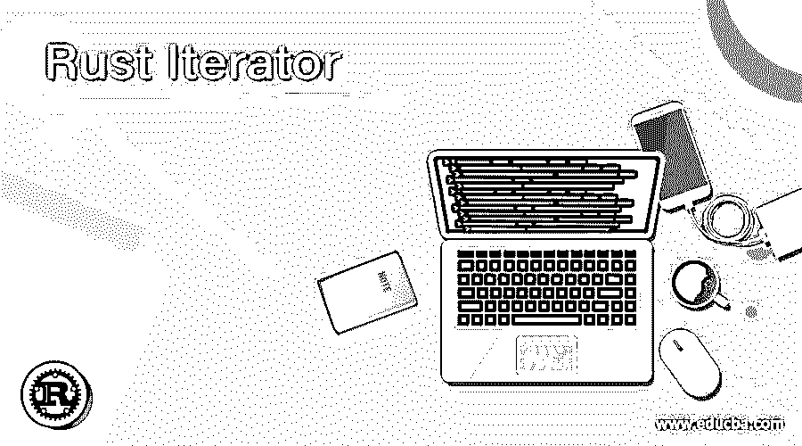
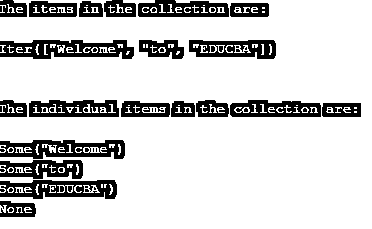
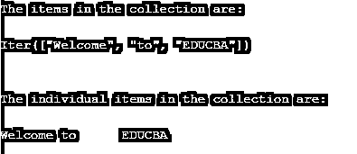
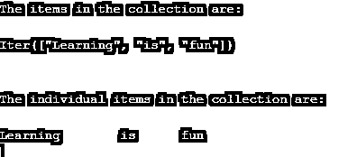

# Rust 迭代器

> 原文：<https://www.educba.com/rust-iterator/>

## Rust 迭代器简介

每当我们想要迭代向量、地图、数组等值的集合时。我们在 Rust 中使用迭代器，在 Rust 的标准库中定义的迭代器特征由迭代器实现，迭代器对象中的值称为项目，迭代器中的项目可以使用名为 next()方法的方法来遍历，当迭代器到达集合末尾时，该方法返回 None 值，一旦迭代器特征实现，也可以使用带有 in 关键字的 for 循环来遍历集合。

**Rust 中声明迭代器的语法如下:**

<small>网页开发、编程语言、软件测试&其他</small>

`let mut iterator_name = collection_name.iter();`

其中 mut 是表示可变变量的关键字，

*   iterator_name 是迭代器的名称。
*   collection_name 是数组、贴图或向量集合的名称。

### Rust 中迭代器的工作原理

Rust 中迭代器的工作方式如下:

*   可以使用称为迭代器的对象生成一个值序列，这样就可以循环或迭代它们。
*   迭代器可以迭代一组值，如映射、数组、向量等。
*   Rust 标准库中定义的迭代器特征是由迭代器实现的。
*   迭代器对象中的值称为项目。
*   迭代器中的项可以用一个叫做 next()的方法来遍历。
*   当迭代器到达集合末尾时，next()方法返回 None 值。
*   一旦实现了迭代器特征，也可以使用带有 in 关键字的 for 循环遍历集合。

### 例子

让我们讨论 Rust 迭代器的例子。

#### 示例#1

Rust 程序演示迭代器，在该程序中，我们声明一个数组，使用迭代器从数组中读取值，并使用 next()方法遍历数组中的下一个元素，并在屏幕上显示输出:

**代码:**

`fn main()
{
//declaring an array of strings and storing it in a variable called arrayname
let arrayname = ["Welcome","to","EDUCBA"];
//defining an iterator trait and storing it in a mutable variable called iteratorname
let mut iteratorname = arrayname.iter();
//printing all the elements of the array using iterator object
println!("The items in the collection are:\n");
println!("{:?}",iteratorname);
println!("\n");
//displaying individual items in the collection by traversing through the collection until the end of the collection is reached
println!("The individual items in the collection are:\n");
println!("{:?}",iteratorname.next());
println!("{:?}",iteratorname.next());
println!("{:?}",iteratorname.next());
println!("{:?}",iteratorname.next());
}`

上述程序的输出如下面的快照所示:

在上面的程序中，我们声明了一个字符串数组，并将其存储在一个名为 array name 的变量中。然后我们定义一个迭代器特征，并把它存储在一个叫做迭代器名的可变变量中。然后我们使用迭代器对象在屏幕上输出数组的所有元素。然后通过遍历集合直到到达集合的结尾来显示集合中的各个项目。输出显示在上面的快照中。

#### 实施例 2

Rust 程序，演示迭代器，其中我们声明一个数组，并使用迭代器从数组中读取值，并使用 for 循环和 in 关键字读取数组中的每一项，并在屏幕上显示输出:

**代码:**

`fn main()
{
//declaring an array of strings and storing it in a variable called arrayname
let arrayname = ["Welcome","to","EDUCBA"];
//defining an iterator trait and storing it in a mutable variable called iteratorname
let iteratorname = arrayname.iter();
//printing all the elements of the array using iterator object
println!("The items in the collection are:\n");
println!("{:?}",iteratorname);
println!("\n");
//displaying individual items in the collection by traversing through the collection using for loop
println!("The individual items in the collection are:\n");
for eachitem in iteratorname
{
print!("{}\t",eachitem);
}
}`

上述程序的输出如下面的快照所示:

在上面的程序中，我们声明了一个字符串数组，并将其存储在一个名为 array name 的变量中。然后我们定义一个迭代器特征，并把它存储在一个叫做迭代器名的可变变量中。然后我们使用迭代器对象在屏幕上输出数组的所有元素。然后通过使用 for 循环沿着 within 关键字遍历集合来显示集合中的各个项。输出显示在上面的快照中。

#### 实施例 3

Rust 程序演示了迭代器，在该程序中，我们声明了一个数组，并使用迭代器从数组中读取值，并使用 for 循环沿着 within 关键字读取数组中的每一项，并在屏幕上显示输出:

**代码:**

`fn main()
{
//declaring an array of strings and storing it in a variable called arrayname
let arrayname = ["Learning","is","fun"];
//defining an iterator trait and storing it in a mutable variable called iteratorname
let iteratorname = arrayname.iter();
//printing all the elements of the array using iterator object
println!("The items in the collection are:\n");
println!("{:?}",iteratorname);
println!("\n");
//displaying individual items in the collection by traversing through the collection using for loop
println!("The individual items in the collection are:\n");
for eachitem in iteratorname
{
print!("{}\t",eachitem);
}
}`

上述程序的输出如下面的快照所示:

在上面的程序中，我们声明了一个字符串数组，并将其存储在一个名为 arrayname 的变量中。然后我们定义一个迭代器特征，并将其存储在一个名为 iteratorname 的可变变量中。然后我们使用迭代器对象在屏幕上输出数组的所有元素。然后通过使用 for 循环和 in 关键字遍历集合来显示集合中的各个项。输出显示在上面的快照中。

### 结论

在本文中，我们学习了 Rust 中迭代器的概念——通过 Rust 中迭代器的定义、语法和工作方式，以及相应的编程示例和输出来演示它们。

### 推荐文章

这是一个指南 Rust 迭代器。这里我们讨论 Rust 中迭代器的介绍、语法、工作原理，以及代码实现的例子。您也可以看看以下文章，了解更多信息–

1.  [Java 数组迭代器](https://www.educba.com/java-array-iterator/)
2.  [Python 中的迭代器](https://www.educba.com/iterators-in-python/)
3.  [c#中的迭代器](https://www.educba.com/iterators-in-c-sharp/)
4.  [c++中的迭代器](https://www.educba.com/iterator-in-c-plus-plus/)

