# Prolog 运算符

> 原文：<https://www.educba.com/prolog-operator/>

## 序言运算符简介

*   prolog 运算符是一个函数，用于操作和处理编程操作数或变量。
*   prolog 运算符是一个符号字符，用于算术、逻辑和比较运算。
*   对于编程语言来说，它是在两个值和对象之间采取行动的符号。
*   prolog 运算符是一个表达式，用于执行算术、逻辑、比较和其他格式中的两个或两个以上的值。
*   prolog 操作符是一个符号函数，用于操作控制台中的“pl”文件值。
*   prolog 运算符是 prolog 控制台的一个功能，用于操作文件变量、对象和给定的操作数。

### Prolog 运算符类型

*   prolog 运算符是执行算术、逻辑、比较和其他运算的函数。
*   prolog 运算符为不同的运算分类了几个运算符。
*   下面给出了它的类型和子类。

### Prolog 算术运算符

该运算符用于算术表达式，如加、减等。

算术运算符类型如下所示。

<small>网页开发、编程语言、软件测试&其他</small>

*   加法(+)运算符
*   减法(-)运算符
*   乘法(*)运算符
*   除法(%)运算符
*   幂(**)运算符
*   整数除法(//)运算符
*   模数(mod)运算符
*   平方根(sqrt)运算符
*   最大值运算符

### Prolog 比较运算符:

*   该运算符用于比较两个操作数和变量，例如相等。

比较运算符类型如下所示。

*   大于(>)运算符
*   小于(
*   大于等于(> =)运算符
*   小于等于(=
*   等号(=:=)运算符
*   不等于(=\=)运算符

**三角算子:**

该运算符用于运算操作数和变量，以找到正切值和余切值。

三角运算符类型如下所示。

1.  正弦算子
2.  COS 运算符

### 用例子解释运算符类型

算术运算符类型示例如下所示。

#### Prolog 算术运算符:

**加法(+)运算符:**

*   该运算符用于加法运算。
*   加法运算示例如下所示。

**例子**

`| ?- ADD is 45 + 12.`

**输出:**

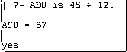

**减法(-)运算符:**

*   该运算符用于减法运算。
*   减法运算示例如下所示。

**例子**

`| ?- SUB is 45 - 12.`

**输出:**

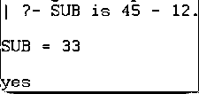

**乘法(*)运算符:**

*   该运算符用于乘法运算。
*   乘法运算示例如下所示。

**例子**

`| ?- MUL is 45 * 12.`

**输出:**

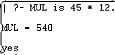

**除法(/)运算符:**

*   该运算符用于除法运算。
*   除法运算示例如下所示。

**例子**

`| ?- Div is 45 / 12.`

**输出:**

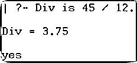

**幂(**)运算符:**

*   该运算符用于功率运算。
*   电源操作示例如下所示。

**例子**

`| ?- POW is 12 ** 2.`

**输出:**

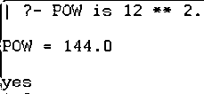

**例子**

`| ?- POW is 12 ^ 2.`

**输出:**

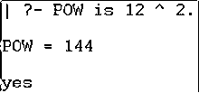

**整数除法(//)运算符:**

*   该运算符用于数字除法运算。
*   整数除法运算示例如下所示。

**例子**

`| ?- IntDiv is 45 // 12.`

**输出:**

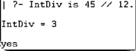

**模数(mod)运算符:**

*   该运算符用于提醒操作的除法运算。
*   模数运算示例如下所示。

**例子**

`| ?- Mod is 45 mod 12.`

**输出:**

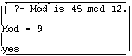

**平方根(sqrt)运算符:**

*   该运算符用于计算值的平方根。
*   平方根运算示例如下所示。

**例子**

`| ?- R is 144,
S is sqrt(R).`

**输出:**

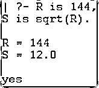

**最大值(max)运算符:**

该运算符用于查找两个值中的最大值。

max 运算符示例如下所示。

**例子**

`| ?- R is 45, S is 48,
T is max(R, S).`

**输出:**

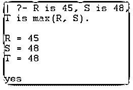

#### Prolog 比较运算符:

比较运算符类型示例如下所示。

**大于(>)运算符**

*   该运算符用于比较两个变量的“大于”值运算。
*   大于号(>)运算符示例如下所示。

**例 1**

`| ?- 13 * 2 > 12 + 13 .`

**输出:**

**例 2**

`| ?- 12 + 13 > 13 * 2.`

**输出:**

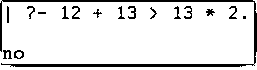

**小于(<)运算符**

*   该运算符用于将两个变量进行“小于”值比较运算。
*   小于(

**例 1**

`| ?- 12 + 13 < 13 * 2.`

**输出:**

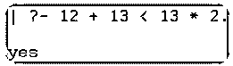

**例 2**

`| ?- 13 * 2 < 12 + 13 .`

**输出:**

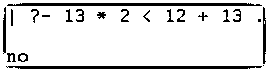

#### 大于等于(> =)运算符

*   该运算符用于比较两个变量的“大于等于”值运算。
*   大于号(> =)运算符示例如下所示。

**例 1**

`| ?- 13 * 2 >= 12 + 13 .`

**输出:**

**例 2**

`| ?- 12 + 13 >= 13 * 2.`

**输出:**

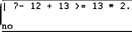

**例 3**

`| ?- 12 + 13 >= 13 + 12.`

**输出:**

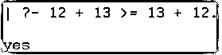

#### 小于等于(=

*   该运算符用于比较两个变量的“小于等于”值运算。
*   小于(=

**例 1**

`| ?- 12 + 13 =< 13 * 2.`

**输出:**

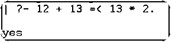

**例 2**

| ? - 13 * 2 =< 12 + 13 .

**输出:**

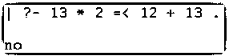

**例 3**

`| ?- 12 + 13 =< 13 + 12.`

**输出:**

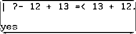

#### 等号(=:=)运算符

该运算符用于比较两个变量的“等于”值运算。

等号(=:=)运算符示例如下所示。

**例 1**

`| ?- 12 + 13 =:= 13 + 12.`

**输出:**

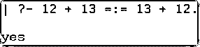

**例 2**

`| ?- 12 + 13 =:= 13 + 14.`

**输出:**

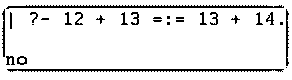

#### 不等于(=\=)运算符

*   该运算符用于比较两个变量的“不等于”值运算。
*   不等于(=\=)运算符示例如下所示。

**例 1**

`| ?- 12 + 13 =\= 13 + 12.`

**输出:**

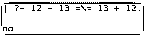

**例 2**

`| ?- 12 + 13 =\= 13 + 14.`

**输出:**

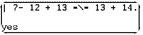

#### Prolog 三角运算符:

三角运算符类型示例如下所示。

**sin()运算符**

*   该运算符用于计算三角模式的正切值。
*   sin 运算符示例如下所示。

**例 2**

`| ?- R is 45,
S is sin(R).`

**输出:**

**cos()运算符**

*   该运算符用于计算三角模式的切线角度。
*   COS()运算符示例如下所示。

**例 2**

`| ?- R is 45,
S is cos(R).`

**输出:**

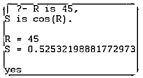

### 结论

*   prolog 运算符有助于处理多个变量和对象。
*   使用 prolog 运算符的算术、比较、三角、逻辑运算。
*   这个操作符使应用程序变得简单、用户友好、优雅。

### 推荐文章

这是一本日志操作员指南。这里我们讨论定义，不同类型的 Prolog 运算符，并以代码实现为例。您也可以看看以下文章，了解更多信息–

1.  [C++运算符=()](https://www.educba.com/c-plus-plus-operator-equal/)
2.  [SQL NOT 运算符](https://www.educba.com/sql-not-operator/)
3.  [JavaScript 中的一元运算符](https://www.educba.com/unary-operators-in-javascript/)
4.  [OpenCV sobel 算子()](https://www.educba.com/opencv-sobel-operator/)

