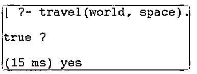
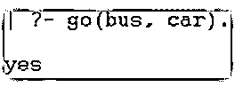
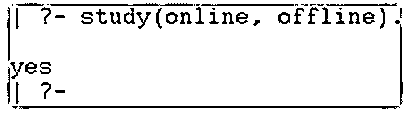
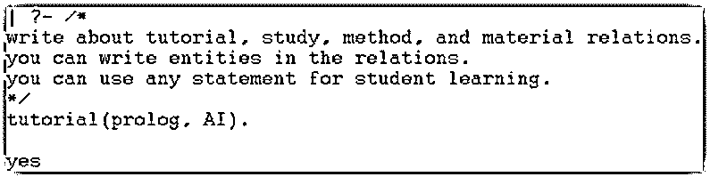
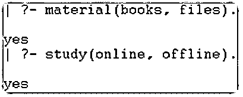
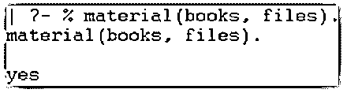
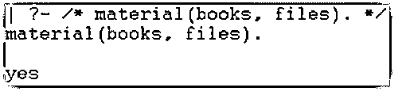

# 序言注释

> 原文：<https://www.educba.com/prolog-comments/>

## 序言注释介绍

序言注释是一种编程特性，用于显示有关编码或一段编码的信息。prolog 注释是一个符号或一组符号，用于显示源代码和 prolog 程序的注释。它们是 prolog 源代码的一部分，但不由 Prolog 编译器和解释器编译和运行。序言注释是用于使其他程序员和用户理解序言程序和源代码的注释。

它们的特点是在 prolog 编程语言上编写额外的信息，以便理解人类和非程序员。prolog 注释用于生成可读的程序或编程逻辑的一部分。它们是单行或多行表达式的结构化注释。

<small>网页开发、编程语言、软件测试&其他</small>

### 序言注释的语法

序言注释用于“pl”文件的单行或多行。

对于 prolog 编程，可以使用行注释或块注释。

序言行注释语法如下:

`% writes annotation and information`

**行注释说明:**

*   单行注释需要百分号“%”。
*   注释信息写在百分号后面。

序言块注释语法如下:

`/*
Write block or paragraph description of the source code
*/`

**块注释说明:**

*   “/*”符号是注释块开始写入的符号。
*   “*/”符号是注释块的结尾。
*   注释信息写在注释块内部。

控制台的序言行注释语法如下:

`% relation (value1, value2, values).`

**解释** **的区块注释:**

*   单行注释需要百分号“%”。
*   在块注释内编写临时序言代码。
*   例如，您在行注释中编写 relation 及其值，但它在控制台中不起作用。

控制台的 prolog 块注释语法如下:

`/*
relation (value1, value2, values).
relation (value1, value2, values).
relation (value1, value2, values).
*/`

**块注释说明:**

*   “/*”和“*/”符号用于开始和结束注释块。
*   在块注释内编写临时序言代码。
*   您在块注释中编写了多个关系和值，但是它在控制台中不起作用。

### 在 Prolog 中注释是如何工作的？

下面给出了注释在 prolog 中的工作方式:

Prolog 注释在“pl”文件中有效

*   创建一个扩展名为“pl”的文件。

**示例:main.pl**

*   为单行信息写单行注释。

%这个语句写的是旅行和地方。

*   您可以在 prolog 注释之后编写代码。

`travel (India, England).`

多行信息的写块命令。

`/*
Write about a tutorial, study, method, and material relations.
You can write entities in the relations.
You can use any statement for student learning.
*/`

您可以在 prolog 注释之后编写代码。

`tutorial (prolog, AI).
study (online, offline).`

**Prolog 注释在控制台中工作:**

*   打开 prolog 控制台或解释器。
*   设置“pl”文件的目录路径。
*   使用给定的 prolog 文件。

**【主】。**

*   为单行信息写单行注释。
*   您可以在 prolog 注释之后编写代码。

`| ?- % this statement write about travel and places.
travel(India, England).
yes
| ?-`

*   多行信息的写块命令。
*   您可以在 prolog 注释之后编写代码。

`| ?- /*
write about a tutorial, study, method, and material relations.
you can write entities in the relations.
you can use any statement for student learning.
*/
tutorial(prolog, AI).
yes`

### 序言注释的示例

下面提到了不同的例子:

#### 示例#1

单行 prolog 注释示例和输出如下所示。

**文件:main.pl**

%这个语句写的是旅行和地方。
旅行(印度、英国)。
旅行(世界，太空)。

**代码:**

`| ?- travel(world, space).`

**输出:**

#### 实施例 2

多行 prolog 注释示例和输出如下所示。

**文件:main.pl**

%该语句将相同的关系名写入不同的实体。
%这个“去”关系写的是地点和方式实体。
去(学校，大学)。
走(公共汽车，汽车)。

**代码:**

`| ?- go(bus, car).`

**输出:**

#### 实施例 3

单行 prolog 注释示例和输出如下所示。

**文件:main.pl**

/*
写一个教程，学习，方法，材料关系。
你可以在关系中写实体。
学生学习可以使用任何语句。
*/
教程(prolog，AI)。
学习(线上、线下)。
方法(文章、视频)。
材料(书籍、文件)。

**代码:**

`| ?- study(online, offline).`

**输出:**

#### 实施例 4

多行 prolog 注释示例和输出如下所示。

**文件:main.pl**

/*
写一个教程，学习，方法，材料关系。
你可以在关系中写实体。
学生学习可以使用任何语句。
*/
教程(prolog，AI)。
学习(线上、线下)。
/*
可以在关系中写实体。
您可以为学生学习使用任何语句。
*/
方法(文章、视频)。
材料(书籍、文件)。

**代码:**

`| ?- study(online, offline).`

**输出:**

#### 实施例 5

带有控制台示例的单行 prolog 注释和输出如下所示。

**代码:**

`% this statement writes about travel and places.
travel(India, England).`

**输出:**

#### 实施例 6

带有控制台示例的 prolog 块注释和输出如下所示。

**代码:**

`/*
write about a tutorial, study, method, and material relations.
you can write entities in the relations.
you can use any statement for student learning.
*/
tutorial(prolog, AI).`

**输出:**

#### 实施例 7

关系的序言注释在文件示例中，输出如下所示。

**文件:main.pl**

%学习(在线、离线)。
/*
可以在关系中写实体。
学生学习可以使用任何语句。
方法(文章、视频)。
物质(书籍、文件)。
*/

**代码:**

`| ?- material(books, files).
yes
| ?- study(online, offline).
Yes`

**输出:**

#### 实施例 8

prolog 行注释了控制台示例，输出如下所示。

**代码:**

`| ?- % material(books, files).`

**输出:**

#### 实施例 9

带有控制台示例的 prolog 块注释和输出如下所示。

**代码:**

`| ?- /* material(books, files). */`

**输出:**

### 结论

序言注释用于避免源代码对其他用户的复杂性。此外，prolog 注释有助于显示关于编程语言的额外信息。

### 推荐文章

这是序言注释的指南。这里我们讨论引言；在 prolog 中注释是如何工作的？和示例。您也可以看看以下文章，了解更多信息–

1.  [XPath 节点](https://www.educba.com/xpath-nodes/)
2.  [人工智能如何工作？](https://www.educba.com/how-artificial-intelligence-works/)
3.  [网络编程语言](https://www.educba.com/web-programming-languages/)
4.  [sprintf Python](https://www.educba.com/sprintf-python/)

