# 序言列表

> 原文：<https://www.educba.com/prolog-list/>

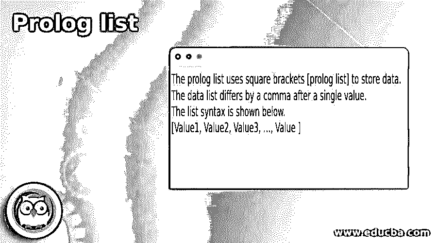

## 序言列表介绍

*   prolog list 是一个函数，用于收集多个值以对大数据进行操作。
*   列表是用于对实体进行分组以处理应用程序数据的数据结构。
*   列表是使用括号存储多个数据项的集合。
*   列表是一种数据结构，使用方括号创建不同值的组。
*   序言列表用于存储各种数据项，不同之处在于使用了逗号符号。
*   序言列表用于大值的插入、删除、更新和追加操作。
*   列表是处理和操作相似或不同类别的不同实体的功能。

**语法**

*   序言列表使用方括号[序言列表]来存储数据。
*   数据列表在单个值后有一个逗号。
*   列表语法如下所示。
*   [值 1，值 2，值 3，…，值]
*   描述
    *   序言列表包含类似类别的值。
    *   方括号包含值，并使用逗号区分这些值。

*   序言空列表语法如下所示。
*   [ ]
*   描述
    *   序言列表为空或非空。
    *   如果列表为空，则括号中不包含任何值。

*   序言列表与头部一起工作。
*   [Head | value1，value2，value3]
*   这个列表有一个尾巴。
*   [Head| tail1，tail2，tail3]
*   描述
    *   竖线分隔列表的头部和尾部。
    *   第一个值称为列表头。
    *   除了第一个值之外的其他值称为尾值。

*   列表使用头部处理变量。

`[Head|_] = [Head| value1, value2, value].`

<small>网页开发、编程语言、软件测试&其他</small>

*   列表使用尾部来处理变量。

`Tail = [value1, value2, value] Prolist = [value| Tail].`

*   描述
    *   prolog 创建变量并包含带有值的列表。
    *   如果这个变量列表在主列表中是必需的，那么把它包含在头部或尾部。

*   下面给出了一些序言列表语法。

`[v1, v2 | [v3] ] [v1, v2| [v3] ] [v1, v2, v3| [ ] ]`

### Prolog 中的列表是如何工作的？

Prolog 注释在“pl”文件中有效

*   创建一个扩展名为“pl”的文件。

例如:main。pl

*   创建一个包含多个实体的列表。

`Plist([Australia, india, japan, UK, USA]).`

Prolog 注释在控制台中有效

*   打开控制台或解释器。
*   设置“pl”文件的目录路径。
*   使用给定的 prolog 文件。

`[main].`

*   使用控制台中的列表。

`Plist([Australia, india, japan, UK, USA]).`

*   直接使用 prolog 控制台中的列表。

`[1, 2, 3, 4, 5] = [Australia, India, Japan, UK, USA].`

Prolog 注释在控制台中有效。

*   方法 1:使用多个变量。

`[1, 2, 3, 4, 5] = [Australia, India, Japan, UK, USA].`

*   “1”是分配给澳大利亚的号码。

`Australia = 1`

*   数字“2”被分配给印度。

`India = 2`

*   数字“3”被分配给日本。

`Japan = 3`

*   数字“4”被分配给英国。

`UK = 4`

*   “5”这个数字被分配给美国。

`USA = 5`

*   方法 2:使用单个变量。

`A = [Australia, India, Japan, UK, USA].`

### 例子

下面是下面提到的例子

**Example1** :单变量示例和输出的基本列表如下。

*   Prolog 控制台

`| ?- A = [Australia, India, Japan, UK, USA].`

**输出**

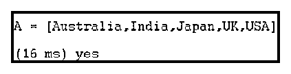

*   Prolog 控制台

`| ?- C = [1, 2, 3, 4, 5, 6, 7].`

**输出**

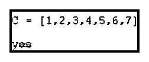

*   Prolog 控制台

`| ?- D = [India, 1, USA, uk].`

**输出**

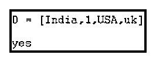

*   描述:
    *   该列表包含数字、小写和大写格式的值。
    *   该列表指定一个变量，并显示为一个程序。

**Example2** :多变量示例和输出的基本序言列表如下。

`[1, 2, 3, 4, 5] = [Australia, India, Japan, UK, USA].`

**输出**

*   Prolog 控制台

`[A, B, C, D, E] = [Australia, India, Japan, UK, USA].`

**输出**

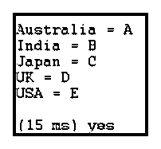

*   Prolog 控制台

`[A, B, C, D, E] = [australia, india, japan, uk, usa].`

**输出**

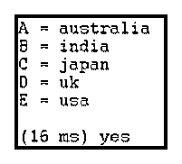

*   描述:
    *   该列表包含数字、小写和大写格式的值。
    *   该列表指定多个变量，并显示变量的值。

**Example3** :带尾例的列表，输出如下图。

`| ?- Tail = [australia, india, japan, england, america],
C = [ countries | Tail].`

**输出**

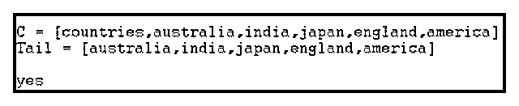

*   描述:
    *   序言列表使用竖线指定头部和尾部。
    *   除了第一个值之外的其他值被称为列表的尾部。

**Example4** :单变量表头示例列表。

`| ?- [Head|_] = [australia, india, japan, england, america].`

**输出**

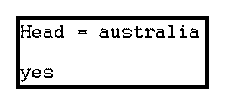

*   描述:
    *   列表使用竖线指定头部和尾部。
    *   第一个值称为列表头。

*   Example5:包含所需实体示例和输出的列表如下所示。
    *   Prolog 控制台

`| ?- [_,Value|_] = [australia, india, japan, england, america].`

**输出**

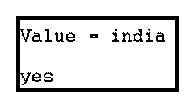

*   Prolog 控制台

`| ?- [_,_,Value|_] = [australia, india, japan, england, america].`

**输出**

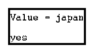

*   Prolog 控制台

`| ?- [_,_,_,Value|_] = [australia, india, japan, england, america].`

**输出**

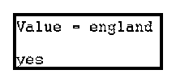

*   描述:
    *   该列表使用变量和下划线符号显示所需的值。
    *   使用逗号和下划线符号指定值的位置。

**示例 6** :基本列表示例和输出如下所示。

`cntry([australia, india, japan, england, america]).`

*   Prolog 控制台

`| ?- cntry(List).`

**输出**

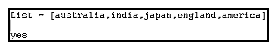

*   描述:
    *   该文件包含具有所需值的列表。
    *   您可以用所需的变量名指定一个列表名。
    *   输出显示一个带有变量名的列表。

*   Prolog 控制台

`| ?- [Head|Tail] = [Countries, australia, india, japan, england, america].`

**输出**

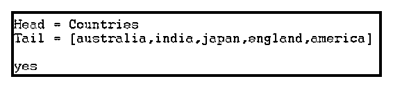

*   描述:
    *   列表使用竖线指定头部和尾部。
    *   第一个值称为列表头。
    *   另一个值称为列表的尾部。

### 结论

*   该列表维护应用程序中值的集合。
*   prolog 列表对数据库的大数据进行操作。
*   该列表创建了用户友好、快速和轻量级的应用程序。
*   这份名单运作效率很高。

### 推荐文章

这是序言列表的指南。在这里，我们将讨论 Prolog 中的列表以及描述和输出是如何工作的。您也可以看看以下文章，了解更多信息–

1.  [链表类型](https://www.educba.com/linked-list-types/)
2.  [Java 收藏列表](https://www.educba.com/java-collection-to-list/)
3.  [月球清单](https://www.educba.com/lua-list/)
4.  [跳过列表 Java](https://www.educba.com/skip-list-java/)

