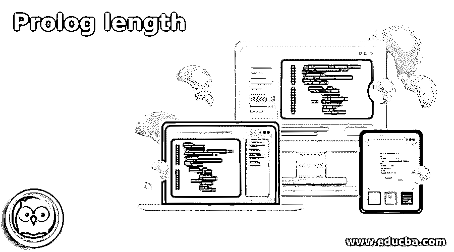
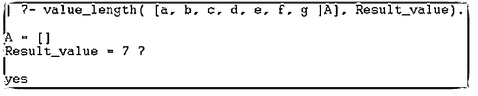
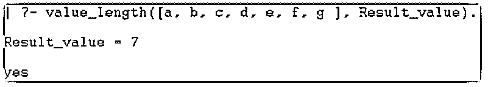
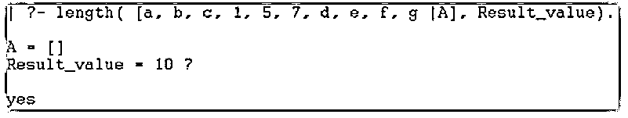
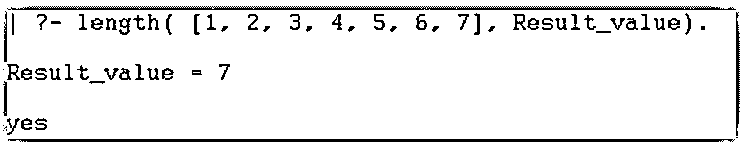

# 序言长度

> 原文：<https://www.educba.com/prolog-length/>

## 序言长度介绍

Prolog length 是一种用函数列表来计算数据长度的编程语言方法。这是一种使用编程语言查找列表长度的方法。它是一个使用 Prolog 语言表示列表实体数量的运算符。序言列表显示列表实体的长度，并断言列表的关系。它确定并计算列表函数中的可用对象。它用于使用 prolog 编程语言操作数据库的列表数据。这是一种维护列表值及其操作(如递增和递减)的方法。

### 序言长度的语法

prolog 长度需要 pl 文件中的一些方法、对象和值。pl 文件语法中的序言长度如下所示。

<small>网页开发、编程语言、软件测试&其他</small>

`\value_length([],0).
value_length([_|END], A) :-
value_length(END, A1), A is A1+1.`

**说明:**

*   value_length 是一个包含属性的方法。
*   “A”和“A1”是属性。
*   “END”是序言列表的尾部。
*   列表在“END”方法之前显示列表的头部。

控制台语法如下所示。

`value_length([value1, value2, value3], Result_value).`

tail 在控制台中，语法如下所示。

`value_length([value1, value2, value3| TAIL], Result_value).`

控制台语法如下所示。

`length( [value1, value2, value3], Result_value).`

对于空列表，语法如下所示。

`length( [ ], Result_value).`

**说明:**

*   value_length 是 pl 文件中包含的一个方法。
*   该方法名称在 pl 文件和 prolog 控制台中可能是相同的。
*   prolog 控制台可以对该方法使用“length”关键字。
*   你可以直接在控制台中找到列表的长度。
*   如果在长度方法中包含列表，则 pl 文件不会用作参考。

### 长度在 Prolog 中是如何工作的？

Prolog 注释在“pl”文件中有效。创建一个扩展名为“pl”的文件。

**示例:main.pl**

将数据插入到序言文件中。

将带有值的对象保存到 pl 文件中。

以下命令可以用于列表中的数据。

*   用对象初始化列表数据和长度。

`value_length([],0).`

*   它包含开始并保留列表中的数据对象。

`value_length([_|END], A)`

*   列表的头尾值插入到 pl 文件中。
*   结果集对象放在方法内部。

`value_length([_|END], A) :-
value_length(END, A1), A is A1+1.`

Prolog 注释在控制台中有效。

*   打开 prolog 控制台或解释器。
*   设置“pl”文件的目录路径。
*   使用给定的 prolog 文件。

**【主】。**

*   您可以直接使用 prolog 控制台进行编程。
*   使用 prolog 控制台中的语法。

`| ?- value_length( [1, 2, 3], Result_value).`

*   使用 prolog 控制台中的语法。

`| ?- value_length( [1, 2, 3|A], Result_value).`

*   在 prolog 控制台中使用 with empty list 语法。

`| ?- value_length( [ ], Result_value).`

*   在 prolog 控制台中使用 with length 关键字语法。

`| ?- length( [1, 2, 3|A], Result_value).`

结合职能的工作程序。

*   使用“main.pl”文件。

`value_length([], 0).
value_length([_|END], A) :-
value_length(END, A1), A is A1+1.`

*   使用带有所需目录路径的给定 prolog 控制台。

**【主】。**

*   使用 prolog 控制台中的语法。

`| ?- value_length( [1, 2, 3, 4, 5, 6, 7], Result_value).`

或者

`| ?- value_length( [a, b, c, d, e, g, h|A], Result_value).`

或者

`| ?- length( [1, 2, 3, 4, 5, 6, 7, 8], Result_value).`

### 序言长度示例

下面是提到的例子:

#### 示例#1

基本示例和输出如下所示。

**prolog(pl)文件:**

`value_length([],0).
value_length([_|END], A) :-
value_length(END, A1), A is A1+1.`

**代码:**

`| ?- value_length( [a, b, c, d, e, f, g |A], Result_value).`

**输出:**

**说明:**

*   数据表使用字符值进行运算。
*   其功能是显示序言列表实体的长度。
*   列表数据包含列表头的字符值。
*   结果集对象用在列表的末尾。

#### 实施例 2

基本示例和输出如下所示。

**prolog(pl)文件:**

`value_length([],0).
value_length([_|END], A) :-
value_length(END, A1), A is A1+1.`

**代码:**

`| ?- value_length([a, b, c, d, e, f, g ], Result_value).`

**输出:**

**说明:**

*   数据表使用字符值进行运算。
*   该函数显示序言列表实体的长度。
*   列表数据包含没有列表头的字符值。
*   结果集对象用在列表的末尾。

#### 实施例 3

带长度关键字的基本示例和输出如下所示。

**prolog(pl)文件:**

`value_length([],0).
value_length([_|END], A) :-
value_length(END, A1), A is A1+1.`

**代码:**

`| ?- length( [a, b, c, 1, 5, 7, d, e, f, g |A], Result_value).`

**输出:**

**说明:**

*   数据表使用字符和数值进行运算。
*   该函数显示序言列表实体的长度。
*   列表数据包含列表头的字符值。

#### 实施例 4

下面显示了带有数值数据的基本列表示例和输出。

**prolog(pl)文件:**

`value_length([],0).
value_length([_|END], A) :-
value_length(END, A1), A is A1+1.`

**代码:**

`| ?- length( [1, 2, 3, 4, 5, 6, 7], Result_value).`

**输出:**

**说明:**

*   数据表使用数值进行运算。
*   该函数显示序言列表实体的长度。列表数据包含没有列表头的字符值。

### 结论

它用来操作和维护大型数据和列表。它有助于更新数据大小及其操作。这是一个获取数据列表信息的函数。

### 推荐文章

这是序言长度的指南。这里我们讨论一下引言，长度在 Prolog 中是如何工作的？和示例。您也可以看看以下文章，了解更多信息–

1.  [人工智能如何工作？](https://www.educba.com/how-artificial-intelligence-works/)
2.  [网络编程语言](https://www.educba.com/web-programming-languages/)
3.  [Prolog 编程](https://www.educba.com/prolog-programming/)
4.  [Prolog 运算符](https://www.educba.com/prolog-operator/)

