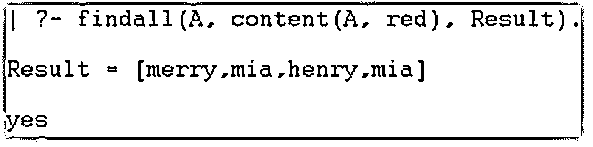
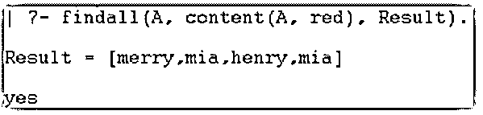
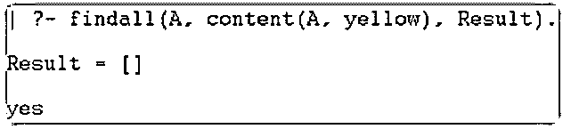
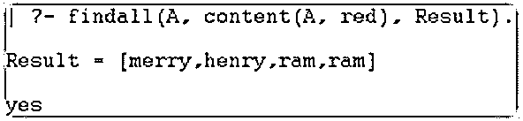
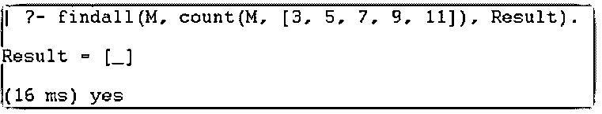
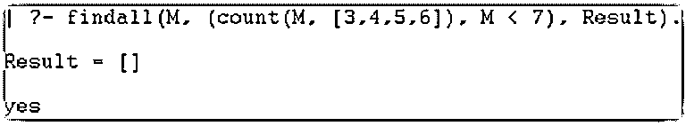
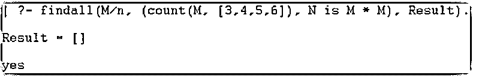
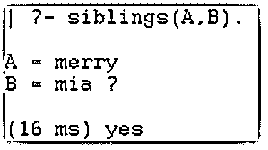
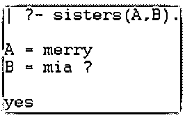
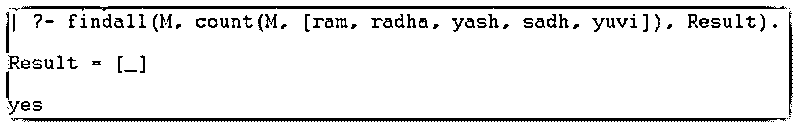

# Prolog findall

> 原文：<https://www.educba.com/prolog-findall/>

## Prolog findall 简介

Prolog findall 是编程语言的一个谓词函数，用于处理列表、目标和模板。它是一个元谓词，使用一系列模板并实现所需的目标。它是一个内置函数，使用模板收集一个项目列表，并绑定该列表以获得所需的目标。它是一种用于关联编程语言对象的函数或方法。它是作为输入的有差别的对象子集，剩余的对象是输出。这是一个收集列表实体并将它们与其他对象绑定的函数。它是仅输入、仅输出、输入和输出实体的类别列表。

### Prolog findall 的语法

prolog findall 在主文件(main.pl)中创建列表和对象。

<small>网页开发、编程语言、软件测试&其他</small>

序言文件的语法如下所示:

`content(merry, red).
content(mia, red).
content(henry, red).
content(Names, red) :- colors(Names).
colors(mia).
siblings(A,B):-content(A,C),content(B,C),A\=B.`

prolog findall 的语法如下所示。

`| ?- findall(A, content(A, red), Result).`

输出对象语法如下所示。

`| ?- siblings(A,B).`

With 文件语法如下所示。

`count(M, [3, 5, 7, 9, 11]).
findall(M, count(M, [3, 5, 7, 9, 11]), Result).`

带控制台的语法如下所示。

`| ?- findall(M, count(M, [3, 5, 7, 9, 11]), Result).`

### Prolog 中 findall 是如何工作的？

Prolog 注释在“pl”文件中有效。

创建一个扩展名为“pl”的文件。

**举例:**

`main.pl`

创建一个带有值的对象，并为 prolog findall 修改它们。

`content(merry, red).
content(mia, red).
content(henry, red).
content(Names, red) :- colors(Names).
colors(mia).`

内容名称可以不同，如 merry、mia 和 henry。

对象子集必须与红色相同。序言文件是用另一个变量如颜色(名称)修改的内容值。颜色函数包含任何变量值。

另一个对象用于根据命令获取输入和输出值。

`siblings(A,B):-content(A,C),content(B,C),A\=B.`

序言文件是用另一个变量如 A 和 b 修改的内容值。兄弟函数包含另一种形式的内容函数值。A 代表了内容名称。B 代表其他内容名称。Prolog 注释在控制台中工作打开 prolog 控制台或解释器。

设置“pl”文件的目录路径。

使用给定的 prolog 文件。

`[main].`

在 prolog 控制台中使用 prolog findall 语法。

prolog findall 的语法如下所示。

`| ?- findall(A, content(A, red), Result).`

输出对象语法如下所示。

`| ?- siblings(A,B).`

With 文件语法如下所示。

`count(M, [3, 5, 7, 9, 11]).
findall(M, count(M, [3, 5, 7, 9, 11]), Result).`

带控制台的语法如下所示。

`| ?- findall (A, (content(A, [1,2,3,4])), Result).`

结合 prolog 编程实现 findall 函数。

在下面显示的文件中。

`content(merry, red).
content(mia, red).
content(henry, red).
content(Names, red) :- colors(Names).
colors(mia).
siblings(A,B):-content(A,C),content(B,C),A\=B.`

在如下所示的控制台中。

`| ?- findall(A, content(A, red), Result).`

### Prolog findall 示例

下面是提到的例子:

#### 示例#1

基本的 prolog findall 示例和输出如下所示。

在下面显示的文件中。

**代码:**

`content(merry, red).
content(mia, red).
content(henry, red).
content(Names, red) :- colors(Names).
colors(mia).`

在如下所示的控制台中。

**代码:**

`| ?- findall(A, content(A, red), Result).`

**输出:**

#### 实施例 2

带有不同子集示例和输出的基本 prolog findall 如下所示。

在下面显示的文件中。

**代码:**

`content(merry, red).
content(mia, red).
content(henry, red).
content(Names, red) :- colors(Names).
colors(mia).
content(mia, yellow).
content(henry, yellow).
content(Names, yellow) :- colors(Names).
colors(mia).`

在如下所示的控制台中。

**代码:**

`| ?- findall(A, content(A, red), Result).`

**输出:**

在如下所示的控制台中。

**代码:**

`| ?- findall(A, content(A, yellow), Result).`

**输出:**

#### 实施例 3

下面显示了带有不同子集示例和输出的基本 prolog findall。

在下面显示的文件中。

**代码:**

`content(merry, red).
content(mia, yellow).
content(henry, red).
content(ram, red).
content(radha, black).
content(Names, red) :- colors(Names).
colors(ram).
siblings(A,B):-content(A,C),content(B,C),A\=B.`

在如下所示的控制台中。

**代码:**

`| ?- findall(A, content(A, red), Result).`

**输出:**

#### 实施例 4

基本的 prolog findall 示例和输出如下所示。

在下面显示的文件中。

**代码:**

`count(M, [3, 5, 7, 9, 11]).
findall(M, count(M, [3, 5, 7, 9, 11]), Result).
findall(M, (count(M, [3,4,5,6]), M < 7), Result).`

在如下所示的控制台中。

**代码:**

`| ?- findall(M, count(M, [3, 5, 7, 9, 11]), Result).`

**输出:**

在如下所示的控制台中。

**代码:**

`| ?- findall(M, (count(M, [3,4,5,6]), M < 7), Result).`

**输出:**

#### 实施例 5

带有操作和条件的基本 prolog findall 示例和输出如下所示。

在下面显示的文件中。

**代码:**

`count(M, [3, 5, 7, 9, 11]).
findall(M, count(M, [3, 5, 7, 9, 11]), Result).
findall(M/n, (count(M, [3,4,5,6]), N is M * M), Result).`

在如下所示的控制台中。

**代码:**

`| ?- findall(M/n, (count(M, [3,4,5,6]), N is M * M), Result).`

**输出:**

#### 实施例 6

带有输入和输出对象的基本 prolog findall 示例和输出如下所示。

在下面显示的文件中。

**代码:**

`content(merry, red).
content(mia, red).
content(henry, red).
content(adam, red).
content(jack, red).
content(sam, red).
content(alen, red).
siblings(A,B):-content(A,C),content(B,C),A\=B.
sisters(A,B):-content(A,C),content(B,C),A\=B.`

在如下所示的控制台中。

**代码:**

`| ?- siblings(A,B).`

**输出:**

在如下所示的控制台中。

**代码:**

`| ?- sisters(A,B).`

**输出:**

#### 实施例 7

基本的 prolog findall 示例和输出如下所示。

在下面显示的文件中。

**代码:**

`count(M, [ram, radha, yash, sadh, yuvi]).
findall(M, count(M, [ram, radha, yash, sadh, yuvi]), Result).`

在如下所示的控制台中。

**代码:**

`| ?- findall(M, count(M, [ram, radha, yash, sadh, yuvi]), Result).`

**输出:**

### 结论

prolog findall 使用应用程序中的项目列表来实现目标。它在单个查询中收集和绑定列表模板，并根据需要进行操作。多个对象在一个使用 prolog findall 函数的短语句中工作。

### 推荐文章

这是一个 Prolog findall 的指南。这里我们讨论一下引言，findall 在 Prolog 中是如何工作的？以及更好理解的例子。您也可以看看以下文章，了解更多信息–

1.  [XPath 节点](https://www.educba.com/xpath-nodes/)
2.  [人工智能如何工作？](https://www.educba.com/how-artificial-intelligence-works/)
3.  [网络编程语言](https://www.educba.com/web-programming-languages/)
4.  [sprintf Python](https://www.educba.com/sprintf-python/)

