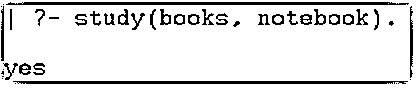
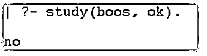
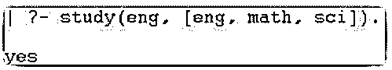
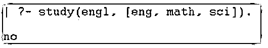
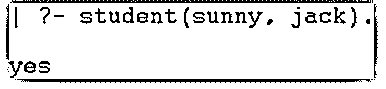
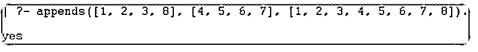
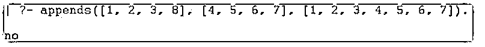
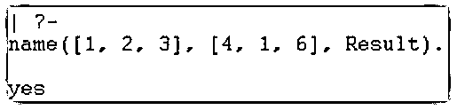

# 序言谓词

> 原文：<https://www.educba.com/prolog-predicate/>

## Prolog 谓词简介

Prolog 谓词是包含参数并返回布尔值(如 true 或 false)的方法。它是一个使用 prolog 编程语言操作并返回给定值、变量或参数的函数。这是一个对参数进行不同操作并以布尔格式返回输出的函数。它包含多个参数，并使用 prolog 语言定义了它们之间的关系。它对给定数据进行追加、反转、删除操作，并显示布尔输出，如是或否。它是一个布尔接口，使用编程语言处理不同的值。它是一个内置函数，用于操作 prolog 编程语言的对象、参数和变量。

### Prolog 谓词的语法

prolog 有许多谓词，可以根据需要操作多个参数。prolog 谓词有一个名称，包含数字和值。

<small>网页开发、编程语言、软件测试&其他</small>

基本的 prolog 谓词语法如下所示。

`name(value1, value2, value3).`

prolog 成员谓词语法如下所示。

`name(v1, [v1, v2, v3]).`

prolog 追加谓词语法如下所示。

`name([value1, value2, value3], [value4, value5, value6], [value1, value2, value3, value4, value5, value6]).`

基本的 prolog 交集谓词语法如下所示。

`name([value1, value2, value3], [value4, value1, value6], Result).`

基本的 prolog 反向谓词语法如下所示。

**Prolog pl 文件语法:**

`reverse_value([], V, V).
reverse_value([H|Tail], V, Res) :- reverse_value(Tail, V, [H|Res]).`

**Prolog 控制台语法:**

`reverse_value([value1, value2, value3, value 4, value5], A, []).`

prolog 谓词语法如下所示。

**Prolog pl 文件语法:**

`name (X, Y) :- sub_name (X, Y).`

**Prolog 控制台语法:**

`sub_name(value1, value2).`

内置的 prolog 谓词语法如下所示。

*   **是:**它表示布尔谓词的真实输出。
*   **否:**它表示布尔谓词的错误输出。

### Prolog 在 Prolog 中是如何工作的？

Prolog 注释在“pl”文件中有效。创建一个扩展名为“pl”的文件。

**举例:**

`main.pl`

将数据插入到序言文件中。

将带有值的对象保存到 pl 文件中。

以下命令可用于 prolog 谓词。

*   基本的 prolog 谓词如下所示。

`study(books, notebook).`

*   prolog 成员谓词如下所示。

`study(eng, [eng, math, sci]).`

*   基本的 prolog 追加谓词如下所示。

`appends([1, 2, 3, 8], [4, 5, 6, 7], [1, 2, 3, 4, 5, 6, 7, 8]).`

*   基本的 prolog 反向谓词如下所示。

`reverse_value([1, 2, 3, 4], V, []).
reverse_value([H|Tail], V, Res) :- reverse_value(Tail, V, [H|Res]).`

*   基本的 prolog 谓词如下所示。

`teacher(adam, sandy).
teacher(X, Y) :- principle(X, Y).
teacher(X, Y) :- student(X, Y).`

*   基本的 prolog 交集谓词如下所示。

`name([1, 2, 3], [4, 1, 6], Result).`

**Prolog 注释在控制台中工作:**

打开 prolog 控制台或解释器。设置 prolog 文件所需的目录路径。使用给定的 prolog 文件。

`[main].`

基本的 prolog 谓词如下所示。

`study(books, notebook).`

prolog 成员谓词如下所示。

`study(eng, [eng, math, sci]).`

基本的 prolog 追加谓词如下所示。

`appends([1, 2, 3, 8], [4, 5, 6, 7], [1, 2, 3, 4, 5, 6, 7, 8]).`

基本的 prolog 反向谓词如下所示。

`reverse_value([], V, []).
reverse_value([H|Tail], V, Res) :- reverse_value(Tail, V, [H|Res]).`

基本的 prolog 谓词如下所示。

`teacher(adam, sandy).`

基本的 prolog 交集谓词如下所示。

`name([1, 2, 3], [4, 1, 6], Result).`

**结合序言长度功能的工作程序:**

使用“main.pl”文件。

`study(books, notebook).
study(eng, [eng, math, sci]).
teacher(adam, sandy).
teacher(X, Y) :- principle(X, Y).
teacher(X, Y) :- student(X, Y).
name([1, 2, 3], [4, 1, 6], Result).`

使用带有所需目录路径的给定 prolog 控制台。

`[main].`

*   基本的 prolog 谓词如下所示。

`study(books, notebook).`

*   prolog 成员谓词如下所示。

`study(eng, [eng, math, sci]).`

*   基本的 prolog 谓词如下所示。

`teacher(adam, sandy).`

### Prolog 谓词的示例

下面是提到的例子:

#### 示例#1

基本的 prolog 谓词示例和输出如下所示。

**prolog(pl)文件:**

`study(books, notebook).`

**代码:**

`| ?- study(books, notebook).`

**输出:**

由于相似的参数，该谓词显示真实的布尔输出。

**代码:**

`| ?- study(boos, ok).`

**输出:**

由于不同的参数，该谓词显示错误的布尔输出。

#### 实施例 2

基本的 prolog 谓词示例和输出如下所示。

**prolog(pl)文件:**

`study(eng, [eng, math, sci]).`

**代码:**

`| ?- study(eng, [eng, math, sci]).`

**输出:**

由于相似的参数，该谓词显示真实的布尔输出。

**代码:**

`| ?- study(engl, [eng, math, sci]).`

**输出:**

由于不同的参数，该谓词显示错误的布尔输出。

#### 实施例 3

prolog 谓词示例和输出如下所示。

**prolog(pl)文件:**

`teacher(adam, sandy).
teacher(X, Y) :- principle(X, Y).
teacher(X, Y) :- student(X, Y).`

**代码:**

`| ?- principle(emma, ram).`

**输出:**

这个谓词显示了真正的布尔输出。

**代码:**

`| ?- student(sunny, jack).`

**输出:**

真布尔输出。

#### 实施例 4

基本的 prolog 追加谓词示例和输出如下所示。

**prolog(pl)文件:**

`appends([1, 2, 3, 8], [4, 5, 6, 7], [1, 2, 3, 4, 5, 6, 7, 8]).`

**代码:**

`| ?- appends([1, 2, 3, 8], [4, 5, 6, 7], [1, 2, 3, 4, 5, 6, 7, 8]).`

**输出:**

显示“真:布尔输出”。

**代码:**

`| ?- appends([1, 2, 3, 8], [4, 5, 6, 7], [1, 2, 3, 4, 5, 6, 7]).`

**输出:**

显示“假”布尔输出。

#### 实施例 5

基本的 prolog 谓词示例和输出如下所示。

**序言(pl)文件和序言代码:**

`name([1, 2, 3], [4, 1, 6], Result).`

**输出:**

### 结论

它操作 prolog 数据库的值及其值。它创建了一个用户友好的、先进的、高效的应用程序。它有助于维护编码参数，并按要求工作。它使有吸引力的，优雅的，和可操作的应用程序。此函数适用于多个值和属性。

### 推荐文章

这是一本关于 Prolog 谓词的指南。这里我们讨论一下入门，prolog 谓词在 prolog 中是如何工作的？和示例。您也可以看看以下文章，了解更多信息–

1.  [Prolog findall](https://www.educba.com/prolog-findall/)
2.  [Prolog 运算符](https://www.educba.com/prolog-operator/)
3.  [Prolog 编程](https://www.educba.com/prolog-programming/)
4.  [XPath 节点](https://www.educba.com/xpath-nodes/)

