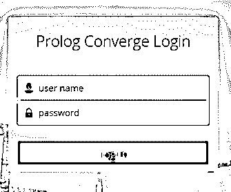
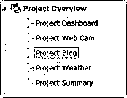
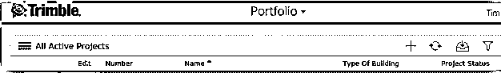
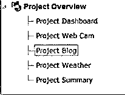
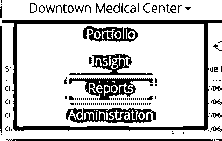
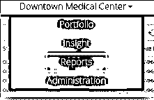

# Prolog 收敛

> 原文：<https://www.educba.com/prolog-converge/>

## Prolog converge 简介

*   prolog coverage 是一个项目管理应用程序，用于连接团队成员和系统。
*   prolog 覆盖范围是使用 prolog 技术将来自任何位置的额外项目团队成员分组在一起的功能。
*   prolog coverage 是一个基于 web 的应用程序，用于将地理位置的团队成员与系统连接起来。
*   prolog 的覆盖范围是使用 prolog 的远程项目团队成员。
*   prolog coverage 是一个构造性的应用程序，用于在联机和脱机系统中加入或关联团队成员。
*   prolog coverage 是一种基于 web 的功能，用于连接额外的项目成员，以便使用 prolog 软件与系统或 project server 连接。
*   prolog coverage 是一个基于 web 的项目管理应用程序，用于现场管理、文档管理和远程项目报告。
*   prolog 的覆盖范围是来自不同地理位置的 web 项目的协作、BIM 集成和移动解决方案的应用工作。

**语法:**

*   请访问 prolog converge 官方网站。
*   您需要权限或授权来打开 prolog converge。

<small>网页开发、编程语言、软件测试&其他</small>

*   根据需求选择所需的项目和投资组合。
*   prolog converge 由项目所需的五个特性组成。
*   prolog converge 的导航包含项目组合、项目洞察、报告、管理。

1.  投资组合:该功能为您提供系统中可用的项目。您可以选择所需的项目结构。
2.  项目:这个特性在 prolog converge 中创建、更新、编辑、显示当前或工作中的项目。

1.  洞察力:这个特性很容易显示项目界面。
2.  报告:这个特性处理项目信息，比如过滤、排序、收集和导出。
3.  管理:该特性管理用户、项目模板和用户组。

*   prolog converge 的导航需要区域菜单、视图菜单和导航轨迹。

o 区域菜单:该功能导航当前项目、报告、投资组合和管理。

o 视图菜单:此选项选择视图或表单选项。

o 导航轨迹:此选项选择轨迹选项，并显示不同类型的记录和表格。

### Prolog converge 是如何工作的？

*   请访问 prolog converge 官方网站。
*   获取 prolog 的凭证以收敛一个 web 应用程序和所需的项目。
*   输入登录 prolog converge 官方网站的用户名和密码。
*   您可以在 prolog converge 中使用以下功能。

#### 项目

*   转到项目功能，使用以下方法选择所需的项目。
*   您可以在 prolog converge 软件中选择默认模板。
*   您可以在“可用项目”和“当前项目”中选择现有项目。
*   您可以根据当前或可用的项目定制模板。

#### 记录

*   转到记录功能，使用以下方法操作所需的项目信息。
*   您可以使用管理设置对记录的访问权限。
*   您可以选择“记录”选项，并从“查看”菜单中查看记录。
*   双击记录选项或单击记录行。
*   在这里，您可以操作多种操作，如创建链接、更新字段、发送通知。

#### 形式

*   转至“表单”功能，使用多个表单创建和修改项目记录。
*   此功能包含项目数据，如图纸、规范和所需信息。
*   管理是处理项目信息所必需的。
*   您可以使用密码添加、删除一般信息和其他项目信息。

#### 见识

*   转到项目功能，使用界面查看所需的项目信息。
*   您可以使用易于使用的 prolog converge 界面从数据库中查看项目数据。
*   您可以选择查看数据、过滤数据和导出数据来查看项目信息。
*   在 INSIGHT 功能中，您可以根据需要查看所有数据或分类数据。

#### 报告

*   进入报告功能，选择项目所需的报告格式。
*   你可以在 prolog converge，manager 中生成一个报告格式。
*   该报告功能是 prolog 管理器中的标准功能。
*   报告功能生成干净、整洁和有组织的项目信息。
*   这种报告格式可以用于多个或不同的项目。

#### 管理区域

*   管理员和使用 access web 管理区域的授权用户可以使用管理区域。使用以下方法获得管理部门的许可。您可以使用用户、用户组或项目模板功能。
*   转到用户组表并选择此功能。
*   您必须选择功能权限选项卡，然后选择工具。
*   转到“安全性”选项卡以访问管理区域的权限。

### 例子

下面的步骤使用 prolog converge 创建一个新项目。

#### 例子# 1:prolog converge 使用下面显示的“使用项目”例子

*   转到文件夹并创建一个新项目。
*   填写项目信息，如项目名称、前缀、后缀、项目编号和序列。
*   选择项目所需的模板。
*   包括数据部分选择“所有数据”、“查找/列表组”或“无数据”选项之一。
*   如果选择“查找/列表组”或“无数据”选项，则选择文件库。
*   转至“预算”标签并选择其选项。
*   单击完成符号。

您得到上面的图像来根据需求控制项目数据和信息。

#### 示例 prolog converge 使用了下面显示的“使用报表”示例

下面的步骤使用 prolog converge 来操作项目报告。

*   转到“查看”菜单，单击下拉符号。
*   在下拉列表中获得多个选项后。
*   点击此选项卡，选择报告选项。
*   要生成报告，请单击打印符号。
*   给出报告的文件名。
*   选择文件格式，如 HTML、pdf、excel 等。
*   您可以根据需要查看、下载和发送该报告。

#### 示例 prolog converge 使用了下面显示的“使用洞察力”示例

下面的步骤使用 prolog converge 来查看项目信息。

*   转到“查看”菜单，单击下拉符号。
*   在下拉列表中获得多个选项后。
*   点击此选项卡，选择洞察选项。
*   如果您想查看数据，请使用“打开”按钮。
*   如果要过滤数据，请使用过滤数据符号。

### 结论

*   prolog converge 不需要任何编程和源代码。
*   这个函数使用接口自动创建一个项目。
*   您必须只选择所需的选项，并使用项目数据。

### 推荐文章

这是一本关于 Prolog converge 的指南。这里我们讨论定义，语法，Prolog converge 是如何工作的？以及更好理解的例子。您也可以看看以下文章，了解更多信息–

1.  [序言列表](https://www.educba.com/prolog-list/)
2.  [Prolog findall](https://www.educba.com/prolog-findall/)
3.  [Prolog 运算符](https://www.educba.com/prolog-operator/)
4.  [Prolog 编程](https://www.educba.com/prolog-programming/)

