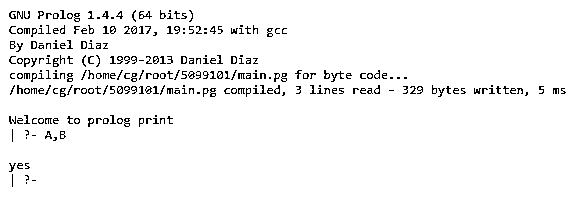

# 序言打印

> 原文：<https://www.educba.com/prolog-print/>

## Prolog 打印介绍

prolog print 被定义为“print”是一个内置谓词，用于在 prolog 中显示显式输出。显式意味着输出将是清晰的，没有任何疑问。它可以绑定变量，并返回我们需要在输出中显示的所有信息。它接受参数中变量的数量，如果参数是一个字符串，那么该字符串必须在单引号中，并且该字符串将在当前输出流中不带引号地打印出来。它将允许在新行和下一行显示输出，它使用新行和制表符操作。

**语法:**

<small>网页开发、编程语言、软件测试&其他</small>

下面是“打印”谓词的语法。

`o “print('Hello World').”:`

“print”谓词以变量或句子的形式接受一个参数，因此它可以接受任意数量的变量，在这种语法情况下，输出将是带引号的句子，但不带引号。

`o “print(+Stream, +Term).” :`

在这种情况下，“print”可以将术语用作变量，out 将显示在当前输出流中。

### Prolog 中的 print 是如何工作的？

prolog 有一些内置的谓词，它们的工作是在内部进行的，在这些谓词之外,“打印”是 Prolog 中使用的另一个谓词，用于以用户可理解的格式显示输出。它将命令作为“print/1 ”,主要通过用于格式化的转义序列使用，它由“print_message”用来在输出流中提供消息。该谓词的定义类似于“write”的定义，在“write”中，print 谓词在调试期间简化了术语，以便于理解输出。

在内部，该谓词使用“描绘”选项，该选项允许用户实现应用程序指定的术语，并在调试期间打印术语或变量。描绘是 prolog 中使用的动态谓词。当接受术语或变量时使用 print/2，它的输出将打印在当前流上。
o“打印(E)”:如果我们输入为“print(E)。”，它在当前输出流中有一个字符，在这种情况下，它将被视为一个字符代码，因此等效的字符代码将显示在输出中，但如果我们将 E = 'b '，在这种情况下，字符 b 将打印在输出中，它与字符绑定。

**输入:**

`“print(E).”`

**输出:**

`| ?- _26
yes
| ?-`

o \n:运算符\n 与' print '一起使用，以获得输出中的下一行或我们想要的行，它可以在两个单词或两行或更多行之间，如果我们有两个单词 America 和 Belgium，我们想在一行打印 America，在另一行打印 Belgium，所以我们可以将输入作为' print('America \n Belgium ')。'然后输出会是。
例如:

**输入:**

`“print('America \n Belgium').”`

**输出:**

`| ?- America
Belgium
yes
| ?-`

o \t:这是一个制表符操作符，表示为' \t '，它在需要的地方与' print '谓词一起工作。该操作符提供了输出流中的空格数。当我们需要一个空格时，我们可以在需要的地方使用一个“\t ”,如果我们需要两个空格，我们可以在需要的地方写两个“\t ”,这样我们可以写 1 到多个制表符操作符。

例如:

**输入:**

`“print('\t\t America \n Belgium').”`

**输出:**

`| ?- America
Begium
yes
| ?-`

o“打印(x)，打印(y)。”“print”操作符允许一起使用两个“print”谓词，在这种情况下，如果我们输入值“print(x)，print(y)”，我们可以将两个打印谓词写在一起然后，它会将两者的变量组合在一起，作为“xy”。
例如:

**输入:**

`“print(x),print(y).”`

**输出:**

`| ?- xy
yes
| ?-`

o "print('Hello welcome to print 谓词')。":此谓词可用于当前输出流，也可用于提供输出。当我们使用“print(' Hello welcome to print predicate ')”时作为当前输出流中的语句，输出将是括号中的单词或句子，但没有引号，这意味着括号中的所有变量都将在输出中显示，不包括引号，单引号也是在一个谓词中写入变量数量所必需的。

当我们想在输出中显示一些关于程序的数据以便于理解时。

**注意:**我们要给 dot(。)后的每一行进行终止。

#### 示例#1

`:- initialization(main).
main :- print('\nWelcome to prolog print\n').`

**输入:**

`1\. print('A,B').
2\. print('\tABCD').`

**输出:**

在上面的例子中，我们输入的值是“print('A，B ')”，我们得到了截图中显示的输出，但是如果我们没有给输入括号中的变量加上单引号，那么它会给出一个未捕获的异常，因为它不允许这样做。如果我们使用输入“print('\tABCD ')”，那么在输出中 ABCD 前面有一个空格，这意味着\t 在 prolog 中作为一个带有打印谓词的制表符。

#### 实施例 2

`:- initialization(main).
main :- print('\n The Print predicate \n').`

**输入:**

`1\. print(1+2+3).
2\. print('Welcome').
3\. print(m),print(n).`

**输出:**

在上面的程序中，我们给出的输入是“print('Welcome ')”，我们得到输出字符串，但没有引号，如果我们不使用引号，那么它会得到一个错误。如果我们把“打印(1+2+3)”。如果我们输入“print('1+2+3 ')，那么括号中的值也是这样。这也给出了 1+2+3 的输出，例如，如果我们输入“print(m)，print(n)，print 允许将两个 print 写在一起。那么它也是有效的。

### 结论

在上面的文章中，我们得出结论，这是 prolog 中使用的另一个内置谓词，就像“write”谓词一样，唯一的区别是“write”将术语作为参数，“print”将变量的数量作为参数，其中该谓词还用于在当前输出流中给出显式输出。

### 推荐文章

这是一本序言印刷指南。在这里我们讨论引言，print 在 Prolog 中是如何工作的？代码实现示例。您也可以看看以下文章，了解更多信息–

1.  [Prolog findall](https://www.educba.com/prolog-findall/)
2.  [Prolog 运算符](https://www.educba.com/prolog-operator/)
3.  [Prolog 编程](https://www.educba.com/prolog-programming/)
4.  [XPath 节点](https://www.educba.com/xpath-nodes/)

