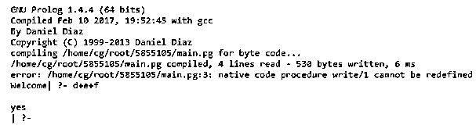
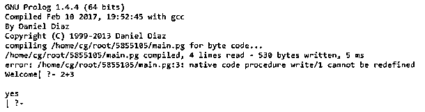
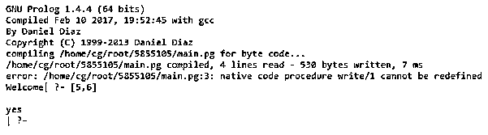
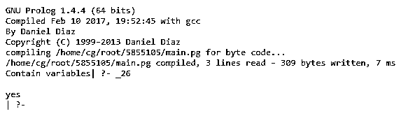
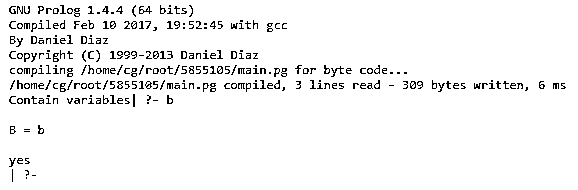

# 序言编写

> 原文：<https://www.educba.com/prolog-write/>

## 序言编写介绍

Prolog write 被定义为,“write”是 Prolog 中的一个内置谓词，它返回我们需要在输出中显示的所有信息，它给出了清晰的输出，这意味着如果我们需要与程序相关的输出，并且带有友好的东西，那么我们可以在程序中使用 write 谓词，它使用术语通过使用适当的括号和运算符来表示当前输出， 这可以称为“write(Y)”，它将项 Y 写入当前输出流，该流是一个带有代码编写器的连续窗口，如果一个参数是字符串，那么它将打印不带引号的字符串。

**语法:**

<small>网页开发、编程语言、软件测试&其他</small>

prolog 中“write”的语法如下所示:

`“write ('Enter the file name').” :`

这里,“write”谓词将显示括号中的输出，但没有引号。

`“write(+Stream, +Term)” :`

我们可以把它理解为在输出流上写这个词。在这种情况下，我们需要通过输入来调用“写”。

在哪里，

o Term–这是一个将在当前输出中显示的术语。o Stream–这是一个可以看到输出的窗口或控制台。

### 如何用 prolog 写作品？

“write”是 prolog 中预定义的内置谓词，在其中对术语进行操作，我们还可以看到用户友好的符号输出，这意味着用户可以理解符号的用法。这也可以写成‘写/1’。我们也可以一个接一个地使用两个 write/1 命令。

内置谓词 write/1 的工作方式如下，它接受术语，并以用户友好的符号显示在屏幕上，以便用户能够理解。

举个例子，

`o write(8+9+7).
output is :
8+9+7
yes`

它给出了我们所使用的术语的输出。

`o write(+(4,1)).
output is :
4+1
yes`

上面的查询将给出如上所示的输出。

`o write([m+n+o]).
Output is :
[m+n+o] yes
o write(.(u,.(v,[]))).
Output is :
[u,v] yes`

如果我们希望元素以用户友好的格式排列，那么我们可以根据需要遵循上面的例子。

现在我们将看到它何时返回包含变量，

`o write(D).`

**输出为:**

_26
是

如上所述，当我们调用变量时，它将返回包含变量，其值以 _(下划线)为前缀。

`o E = d, write(E).`

**输出为:**

是的

在这种情况下，我们可以给项赋值，这里我们给 E 赋值，这也会显示在输出中，因为它包含变量。

让我们看看如何在 prolog 中使用两个 write/1 命令，

`o write(m),write(n).`

**输出为:**

是的

在这种情况下，我们可以说 prolog 允许一个接一个地写入两个“write”命令，并且输出是连续的，这意味着它不会自动占用空格或逗号。

`o write(m),write(' '),write(n).`

**输出为:**

是的

在这种情况下，我们使用 write(')来打印 m，n 这两个字母之间的空格，因为当我们一个接一个地写命令时，它会自动一个接一个地打印，这意味着它不会占用空格，所以我们需要告诉 prolog 将空格打印为' write(')'。

`o write(m),write(' '),write(n).`

**输出为:**

是的

在这种情况下，我们在两个字母之间留出了 5 个空格。这意味着我们可以放置不止一个空格，但是我们必须告诉 prolog 来打印它。

`o write(p),tab(6),write(q).`

**输出为:**

是的

在这种情况下，我们可以通过使用制表符谓词来给出空格。如果我们想要两个字母之间有 6 个空格，那么我们可以使用 tab 谓词，但是我们必须给它参数，这意味着如果我们想要 6 个空格，那么在 tab 中传递参数 6。

`o write(i),nl,write(j).`

**输出为:**

是的

在这种情况下，我们使用“nl”谓词来换行，“nl”是一个格式谓词，它告诉 prolog 换行并在下一行继续打印。这也是 prolog 中一个有用的谓词。
“写入”谓词的工作取决于查询，我们可以根据要求准备查询，因此，正如我们在上面看到的许多不同类型的示例及其输出,“写入”的工作非常友好，用户可以轻松理解。

#### 示例#1

`:- initialization(main).
main :- write('Welcome').
write(d+e+f).`

**输入:**

1)写(d+e+f)。
2)写(+(2，3))。
3)写(。(5,.(6,[]))).

**输出:**

在上面的程序中，首先，第二行中的“write”谓词在编译时自动调用的输出窗口中显示引用的信息。在第三行中，我们使用“write”和术语“(d+e+F)”，但我们需要通过输入来调用它。在这种情况下，我们给出的输入是‘write(d+e+f)’。，则它提供输出作为所使用的术语。

当我们输入‘写(+(2，3))’那么输出将是:

当我们输入‘写(.(5,.(6,[]))).'那么输出将是:

#### 实施例 2

`:- initialization(main).
main :- write('Contain variables').`

**输入:**

1)写(一)。
2) B = b，写(B)。

**输出:**

在上面的程序中，我们通过给出输入“write(A)”来调用“write”谓词然后它给出输出，因为它包含变量，如果我们使用大写字母的术语 as，那么它将返回包含变量，但是如果我们把小写字母' a '作为输入，那么输出就是' a '本身。

当我们输入 B = b 时，写(B)那么输出将如下所示:

这意味着当我们把值放到它的。

### 结论

在上面的文章中，我们得出结论，prolog 中有许多可用的谓词，因为“write”也是一个预定义的谓词，用于根据我们在上面看到的操作和定义返回输出，我们还可以得出结论，上面的谓词对于在输出中显示程序相关信息也是有用的。

### 推荐文章

这是一个序言编写指南。这里我们讨论序言，语法，如何用 prolog 写工作？代码实现示例。您也可以看看以下文章，了解更多信息–

1.  [Prolog 运算符](https://www.educba.com/prolog-operator/)
2.  [Prolog 编程](https://www.educba.com/prolog-programming/)
3.  [Prolog findall](https://www.educba.com/prolog-findall/)
4.  [PHP XMLWriter](https://www.educba.com/php-xmlwriter/)

