# 序言不相等

> 原文：<https://www.educba.com/prolog-not-equal/>

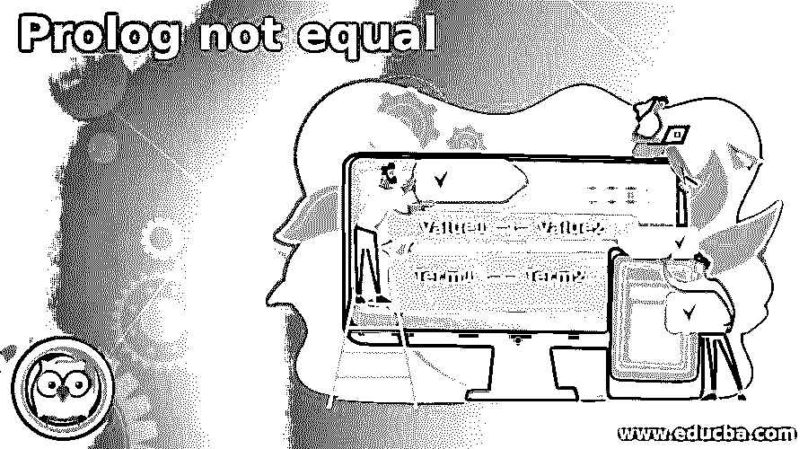

## 序言介绍不相等

Prolog not equal 是一种使用编程语言比较两个值和操作数的运算符。它是使用高级编程语言的算术运算的函数。prolog not equal is 运算符确定两个值不相同或不匹配。它是一个算术运算符，用于在编程语言中寻找等式函数的反函数。

它是算术运算符和比较运算符的组合，用于比较变量或值。它使用高级语言比较算术运算不相似的两个值。该语言使用运算符求反或确定两个值不相等。布尔运算符判断给定的两个值是否相等。

<small>网页开发、编程语言、软件测试&其他</small>

### 序言的语法不相等

prolog 语言使用逻辑运算进行“不相等”运算。prolog，not equal 运算符语法如下所示。

`Value1 =\= Value2.`

**说明:**

*   “=\=”符号用于确定不相等的值。
*   该运算符主要用于数值和算术运算。

prolog 语言使用另一个运算符进行“不等于”运算。

“不等于”运算符的语法如下所示。

`Term1 \== Term2.`

**说明:**

*   “\==”符号用于确定不相等的术语。
*   该运算符主要用于数值和字符值。
*   该函数使用 prolog 文件中的术语。

该语言使用带有“不相等”运算术语的运算符。

“不等于”运算符的语法如下所示。

`Term1 \= Term2.`

**说明:**

*   “\==”符号用于确定不相等的术语。
*   该运算符主要用于数值和字符值。
*   该函数使用 prolog 文件中的术语。

### Prolog 中的不等号运算符是如何工作的？

Prolog 注释在“pl”文件中有效。

*   创建一个扩展名为“pl”的文件。

**举例:main。pl**

*   将数据插入到序言文件中。
*   将带有值的对象保存到 pl 文件中。

注释在控制台中有效。

*   打开 prolog 控制台或解释器。
*   设置“pl”文件的目录路径。
*   使用给定的 prolog 文件。

`[main].`

*   您可以直接使用 prolog 控制台进行编程。
*   在 prolog 控制台中使用 prolog“不等于”语法。
*   prolog“不等于”运算符语法如下所示。

`6 =\= Value 9.`

*   prolog“不等于”运算符语法如下所示。

`6 \== Value 9.
prolog \== prolog.
prolog(A, B) \== prolog(C, D).`

*   该运算符主要用于数值和字符值。
*   这个函数使用文件中的术语。
*   如果对象相同但值不同，则输出将会改变。

prolog“不等于”运算符语法如下所示。

`6 \= Value 9.
prolog \= prolog.
prolog(A, B) \= prolog(C, D).`

*   该运算符主要用于数值和字符值。
*   该函数使用 prolog 文件中的术语。
*   如果对象相同但值不同，则输出将会改变。

### Prolog 不相等的示例

下面是提到的例子:

#### 示例#1

基本的 prolog“不相等”示例和输出如下所示。

**代码:**

`| ?- 7 =\= 9.`

**输出:**

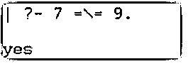

**代码:**

`| ?- 7 =\= 7.`

**输出:**

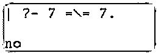

**代码:**

`| ?- prolog =\= prolog.`

**输出:**

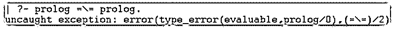

**说明:**

*   如果值不相等，则输出显示“yes”语句。
*   如果值相同，则输出显示“否”语句。
*   该运算符只处理数值。
*   如果您尝试处理其他数据类型值，prolog 控制台会显示一个错误。

#### 实施例 2

prolog 不等于术语 example，输出如下所示。

**代码:**

`| ?- 7 \== 9.`

**输出:**

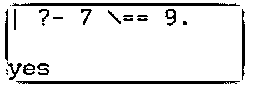

**代码:**

`| ?- 7 \== 7.`

**输出:**

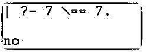

**说明:**

*   如果值不相等，则输出显示“yes”语句。
*   如果值相同，则输出显示“否”语句。

**代码:**

`| ?- prolog \== prolog.`

**输出:**

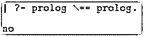

**代码:**

`| ?- PROLOG \== prolog.`

**输出:**

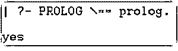

**说明:**

*   如果数据不相等，则输出显示“是”语句。
*   如果数据相同，则输出显示“否”语句。
*   该运算符对不相等运算区分大小写。
*   大写和小写字符也产生不同的值。

**代码:**

`| ?- prolog(learn, online) \== prolog(teach, online).`

**输出:**

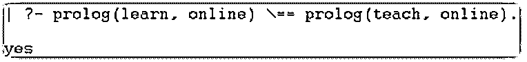

**代码:**

`| ?- prolog(learn, online) \== python(learn, online).`

**输出:**

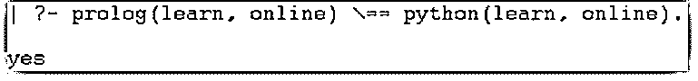

**代码:**

`| ?- prolog(learn, online) \== prolog(learn, online).`

**输出:**

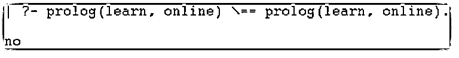

**说明:**

*   如果对象和值不相等，则输出显示“yes”语句。
*   如果对象不同而值相同，则输出显示“是”语句。
*   如果对象相同而值不同，则输出显示“是”语句。
*   如果对象和值相同，则输出显示“否”语句。

#### 实施例 3

prolog 不等于术语 example，输出如下所示。

**代码:**

`| ?- 7 \= 9.`

**输出:**

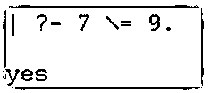

**代码:**

`| ?- 7 \= 7.`

**输出:**

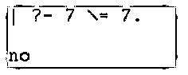

**说明:**

*   如果值不相等，则输出显示“yes”语句。
*   如果值相同，则输出显示“否”语句。

**代码:**

`| ?- prolog \= python.`

**输出:**

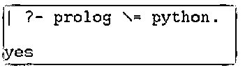

**代码:**

`| ?- prolog \= prolog.`

**输出:**

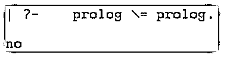

**代码:**

`| ?- PROLOG \= prolog.`

**输出:**

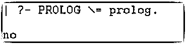

**说明:**

*   如果数据不相等，则输出显示“yes”语句。
*   如果数据相同，则输出显示“否”语句。
*   该运算符不区分大小写，用于不等运算。
*   相似的大写和小写字符是相同的。

**代码:**

`| ?- prolog(learn, online) \= prolog(teach, online).`

**输出:**

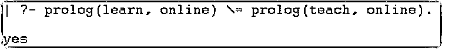

**代码:**

`| ?- prolog(learn, online) \= python(learn, online).`

**输出:**

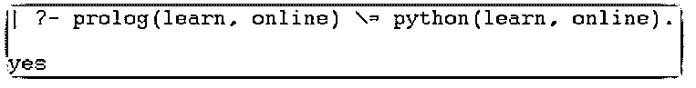

**代码:**

`| ?- prolog(learn, online) \= prolog(learn, online).`

**输出:**

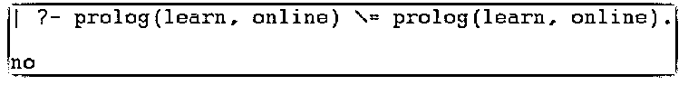

**说明:**

*   如果对象和值不相等，则输出显示“yes”语句。
*   如果对象不同而值相同，则输出显示“是”语句。
*   如果对象相同而值不同，则输出显示“是”语句。
*   如果对象和值相同，则输出显示“否”语句。

### 结论

序言“不等于”是用于比较和算术运算的运算符。它确定数据或值是否相等。

### 推荐文章

这是一个序言不相等的指南。这里我们讨论一下入门，不等于运算符在 Prolog 中是如何工作的？和示例。您也可以看看以下文章，了解更多信息–

1.  [XPath 节点](https://www.educba.com/xpath-nodes/)
2.  [人工智能如何工作？](https://www.educba.com/how-artificial-intelligence-works/)
3.  [网络编程语言](https://www.educba.com/web-programming-languages/)
4.  [sprintf Python](https://www.educba.com/sprintf-python/)

