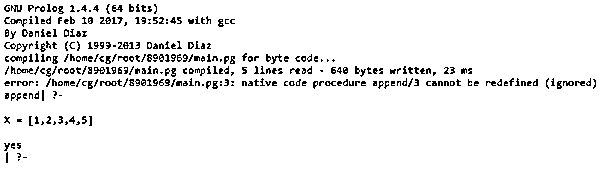
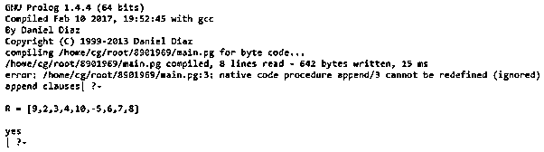

# 序言追加

> 原文：<https://www.educba.com/prolog-append/>

## 序言附加简介

Prolog append 是指使用 Prolog 程序设计语言将一个表中的项添加到另一个表中的操作，它是 prolog 的一个基本操作。prolog 是一种逻辑和声明性程序设计语言，它是 prolog 中的一个重要谓词，由 append/3(list 2 对 List1 的追加结果)定义，其参数都是列表。append 中的列表已声明为“append(L1，L2，L3)”当列表 L3 是将列表 L1 和 L2 连接在一起的结果时会发生这种情况，将空列表追加到任何列表中也会产生相同的列表。

**语法:**

<small>网页开发、编程语言、软件测试&其他</small>

`append([ ], Y, Y).
append([X|L1],L2,[X|L3]):-append(L1,L2,L3).`

在哪里，

*   追加([]，Y，Y)。–append[]，Y 得到 Y
*   追加([X|L1]，L2，[X|L3])。–追加[X|L1]和 Y 得到[X|L3]
*   追加(L1，L2，L3)。–If 追加 X 和 Y 得到 Z

以上是 prolog 中 append 的声明性语法，在对其执行操作后，结果将采用“append (L1，L2，L3)”的格式，其中 L3 是通过将 L1 和 L2 连接在一起而得到的结果列表，其中列表是项目的组合，append 是列表之间的关系，列表要么是空的，要么是有头有尾的组合，空列表由[]表示。

### Prolog 中的 append 是如何工作的？

在 prolog 中，append 作用于列表，这意味着 append 作用于组合两个列表或将两个列表连接在一起，例如，如果我们有两个列表，我们必须将它们组合成一个列表，那么 append 具有将两个列表连接在一起的语法，我们也可以说 append 是列表之间的关系。将两个列表追加在一起或添加一个列表作为项目。现在，如果条目已经出现在列表中，那么追加将不起作用，我们需要创建一个名为“list_append(L1，L2，L3)”的谓词让我们来研究一下，假设 P 是一个元素，L1 是一个列表，如果 L1 已经有了 P 元素，那么 L1 也是。

为了说明 prolog 中 append 的工作原理，我们将通过下面的例子来了解它，我们必须定义一个重要的谓词 append/3，它的参数都是列表。让我们声明 append[L1，L2，L3]，它保存列表 L3，其中 L3 是连接 L1 和 L2 列表后得到的结果列表，如果我们传递查询 append([p，q，r]，[1，2，3]，[p，q，r，1，2，3])，那么首先我们得到响应，是的，然后如果我们传递查询 append([p，q，r]，[1，2，3]，[p，q，r，1，2])，那么我们将得到响应 no

因此，现在从过程的角度来看，append/3 用于将两个列表连接在一起，我们可以通过使用一个变量作为第三个参数来实现，然后显示查询

追加([p，q，r]，[1，2，3]，L3)。'通过执行这个查询，响应将得到' L3 = [p，q，r，1，2，3]yes，append/3 也用于拆分列表。

现在让我们来看看 append/3 的定义:

`append([], L,L).
append([H|T],L2,[H|L3]):-append(T,L2,L3).`

这种类型的声明在 prolog 中被称为递归声明，追加任何空列表都会产生一个列表。首先，我们必须将一个非空列表[H|T]与列表 L2 连接起来，这将最终得到一个列表，它的头是 H，尾是 T 与 L2 连接后得到的结果，因此输入“[H| T]+L2”将给出结果“[H|L3]”。

现在，我们将看到关于追加的细节，通过使用搜索树模式来理解追加如何与非空列表和空列表一起工作。假设我们想要追加列表[9，2，6，8，10]和[5，1，3]。当首先追加时，它将检查我们要追加的列表是否为空。

因此，我们希望将[9，2，6，8，10]追加到[5，1，3]中，被追加的列表是非空的，那么结果将 5 作为第一个元素，后面是将[9，2，6，8，10]追加到[1，3]的结果。

现在，我们必须将[9，2，6，8，10]追加到[1，3]中，作为结果中的第一个元素，被追加的列表不为空，然后是追加[9，1，6，8，10]到[3]。

再次将[9，2，6，8，10]追加到[3]中，被追加的列表也是非空的，将 3 作为第一个元素，后面是将[9，2，6，8，10]追加到[]的结果，现在被追加的列表是空的，因此结果列表将是[9，2，6，8，10]。

将[9，2，6，8，10]追加到[ ]的结果是[9，2，6，8，10]，因此将[9，2，6，8，10]追加到[ 3]的结果是[ 3，9，2，6，8，10]，再次将列表[3，9，2，6，8，10]追加到[1，3]的结果是[1，3，5，9，2，6，8，10]。

由于将[9，2，6，8，10]追加到[5，1，3]的结果是[5，1，3，9，2，6，8，10]，将[9，2，6，8，10]追加到[5，1，3，9，2，6，8，10]。

注意:在本文中，我们没有使用前缀'？-'因为这里使用的编译器不允许使用它。

### 序言附加示例

下面举几个例子

#### 示例#1

**代码:**

`:- initialization(main).
main :- write('append').
append( [], X, X).
append( [X | Y], Z, [X | W]) :- append( Y, Z, W).
Input:
append([1,2],[3,4,5], X).`

**输出:**

在上面使用 append 的例子中，代码已经通过执行 append 来自两个列表的第三个列表的步骤而编写，其中我们可以说如果 X=[1，2]，Y=[3，4，5]，并且 Z 是 X 和 Y 的连接，Y 是第三个列表。

#### 实施例 2

**代码:**

`:- initialization(main).
main :- write('append clauses').
append(List1, List2, Result) :-
List1  = [Head1 | Tail1],
Result = [HeadR | TailR],
Head1  =  HeadR,
append(Tail1, List2, TailR).`

**输入:**

`append([9, 2, 3, 4], [10, -5, 6, 7, 8], R).`

**输出:**

在上面的示例中，我们以代码格式的子句为例，因为我们以 head 和 tail 的格式执行操作，然后在内部一步一步地，数字可以指示每次使用的子句，我们向列表中输入内容，以便在屏幕截图中看到结果列表。

### 结论

在上面的文章中，我们得出结论，在 prolog 中，追加谓词的特性是内置的，追加谓词用于将元素追加到列表中，也用于调用列表进行追加，append/3 用于将列表分成两部分，我们还得出结论，追加是两个列表之间的关系。

### 推荐文章

这是一个序言追加指南。在这里，我们将讨论 append 在 Prolog 中是如何工作的，并举例说明代码和输出。你也可以看看下面的文章来了解更多

1.  [Prolog 编程](https://www.educba.com/prolog-programming/)
2.  [NumPy 数组追加](https://www.educba.com/numpy-array-append/)
3.  [C++字符串追加](https://www.educba.com/c-plus-plus-string-append/)
4.  [jQuery ajax 请求](https://www.educba.com/jquery-ajax-request/)

