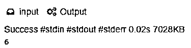
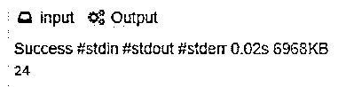
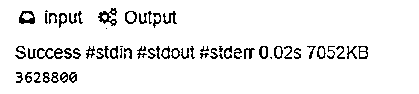
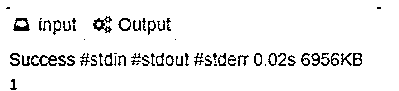

# Prolog 阶乘

> 原文：<https://www.educba.com/prolog-factorial/>

## Prolog 阶乘简介

Prolog factorial 由两个子句组成。第一个是没有人的单元子句，第二个是规则，在正文中。Prolog 编程是一种逻辑和声明性编程语言。Prolog 名称本身是逻辑编程的缩写，它包括对定理证明的研究和在 20 世纪 60 年代和 70 年代开发的其他演绎系统。Prolog 是支持声明性范例的第四代编程语言的主要例子之一。正如日本在 1981 年宣布的第五代，已经采用编程作为开发语言。让我们看看 Prolog factorial 是如何设计的，并通过几个例子检查 Prolog 中 factorial 背后的实际逻辑。

### Prolog 背后的逻辑

Prolog 阶乘是一个整数和小于给定数字的其他整数的乘积，即 5！表示为 5*4*3*2*1，等于 120。

<small>网页开发、编程语言、软件测试&其他</small>

在 Prolog factorial 中，

*   Prolog 阶乘函数定义也类似于普通阶乘函数。
*   阶乘(0，1)，即 0 的阶乘通常是 1。
*   阶乘(N，M)，如果任何临时值 N1 被分配给 N-1。
*   阶乘(N1，M1)，而 N1 的阶乘是 M1。
*   M 是 NM1，即把 M 指定给 N*M1，则 N 的值是 M
*   上面恰好是 N 和阶乘 m 之间的递归关系，它按照从上到下的顺序回顾了特定关系的规则。

**阶乘代码:**

`factorial(0,1).
factorial(N,M) :-
N>0,
N1 is N-1,
factorial(N1, M1),
M is N*M1.`

*   也有两个阶乘定义，它们由两个子句组成。
*   第一个子句是没有主体的单元类，第二个子句是有主体的规则。
*   第二个子句的主体在“:-”的右边，读作“if”。
*   正文由逗号分隔的文本组成，每个文本读作“和”。
*   子句的头是 total 子句是 unit 子句，else 子句的头是出现在冒号左边的子句的一部分。
*   第一个子句的声明性阅读，即 0 的阶乘是 1，如果 N>0 且 N1 是 N-1，则第二个子句声明 N 的阶乘是 M。
*   因此，N1 的阶乘是 M1，M 是 N*M1。

考虑一个计算 4 的阶乘响应 W 值的例子，即目标变量 8。

将使用子句树来计算识字的阶乘' factorial(4，W)'。因为子句树不包含任何变量，但是具有变量的实例。每个节点的分支由原始程序中的子句决定，使用变量的相关实例。

节点由子句头的某个实例决定，子句的正文将决定子句树中的节点子节点。

阶乘(4，24)

4>0 3 是 4-1 阶乘(3，3) 24 是 4*6

3>0 2 是 3-1 阶乘(2，2) 6 是 3*2

2>0 1 是 2-1 阶乘(1，1) 2 是 2*1

1>0 0 是 1-1 阶乘(0，1) 1 是 1*1

真实的

这样，4 的阶乘是 24 就是真的。

### Prolog 阶乘的示例

下面是提到的例子:

#### 示例#1

3 的 Prolog 阶乘！

**代码:**

`factorial(0, 1).
factorial(N, M) :- N > 0, Prev is N -1, factorial(Prev, M1), M is M1 * N.
:- factorial(3,W), writeln(W).`

**输出:**

因为 3 的阶乘将是 3*2*1，即 6。

#### 实施例 2

4 的 Prolog 阶乘！

**代码:**

`factorial(0, 1).
factorial(N, M) :- N > 0, Prev is N -1, factorial(Prev, M1), M is M1 * N.
:- factorial(4,W), writeln(W).`

**输出:**

这里是 4！将是 4*3*2*1 即 24。

#### 实施例 3

10 的 Prolog 阶乘！

**代码:**

`factorial(0, 1).
factorial(N, M) :- N > 0, Prev is N -1, factorial(Prev, M1), M is M1 * N.
:- factorial(10,W), writeln(W).`

**输出:**

这是 10 美元！将是 10*9*8*7*6*5*4*3*2*1 即 3628800。

#### 实施例 4

1！

**代码:**

`factorial(0, 1).
factorial(N, M) :- N > 0, Prev is N -1, factorial(Prev, M1), M is M1 * N.
:- factorial(1,W), writeln(W).`

**输出:**

所以在这里，1 的阶乘是 1。

它的计算步骤非常简单，如上图所示。正如我们前面所看到的，在阶乘树中，所有的子节点在求值时都是真的，树中最低的一个对应于程序的第一个子句。第一个子句可以写成，factorial(0，1) :- true。

Factorial(4，24)是 prolog 程序的结果，因为有一个以子句树为根并且所有根节点都为真，而另一方面，literal factorial(5，6)根本不是 Prolog 程序的结果，因为没有以(5，6)为根的子句树，因此它给出 false。

### 结论

至此，我们将结束“Prolog Factorial”这一主题。我们已经看到了什么是 Prolog 阶乘及其定义。我们已经了解了 Prolog word 是如何产生的，以及 Prolog 编程是什么。我们也看到了一些例子，它们给出了任何非负整数的阶乘。我们还描述了一个 4 的例子！即，对于子句树，24 为真，并且还看到了其中涉及的逻辑。

### 推荐文章

这是一个 Prolog 阶乘的指南。在这里，我们讨论介绍、prolog 背后的逻辑以及一些例子，以便更好地理解。您也可以看看以下文章，了解更多信息–

1.  [人工智能如何工作？](https://www.educba.com/how-artificial-intelligence-works/)
2.  [网络编程语言](https://www.educba.com/web-programming-languages/)
3.  [sprintf Python](https://www.educba.com/sprintf-python/)
4.  [Prolog 编程](https://www.educba.com/prolog-programming/)

