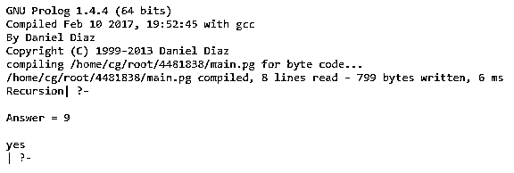
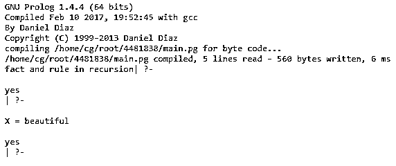

# Prolog 递归

> 原文：<https://www.educba.com/prolog-recursion/>

## Prolog 递归介绍

prolog 递归被定义为，在 prolog 中，递归似乎是当一个谓词有一个指向它自己的目标时，递归是一个可以调用它自己直到目标成功的函数，prolog 递归中的谓词被递归地定义，因为它在定义指向它自己时有一个以上的规则，递归是一个强大的工具，它在 prolog 中被广泛使用，它也可以被许多不同的数据结构使用，其中结构包括子结构， 它有两个组成部分，一个是基本递归，另一个是递归本身，它主要涉及到调用自身的谓词，所以 prolog 支持递归。

**语法:**

<small>网页开发、编程语言、软件测试&其他</small>

使用家族关系进行递归的语法:

`predecessor(M,O) :- parent(M,O).
predecessor(M,O) :- parent(M,N),predecessor(N,O).`

因此，第一行作为父(M，O)有一些事实，它将被实例化，这也称为基础情况，第二行显示了递归关系。

条款分为事实和规则。

*   **事实:**没有正文的子句称为事实，

**语法:**

`parent(M,O).`

这相当于-

`parent(M,O):- true.`

*   规则是一种形式，它被用来调用谓词，我们知道谓词是 prolog 中内置的。

例如，我们有一个分句“大脑:-心脏。”，所以意思是‘心真则脑真’。

### Prolog 中递归是如何工作的？

递归是 prolog 中一个非常强大的工具，许多编程语言都使用递归。所以我们希望对数据结构执行一些操作，或者直到到达某一点，在 prolog 中这种重复被称为递归。它也可以被许多数据结构使用，因此递归数据结构是这样一种结构，其中的结构包括功能与整个结构相同的子结构。

我们在递归中使用的谓词本质上是递归的。我们将在一个例子的帮助下看到递归的工作，

**举例:**

`is_eating(S, T):- just_cook(S, T).`

`is_eating(S, T):- just_cook(S, R),is_eating(R, T).`

所以，这种类型的谓词被称为递归，所以如果我们说' just_cook(veg，food)'就意味着' is_eating(veg，food)'为真。现在，如果我们说' is_eating(nonveg，food)'这将是真的，如果' is_eating(nonveg，food):- just_cook(nonveg，veg)，is_eating(veg，food)'那么陈述' is_eating(nonveg，food)'也是真的。

让我们看看递归在家族关系中的工作，所以我们知道什么是递归，递归主要有两个问题，第一个是开始输入和输出是我们已知的，所以它被称为基本情况递归，在 prolog 中它将满足给定的事实，另一个问题是 prolog 程序或 prolog 函数可以调用自己，所以我们会看到 prolog 何时在其声明中调用自己，所以这也是递归的一个很好的例子。所以在其他编程语言中，我们可能会使用递归，prolog 支持递归，在家族关系中，我们可以使用递归。我们已经定义了父母，男性，母亲，父亲，子女，兄弟，姐妹，祖父母，妻子和叔叔家庭关系，现在我们将看到前任关系。如果 P 是 Q 的父代，那么显然 P 可以被视为 Q 的前身，但是如果我们进一步说，如果 P 是 Q 的父代，Q 是 R 的父代，那么我们可以说 P 是 R 的前身，类似地，如果 P 是 Q1 的父代，Q1 是 Q2 的父代，Q2 是 R 的父代，那么 P 可以被称为 R 的前身。这样，我们可以移动到 n 层。

`predecessor(P,R):- parent(P,R).`

`predecessor(P,R):- parent(P,Q),predecessor(Q,R).`

在上面的子句中我们已经声明了 predecessor(P，R)子句，我们可以论证或说上面的子句为 predecessor(P，R) if a parent(P，R) otherwise predecessor(P，R)if parent(P，Q) and predecessor(Q，R)，所以这样在 predecessor 声明中我们使用递归。在递归的例子中，有两个问题，一个是递归有一些算法终止的基本情况，递归算法必须有一个直接或间接的调用指令。前一个(P，R)什么都不是，但是如果 P 比 R 高一级，那么它就会起作用，否则我们就要更高一级。我们在左右两边都使用了 predecessor，所以这是一个很好的递归例子。

#### 示例#1

`:-initialization(main).
main :- write('Recursion').
sumlist([], 0).
sumlist([First | Item], Sum) :-
sumlist(Item, SumOfItem),
Sum is First + SumOfItem.`

**输入:**

sumlist([4，2，3]，回答)。

**输出:**

在上面的程序中，我们使用递归过程“sumlist”，在“sumlist”的每个递归调用中，都有一个单独的变量实例 First、Item、Sum、SumofItem，这些变量用一个下标来区分，因此它为 First 创建了 First1 实例以调用“sumlist”，并且还为 First 在 First 递归调用中创建了 First2 实例以调用“sumlist”。我们编写了一个程序，通过输入上面给出的内容来显示总和。

#### 实施例 2

`:- initialization(main).
main :- write('fact and rule in recursion').
hat(beautiful).
item(X) :- hat(X).`

**输入:**

*   帽子(漂亮)。
*   有(x)。

**输出:**

在上面的例子中，我们通过使用 prolog 计算机语言解释了事实和规则在递归中的工作。由于 prolog 有一个内置谓词 true/0 始终为 true。因此，为了询问给定的事实，我们给出的输入是“hat(beautiful)。”它将给出一个输出 Yes。当我们输入‘hat(X)’然后，它会给出代码中提供的值的输出，因此它是“X=beautiful”并带有 yes，如屏幕截图所示。

### 结论

在上面的文章中，我们得出结论，prolog 递归是一种具有某种目标的引用自身的技术，它具有带有其规则的声明性语法，它具有前置逻辑来显示家族之间的关系，我们还可以得出结论，prolog 非常适合使用递归规则。通过使用递归，我们可以很容易地找到祖先。

### 推荐文章

这是一个关于 Prolog 递归的指南。在这里，我们还将讨论 prolog 中的介绍以及递归是如何工作的？并附有示例。您也可以看看以下文章，了解更多信息–

1.  [Prolog 编程](https://www.educba.com/prolog-programming/)
2.  [CouchDB vs MongoDB](https://www.educba.com/couchdb-vs-mongodb/)
3.  [反向链接](https://www.educba.com/backward-chaining/)
4.  [XPath 节点](https://www.educba.com/xpath-nodes/)

