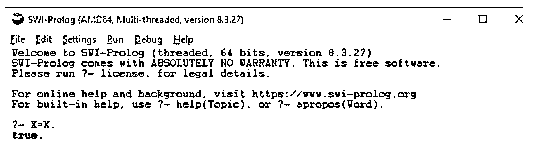
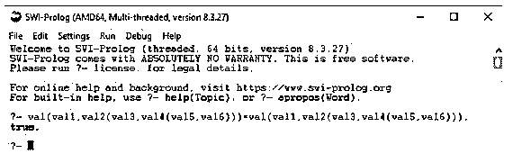
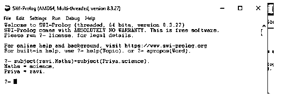
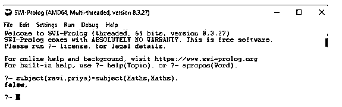
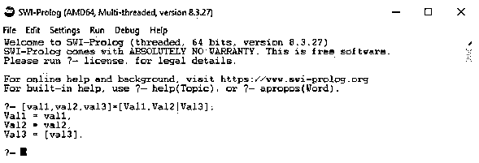
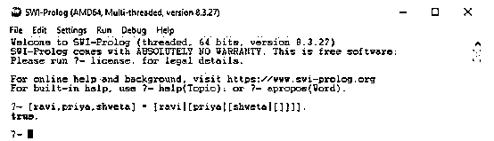

# Prolog 统一

> 原文：<https://www.educba.com/prolog-unification/>

## Prolog 统一介绍

Prolog unification 为一个或多个变量赋予值，以使两个调用项相同，这个过程称为将变量绑定到值。在 prolog 统一中，prolog 同意两个术语统一，即变量与任何事物统一，因此它们将彼此统一。Prolog 匹配两个术语的过程称为 Prolog unification。这个概念类似于统一逻辑。这个匹配过程是从左到右进行的，如果没有找到匹配，则失败。

### Prolog 统一的语法

不是 Prolog 统一的语法，而是统一的例子。

<small>网页开发、编程语言、软件测试&其他</small>

`?- X = X.`

`?- bob = X.`

`?- bob = robert.`

Prolog 最大的特点是它内置的模式匹配算法之一，即 unification。

我们有三种与统一相关的术语:

*   **常数:**像数字(34)和富兰克林(小写字母，也叫原子)。
*   **变量:**像 X，Y(大写开头的词)。
*   **复杂术语:**这些术语有形式。

如果两个术语可以匹配，则称这两个术语是统一的，只有在以下情况下才称它们匹配:

*   他们是同一届的。

或者

*   它们包含可以统一的变量，因此没有变量的两个术语是相同的。

例如，让我们考虑术语“雷克斯”和“雷克斯”；这些统一起来，因为它们是同一个原子。

类似地，第 34 项和第 34 项是统一的，因为它们是相同的数。

Y 和 Y 项是统一的，因为它们是同一个变量。

术语 men(bob)和 men(robert)也是统一的，因为它们通过将 bob 实例化为 robert 而变得相等。

术语 men(bob，X)和 men(X，robert)并不统一。这里，不可能找到 X 的实例化，这使得两个项相等。

将 X 实例化为 bob 将给出术语 men(bob，bob)和 men(bob，robert)，这表明它们是不相等的。然而，将 X 实例化为罗伯特会得到男人(鲍勃，罗伯特)和男人(罗伯特，罗伯特)，这也是不平等的。

这让我们得出一个结论，用户不仅对两个术语统一感兴趣，还想知道变量如何被实例化为相等。因此，prolog 执行所有必要的实例化，以使术语向前相等。Prolog 中的这一特殊功能允许构建复杂的术语，并使统一成为强大的编程机制之一。

### Prolog 统一背后的逻辑

统一不仅告诉 prolog 将统一哪些术语，还显示 Prolog 将对变量做什么来实现统一。如果值 1 和值 2 是常数，那么值 1 和值 2 统一当且仅当它们是相同的原子或相同的数。如果 value1 是一个变量，value2 是任何类型的值，那么 value1 和 value2 将统一，value1 将实例化为 value2。同样，如果 value2 是变量，而 value1 是任何类型的值，那么 value1 和 value2 将统一，value2 用实例化为 value1。如果 value1 和 value2 都是变量，则两者相互实例化并共享值。

如果 value1 和 value2 是复杂术语，当且仅当这两个值统一。

*   它们有相同的因子和 arity。
*   并且它们对应的所有论点都是统一的。
*   和变量实例化彼此兼容。

两个术语是统一的，当且仅当它们遵循要统一的前三个子句。

### Prolog 统一的例子

下面提到了不同的例子:

#### 示例#1

规则一

**代码:**

`?- X = X.`

**输出:**

根据上述第一条规则，这表示布尔值为真。

#### 实施例 2

第四条规则

**代码:**

`?- val(val1,val2(val3,val4(val5,val6)))=val(val1,val2(val3,val4(val5,val6))).`

**输出:**

#### 实施例 3

Prolog 统一

**代码:**

`?- men(bob,robert)= men(bob,robert).`

**输出:**

#### 实施例 4

实例化

**代码:**

`?- subject(ravi,Maths)=subject(Priya,science).`

**输出:**

这表明值是实例化的。

#### 实施例 5

不统一

**代码:**

`?- subject(ravi,priya)=subject(Maths,Maths).`

**输出:**

这里没有统一，因为科目(数学，数学)必须有相同的第一和第二参数。

#### 实施例 6

列表

**代码:**

`?-[val1,val2,val3]=[Val1,Val2|Val3].`

**输出:**

列表上的统一不必局限于寻找第一个头元素。这里我们可以看到第一个和第二个元素(Val1 和 Val2)，然后是 tail (Val3)。

#### 实施例 7

符号变体

**代码:**

`?- [ravi,priya,shweta] = [ravi|[priya|[shweta|[]]]].`

**输出:**

### 结论

我们已经看到了 Prolog 统一意味着什么，以及统一背后的实际逻辑是什么。我们还列出了大多数有用的例子，以提高对相关概念的了解。这种形式的 Prolog 编程特别适用于重要概念具有自然层次结构的应用程序。

### 推荐文章

这是一本关于 Prolog 统一的指南。在这里，我们分别讨论引言、prolog 统一背后的逻辑和例子。您也可以看看以下文章，了解更多信息–

1.  [人工智能如何工作？](https://www.educba.com/how-artificial-intelligence-works/)
2.  [网络编程语言](https://www.educba.com/web-programming-languages/)
3.  [sprintf Python](https://www.educba.com/sprintf-python/)
4.  [Prolog 编程](https://www.educba.com/prolog-programming/)

