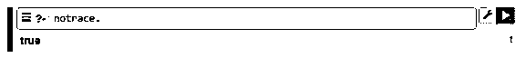
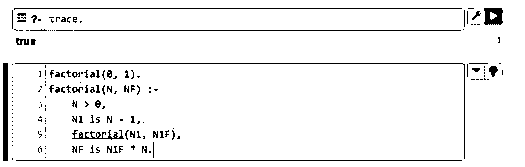
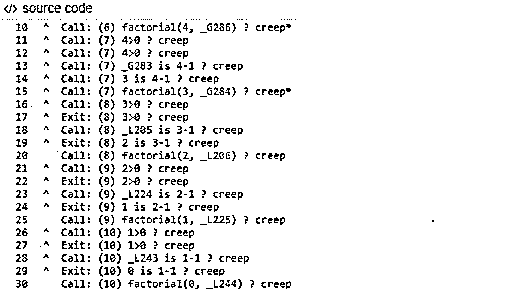
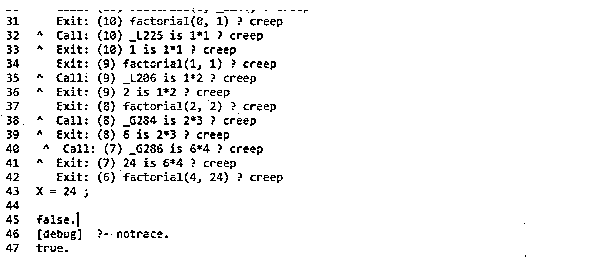

# 序言跟踪

> 原文：<https://www.educba.com/prolog-trace/>

## Prolog 跟踪简介

Prolog trace 跟踪 Prolog 查询的执行，它允许按顺序查看作为查询的一部分正在执行的所有目标，而与查询是否成功无关。它还允许用户查看作为 Prolog 回溯出现的步骤。它将允许用户在寻找特定查询的解决方案时跟踪程序的路线。为此，有两种不同的方法，一种是图形跟踪，另一种是非图形跟踪。各种跟踪给出了相同的解决方案，但以两种不同的方式完成。

**序言跟踪的语法**

<small>网页开发、编程语言、软件测试&其他</small>

要在 Prolog 中打开跟踪模式，我们需要执行下面的“目标”。

`?- trace.`

没错。

当不需要进一步追踪时，我们需要执行下面的“目标”。

`?- notrace.`

一个展示 trace 实际情况的示例:

**举例:**

Prolog 中的阶乘运算符。

**代码:**

`factorial(0, 1).
factorial(N, NF) :-
N > 0,
N1 is N - 1,
factorial(N1, N1F),
NF is N1F * N.`

在上面的代码中，计算的是 N 的阶乘，也就是 1 到 N 的数的乘积，按照约定，0 的阶乘是 1，N 的阶乘写成 N！，感叹号代表“阶乘运算符”。

### Prolog 跟踪的示例

下面提到了不同的例子:

#### 示例#1

序言跟踪。//开始

**代码:**

`?- trace.`

**输出:**

这里，trace 命令显示 true，这意味着跟踪目标已经成功执行。

#### 实施例 2

序言跟踪//结束。

**代码:**

`?- notrace.`

**输出:**

这里，使用 notrace 命令显示 true，这意味着没有成功执行任何跟踪目标。

#### 实施例 3

阶乘的轨迹。

让我们考虑下面的阶乘逻辑；我们将把下面的代码放在一个. pl 文件中，比如 factorial.pl，否则我们可以把它放在控制台中，如屏幕截图所示。

**代码:**

`factorial(0, 1).
factorial(N, NF) :-
N > 0,
N1 is N - 1,
factorial(N1, N1F),
NF is N1F * N.`

**输出:**

使用以下查询

**代码:**

`prolog -s factorial.pl.`

将执行 factorial.pl 文件，然后调用 trace goal。

**代码:**

`?- trace.
true
[trace] ?- factorial(3,X).`

生成以下跟踪。

**输出:**

`^ Call: (6) factorial(4, _G286) ? creep*
^ Call: (7) 4>0 ? creep
^ Call: (7) 4>0 ? creep
^ Call: (7) _G283 is 4-1 ? creep
^ Call: (7) 3 is 4-1 ? creep
^ Call: (7) factorial(3, _G284) ? creep*
^ Call: (8) 3>0 ? creep
^ Exit: (8) 3>0 ? creep
^ Call: (8) _L205 is 3-1 ? creep
^ Exit: (8) 2 is 3-1 ? creep
Call: (8) factorial(2, _L206) ? creep
^ Call: (9) 2>0 ? creep
^ Exit: (9) 2>0 ? creep
^ Call: (9) _L224 is 2-1 ? creep
^ Exit: (9) 1 is 2-1 ? creep
Call: (9) factorial(1, _L225) ? creep
^ Call: (10) 1>0 ? creep
^ Exit: (10) 1>0 ? creep
^ Call: (10) _L243 is 1-1 ? creep
^ Exit: (10) 0 is 1-1 ? creep
Call: (10) factorial(0, _L244) ? creep
Exit: (10) factorial(0, 1) ? creep
^ Call: (10) _L225 is 1*1 ? creep
^ Exit: (10) 1 is 1*1 ? creep
Exit: (9) factorial(1, 1) ? creep
^ Call: (9) _L206 is 1*2 ? creep
^ Exit: (9) 2 is 1*2 ? creep
Exit: (8) factorial(2, 2) ? creep
^ Call: (8) _G284 is 2*3 ? creep
^ Exit: (8) 6 is 2*3 ? creep
^ Call: (7) _G286 is 6*4 ? creep
^ Exit: (7) 24 is 6*4 ? creep
Exit: (6) factorial(4, 24) ? creep
X = 24 ;
false.
[debug] ?- notrace.
true.`

这里，生成了阶乘为 4 的跟踪。

**什么是蠕变？**

在 prolog 语言中，prolog 的一种实现，该字典使用它的语法，当用户在一行跟踪的末尾给出 return 时，Prolog 在同一行打印出单词“creep ”,然后打印出下一行的跟踪。然后，再次返回，打印在该行上蔓延并移动到其他行，等等。

还有进一步的跟踪设施，目标如下。

`?- help(trace).`

**Note:** Built-in programs are not traced, as the internal calls cannot be explained on tracing.

### 结论

我们已经看到了什么是 Prolog trace 以及它是如何实现的。我们还看到了实现 prolog 程序跟踪所需的目标和停止 prolog 程序跟踪所需的目标。我们还看到了一些跟踪的例子，这将有助于进一步理解跟踪的概念。我们可以给。pl 文件，并在 SWI prolog 终端的“Consult”选项下运行它，或者如上实现它。

### 推荐文章

这是一个 Prolog 跟踪指南。为了更好地理解，我们在这里讨论 prolog 跟踪的介绍和例子。您也可以看看以下文章，了解更多信息–

1.  [Prolog 编程](https://www.educba.com/prolog-programming/)
2.  [Prolog 运算符](https://www.educba.com/prolog-operator/)
3.  [人工智能如何工作？](https://www.educba.com/how-artificial-intelligence-works/)
4.  [网络编程语言](https://www.educba.com/web-programming-languages/)

