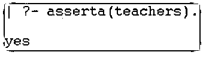
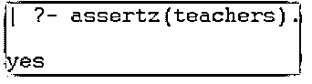
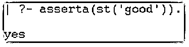
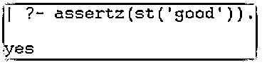
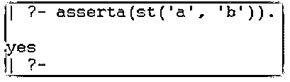
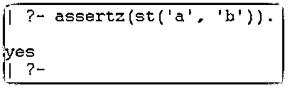
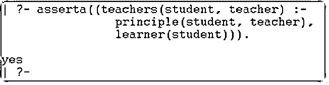
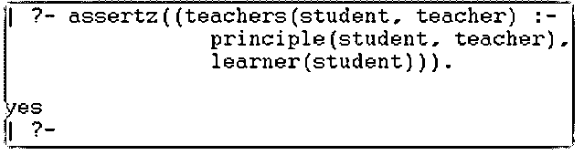

# Prolog 断言

> 原文：<https://www.educba.com/prolog-assert/>

## Prolog 断言简介

prolog assert 是一个谓词，用于使用 prolog 语言在应用程序的数据库中添加新参数。它是一个元谓词，根据需要在数据库中插入事实和子句。它是一种使用编程语言在数据库的开头或结尾插入单个子句或规则的功能。使用 prolog 编程语言在数据库中添加所需的子句和事实是一种不同类型的方法。在 prolog 数据库中，在其他参数和子句之前或之后添加事实或规则是谓词之一。prolog 数据库允许在任何位置使用谓词添加一些规则、事实和子句，称为 prolog 断言。

### Prolog 断言的语法

以下语法显示了 prolog 断言及其数据。

<small>网页开发、编程语言、软件测试&其他</small>

`assert(Data).`

**说明:**

*   它用于在数据库中添加子句或事实。
*   它在其他参数之前或之后插入参数。
*   此函数对事实或子句使用单个参数。

例如，prolog assert inserts 子句 before other arguments 语法如下所示。

`asserta(Data).`

**说明:**

*   它用于在数据库中添加子句或事实。
*   它在其他参数之前插入参数。
*   此函数对事实或子句使用单个参数。

它在其他参数后插入子句，语法如下所示。

`Assertz (Data).`

**说明:**

*   它用于在数据库中添加子句或事实。
*   它在其他参数之后插入参数。
*   此函数对事实或子句使用单个参数。

参数前有事实和值，语法如下所示。

`asserta(fact('value')).`

**说明:**

*   它用于在数据库中添加事实及其值。
*   它在其他参数之前插入参数。

其他参数后带有事实和值，语法如下所示。

`Assertz (fact('value')).`

**说明:**

*   它用于在数据库中添加事实及其值。
*   它在其他参数之后插入参数。

### Prolog 中 assert 是如何工作的？

下面给出了 assert 在 Prolog 中的工作方式:

#### 方法 1:

Prolog 注释在“pl”文件中有效。

*   创建一个扩展名为“pl”的文件。

**示例:main.pl**

*   如果你想要这些数据，那么参考 prolog 文件。

Prolog 注释在控制台中有效。

*   打开 prolog 控制台或解释器。
*   设置“pl”文件的目录路径。
*   使用给定的 prolog 文件。

**【主】。**

*   您可以直接使用 prolog 控制台进行编程。
*   使用 prolog 控制台中的语法。

`| ?- asserta(teachers).`

或者

`| ?- assertz(teachers).`

#### 方法二:

对于数据库中的 inserts 子句，可以直接使用 prolog 控制台。

Prolog 注释在控制台中有效。

*   打开 prolog 控制台或解释器。
*   您可以直接使用 prolog 控制台进行编程。
*   使用 prolog 控制台中的语法。

`| ?- asserta((teachers(student, teacher) :-
principle(student, teacher),
learner(student))).`

#### 方法三:

对于数据库中的 inserts 子句，可以直接使用 prolog 控制台。

Prolog 注释在控制台中有效。

*   打开 prolog 控制台或解释器。
*   您可以直接使用 prolog 控制台进行编程。
*   使用 prolog 控制台中的语法。

`| ?- asserta(st('a', 'b')).`

或者

`| ?- assertz(st('a', 'b')).`

#### 方法 4:

对于数据库中的 inserts 子句，可以直接使用 prolog 控制台。

Prolog 注释在控制台中有效。

*   打开 prolog 控制台或解释器。
*   您可以直接使用 prolog 控制台进行编程。
*   使用 prolog 控制台中的语法。

`| ?- asserta(st('a')).`

或者

`| ?- assertz(st('a')).`

### Prolog 断言的示例

下面提到了不同的例子:

#### 示例#1

带有 before 参数的基本“prolog assert”示例，输出如下所示。

**代码:**

`| ?- asserta(teachers).`

**输出:**

**说明:**

*   它使用在数据库中添加一个子句。
*   它在其他参数之前插入参数。

#### 实施例 2

带有 after 参数的基本“prolog assert”示例，输出如下所示。

**代码:**

`| ?- assertz(teachers).`

**输出:**

**说明:**

*   它使用在数据库中添加一个子句。
*   它在其他参数之后插入参数。

#### 实施例 3

带有 before 参数的基本“prolog assert”示例，输出如下所示。

**代码:**

`| ?- asserta(st('good')).`

**输出:**

**说明:**

*   该命令使用事实及其在数据库中的单个数据。
*   它在其他参数之前插入参数。

#### 实施例 4

带有 after 参数的基本“prolog assert”示例，输出如下所示。

**代码:**

`| ?- assertz(st('good')).`

**输出:**

**说明:**

*   该命令使用事实及其在数据库中的单个数据。
*   它在其他参数之后插入参数。

#### 实施例 5

带有 before 参数的基本“prolog assert”示例，输出如下所示。

**代码:**

`| ?- asserta(st('a', 'b')).`

**输出:**

**说明:**

*   该命令使用数据库中的事实和多个数据。
*   它在其他参数之前插入参数。

#### 实施例 6

带有 after 参数的基本“prolog assert”示例，输出如下所示。

**代码:**

`| ?- assertz(st('a', 'b')).`

**输出:**

**说明:**

*   该命令使用数据库中的事实和多个数据。
*   它在其他参数之后插入参数。

#### 实施例 7

带有 before 参数的基本“prolog assert”示例，输出如下所示。

**代码:**

`| ?- asserta((teachers(student, teacher) :-
principle(student, teacher),
learner(student))).`

**输出:**

**说明:**

*   该命令使用数据库中的多个事实及其数据。
*   它在其他参数之前插入参数。

#### 实施例 8

带有 after 参数的基本“prolog assert”示例，输出如下所示。

**代码:**

`| ?- assertz((teachers(student, teacher) :-
principle(student, teacher),
learner(student))).`

**输出:**

**说明:**

*   该命令使用数据库中的多个事实及其数据。
*   它在其他参数之后插入参数。

### 结论

它将事实、规则和子句插入到应用程序数据库中。该条件创建了一个优雅的、用户友好的和可操作的应用程序。该功能根据需要管理和操作编程数据或值。

### 推荐文章

这是一个 Prolog 断言指南。这里我们讨论一下入门，Prolog 中的 assert 是如何工作的？和示例。您也可以看看以下文章，了解更多信息–

1.  [Prolog 编程](https://www.educba.com/prolog-programming/)
2.  [Prolog 运算符](https://www.educba.com/prolog-operator/)
3.  [人工智能如何工作？](https://www.educba.com/how-artificial-intelligence-works/)
4.  [Prolog findall](https://www.educba.com/prolog-findall/)

