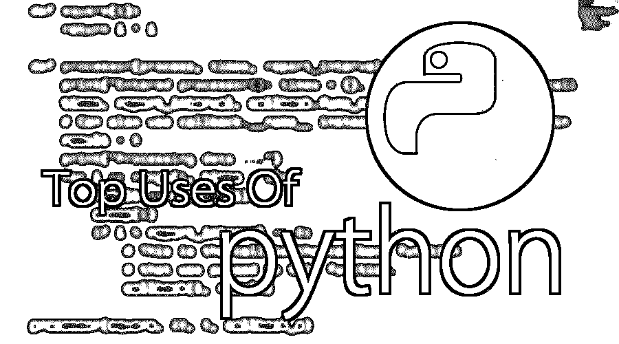

# Python 的用途

> 原文：<https://www.educba.com/uses-of-python/>

## Python 使用简介

[Python](https://www.educba.com/what-is-python/) 是市面上众多开源的、面向对象的编程应用软件之一。Python 的许多用途包括应用程序开发、自动化测试过程的实现、允许多种编程构建、完全构建的编程库、可用于所有主要操作系统和平台、数据库系统可访问性、简单可读的代码、易于应用于复杂的软件开发过程、有助于测试驱动的软件应用程序开发方法、机器学习/数据分析、帮助模式识别、在多种工具中得到支持、被许多提供的框架所允许等。

### Python 的 10 个重要用途

Python 可以更人性化，因为它的优点。出于不同的原因，请在下面找到 python 语言的用法:

<small>网页开发、编程语言、软件测试&其他</small>

#### 1.应用程序

Python 可用于开发不同的应用程序，如 web 应用程序、基于图形用户界面的应用程序、软件开发应用程序、科学和数字应用程序、网络编程、游戏和 3D 应用程序以及其他商业应用程序。它使交互界面和应用程序的开发变得容易。

#### 2.多种编程范例

它之所以被使用，还因为它提供了对几种编程范例的持续支持，因为它[支持面向对象编程](https://www.educba.com/functional-programming-vs-oop/)和结构化编程。Python 有特性，也支持函数式编程语言的各种概念。它用于动态类型系统和自动内存管理。Python 语言特性和编程范式允许您开发小型和大型应用程序。它可以用于[复杂的软件应用](https://www.educba.com/what-is-application-software-its-types/)。

#### 3.强大的标准库

它有一个庞大而健壮的标准库用于开发应用程序。这也使得开发人员使用 Python 胜过其他语言。标准库帮助您使用 Python 可用的各种模块，因为该模块帮助您添加功能，而无需编写更多代码。要获得关于各种模块的信息，可以参考 python 标准库的文档。在开发任何 web 应用程序、实现 web 服务、执行字符串操作和接口协议等其他用途时，标准库文档会有所帮助。

#### 4.与主要平台和系统兼容

它主要与主流平台和系统兼容，因此主要用于开发应用程序。在 python 解释器的帮助下，python 代码可以在特定的平台和工具上运行，因为它支持许多操作系统。因为 python 是一种解释型高级编程语言；它允许你在多个平台上运行代码。新的和修改后的代码无需重新编译即可执行，并且可以监控或检查其影响。这意味着不需要在每次修改后重新编译代码。这个特性有助于节省开发人员的开发时间。

#### 5.数据库的访问

Python 的使用也有助于轻松访问数据库。Python 有助于定制不同数据库的接口，如 MySQL、Oracle、Microsoft SQL Server、PostgreSQL 和其他数据库。它有一个像 Durus 和 ZODB 这样的对象数据库。用于[标准数据库](https://www.educba.com/careers-in-database-administration/) API，免费下载。

#### 6.代码可读性

Python 代码易于阅读和维护。在需要的地方，它也很容易被重用。Python 有简单的语法，这允许开发不同的概念，而无需编写任何额外的代码。代码要质量好，易于维护源代码，简化维护，这是开发软件应用所要求的。与其他编程语言不同，它还强调代码的可读性，这是一个很好的特性。它有助于构建定制的应用程序，干净的代码有助于维护和更新软件应用程序，而无需在相同的代码中投入额外的精力。

#### 7.简化复杂的软件开发

Python 是一种通用的编程语言，应用 Python 可以简化复杂的软件开发过程。它用于开发复杂的应用程序，如科学和数字应用程序，以及桌面和 web 应用程序。Python 具有分析数据和可视化等功能，这有助于创建定制解决方案，而无需投入额外的精力和时间。它帮助您以有效的方式可视化和呈现数据。

#### 8.许多开源框架和工具

Python 是开源的，很容易获得。这也有助于大幅降低软件开发的成本。有许多 [python 框架](https://www.educba.com/python-frameworks/)的开源应用程序、库和开发工具，用于开发应用程序而无需投入额外成本。Python 框架简化并加快了 web 应用程序开发的过程，框架有 Django、Flask、pyramid 等。Python GUI 框架可用于开发基于 GUI 的应用程序。

#### 9.采用测试驱动开发

借助于采用测试驱动的开发方法，Python 使得编码和测试变得更加容易。测试用例可以在任何代码开发之前轻松编写。每当代码开发开始时，编写的测试用例可以同时开始测试代码并提供结果。这些也可以用于检查或测试基于源代码的预先需求。

#### 10.使用 python 的其他应用程序

使用 python 的其他应用有机器人、网络抓取、脚本、人工智能、数据分析、机器学习、人脸检测、颜色检测、3D CAD 应用、基于控制台的应用、基于音频的应用、基于视频的应用、企业应用和图像应用等。这些是一些主要的应用。

### 结论

在这篇使用 python 的文章中，我们看到 Python 是用于开发桌面和 web 应用程序的主要语言之一。Python 具有处理常见编程任务的特性。Python 易学易用。有时，python 比其他广泛使用的编程语言如 Java 慢。Python 应用程序可以通过简单地维护代码和使用自定义运行时来加速。

Python 支持模块和包，这鼓励程序模块化和代码重用。Python 提供了生产率的提高，这使得它成为开发人员的首选。它有一个很好的学习曲线，因为它支持函数式和过程式编程语言。它是开源的，可以自由分发。编程语言的选择主要基于需求以及与平台和数据库的兼容性。

### 推荐文章

这是使用 Python 语言的指南。在这里，我们详细讨论了 Python 的不同用途，如数据库的轻松访问、软件开发、代码可靠性、健壮的标准库。您也可以看看以下文章，了解更多信息–

1.  [Hadoop 的用途](https://www.educba.com/uses-of-hadoop/)
2.  [JavaScript 的使用](https://www.educba.com/uses-of-javascript/)
3.  [Unix 的使用](https://www.educba.com/uses-of-unix/)
4.  [node . js 的用途](https://www.educba.com/uses-of-node-dot-js/)

