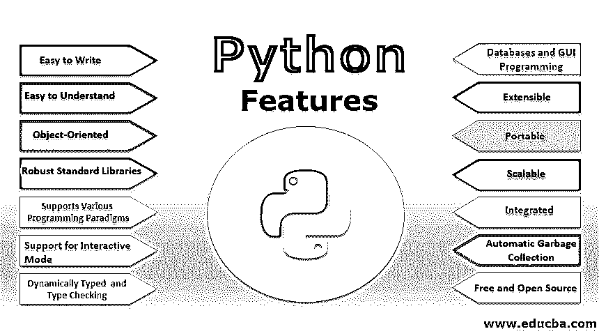

# Python 特性

> 原文：<https://www.educba.com/python-features/>




## Python 功能概述

Python 是一个著名的编程框架，以其简单的面向对象的特性优势而闻名。Python 的其他一些显著特性是库函数&模块本质上是可靠的，并通过其交互模式方便了开发人员。它还支持其他编程理论，提供类型的动态代码检查，易于访问数据库应用程序，用户界面编程非常简单，任何人都可以使用 python 编程，因为它是免费和开源的。它支持可扩展性和可伸缩性，最后，最重要的特点是自学、理解和编写代码很容易。

### Python 的 15 大特性

Python 的 15 大特性如下:

<small>网页开发、编程语言、软件测试&其他</small>

#### 1.容易写

如今，随着各种语言中库数量的增加，开发人员的大部分时间都花在了记住它们上。这是 python 的一大特点，因为 python 库使用简单的英语短语作为关键字。因此用 python 写代码非常容易。例如:-

为函数编写代码不使用花括号来分隔代码块。人们可以在函数、循环或类下缩进代码。

```
def fun()
print("Hi, i am inside fun");//this line    comes under function block as it is indented.
print("Hi ,i am outside  fun");//This line will be printed when control comes out of the function block.
```

#### 2.容易理解

这是 python 语言最强大的特性，这使得它成为每个人的选择。因为这里使用的关键字是简单的英语短语；因此，这很容易理解。

#### 3.面向对象

Python 拥有面向对象语言[的所有特性，比如继承](https://www.educba.com/inheritance-in-python/)、方法覆盖、对象等。因此，它支持所有的范例，并在其库中具有相应的功能。与 java 不同，它还支持多个继承的实现。

#### 4.强大的标准库

python 的库非常庞大，包括各种模块和函数，支持在各种数据类型[中工作的各种操作，如正则表达式](https://www.educba.com/regular-expressions-in-java/)等。

#### 5.支持各种编程范例

Python 支持面向对象语言的所有特性，也支持面向过程的范例。它也支持[多重继承](https://www.educba.com/multiple-inheritance-in-python/)。这一切都是可能的，因为它的庞大而健壮的库包含了所有的功能。

#### 6.支持交互模式

Python 还支持在交互模式下工作，在这种模式下可以轻松地调试代码并逐行进行单元测试。这有助于尽可能减少错误。

#### 7.自动垃圾收集

Python 还启动自动垃圾收集，以实现更好的内存和性能管理。因此，可以最大限度地利用内存，从而使应用程序更加健壮。

#### 8.动态类型和类型检查

这是 python 的一个重要特性，在使用变量之前不需要声明变量的数据类型。一旦值被赋给变量，它的数据类型就被定义了。因此，与其他编程语言不同，python 中的类型检查是在运行时完成的。

对于例如

```
v=7;// here type or variable v is treated as an integer
v="great";//here type of the variable v is treated as a string<
```

#### 9.数据库

应用程序的数据库是关键的部分之一，也需要相应的编程语言的支持。Python 支持所有可以在应用程序中使用的主要数据库，如 MYSQL、ORACLE 等。它们的数据库操作的相应函数已经在 python 库中定义了。人们需要在代码中包含这些文件才能使用它。

#### 10.GUI 编程

Python [作为一种脚本语言](https://www.educba.com/python-scripting-language/)也支持许多特性和库，允许应用程序的图形化开发。在大量的库和函数中，定义了相应的系统调用和过程来调用特定的操作系统调用，以开发应用程序的完美 GUI。Python 也需要一个框架来创建这样的 GUI。一些框架的例子有 Django、Tkinter 等。

#### 11.可扩张的

这个特性使得在 python 代码中使用其他语言成为可能。这意味着 python 代码也可以扩展到其他语言；因此，它可以很容易地嵌入到现有代码中，使其更加健壮并增强其功能。其他语言可以用来编译我们的 python 代码。

#### 12.轻便的

如果一种编程语言允许我们编写一次代码并在任何地方运行，那么它就是可移植的。这意味着它被编码的平台和它将要运行的平台不需要相同。这个特性允许面向对象语言最有价值的特性之一——可重用性。作为开发人员，需要对解决方案进行编码并生成其字节码，而不需要担心它将运行的环境。EO-one 可以在任何其他操作系统 Linux、Unix 等上运行在 Windows 操作系统上开发的代码。

#### 13.可攀登的

这种语言有助于开发各种能够处理不断增加的工作量的系统或应用程序。这些类型的应用程序对组织的发展帮助很大，因为它们足够强大，可以在一定程度上处理这些变化。

#### 14.免费和开源

是的，你没看错，在你的申请中使用这种语言你不需要支付一分钱。一个人只需要从它的官方网站下载，这一切都是为了开始。由于它是开源的，所以它的源代码也是公开的。人们可以很容易地下载它，根据需要使用它，并与他人分享。因此它每天都在进步。

#### 15.完整的

Python 可以很容易地与其他可用的编程语言如 C、C++、Java 等集成。这使得每个人都可以使用它来增强现有应用程序的功能，使它们更加健壮。

### 结论

Python 是一种高级的、高级的、健壮的、开源的、但易于理解和编码的语言，它允许开发人员专注于解决方案，而不是记住大量的关键字，因为它使用简单且易于记忆的英语短语作为其关键字。

其强大的库、对不同范例的支持、GUI 编程特性和集成特性使其成为最合适的语言。

### 推荐文章

这是 Python 特性的指南。这里我们讨论 python 的概述和 15 个不同的特性，包括易于编写和理解、面向对象和支持交互模式等。您也可以浏览我们推荐的其他文章，了解更多信息——

1.  [Python 框架](https://www.educba.com/python-frameworks/)
2.  [Python 编辑器](https://www.educba.com/python-editors/)
3.  [用于数据科学的 Python 库](https://www.educba.com/python-libraries-for-data-science/)
4.  [Python 替代品](https://www.educba.com/python-alternatives/)


