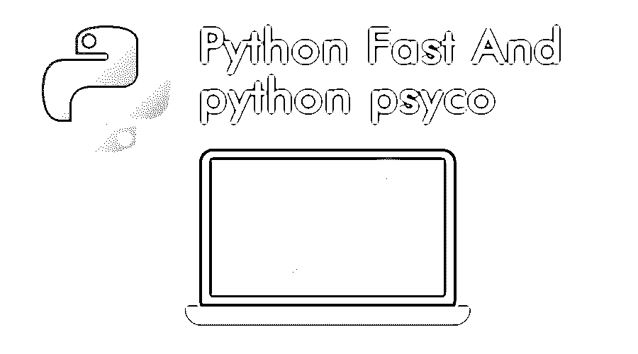

# python fast 和 python psycho

> 原文：<https://www.educba.com/python-fast/>




## 如何让 python 像《惊魂记》一样快

以下文章提供了 Python Fast 和 Python Psyco？如果你是另一个领域的经验丰富的程序员，并且你认为你知道基本知识，现在你可以阅读这个博客，那么就问自己一个问题，你知道 Psyco 是什么吗？如果在这一点上你认为这个“Psyco”意味着疯狂，那么这东西不适合你。

你仍然回避了很多基本的东西，或者你只是在自欺欺人，说你是一个有经验的程序员。相信我，我会尽量让这个博客变得简单，尽量不冒犯任何人。但是如果你没有正确的基础知识，你就很难理解这一点。

<small>网页开发、编程语言、软件测试&其他</small>

把难的部分放在一边；你甚至开始认为 python 快速的东西比任何其他编程都难，这是绝对错误的。现在我们知道什么是什么了，让我们开始吧，好吗？

### 什么是神经病

那么，Psyco 是什么？它让 python 变得很快。迷茫？是的，当我第一次听到这个的时候，我也很困惑。已经很快了，那为什么还要用 psyco 呢？所以我才说。这个博客不适合新手和初学者。如果你已经编写了代码，它运行了相当长的时间，创建了许多代码和一切，你会知道 python fast 需要紧凑和严格的编码。有了合适的编码类型，你可以使它既快又紧凑。

但这需要时间和材料。你不可能凭空创造出紧凑且无错误的代码。这就是 Psyco 的由来。它只是一个 python 快速扩展模块，可以加速 python 运行代码的执行。所以，你现在可能很困惑；模块是不是让 Python 代码运行更快了？是的，确实是这样。

### Python 及其本质

如果你以前用 Java 或 C 编写过代码，你可能会认为 python run 比其他的都快得多。但这就是你错的地方。就原始性能而言，肯定比 C、Java 或 C#慢。但它并不以原始性能的速度著称。

只有初学者或新手做原始编码。专业人员使用适当的缩进进行适当的编码。当您比较正确编译的代码并测量总内存使用量、初始启动时间、加载时间时，在那个时间点上，它运行得非常快。

此外，如果你试图编写代码来创建一个服务器之类的东西，Java 非常快，甚至比 c 更快。这是可能的，因为 Java 虚拟机可能会将热字节码编译成机器码。在这样做的时候，它可以充分利用 CPU 的每一个特性。

C 语言通常不是这种情况，至少在你离开实验室环境之前是这样。现在假设，将十几个优化的构建分发给你的客户——这是行不通的。

所以，现在让我们回到我们的主要观点，如果启动时间是一个问题(例如，对于服务器应用程序来说这不是一个问题)，Java 可能不是最好的选择。这也可能取决于您的热代码区域在哪里；例如:如果它们在本地库中，用一些 Python fast 代码简单地将它们粘合在一起，那么用 Python fast 也能获得类似 C 的性能。但是，脚本语言还是会慢一些——至少在大多数时候。

### 神经病——听起来就是这样

是的，你没看错。现在，让我们回到我们的主题。这是 psyco 开发人员在他们的网页中定义的内容:

“可以把 Psyco 看作是一种实时(JIT)编译器，有点像其他语言中存在的编译器，它会动态地发出机器代码，而不是一步一步地解释您的 Python 程序。与传统的 JIT 编译器不同的是，Psyco 编写了相同块的几个版本(一个块相当于一个函数)，这些版本通过专门化某些类型的变量进行了优化(一个“种类”可以表示一种类型，但它更通用)。结果是您的未修改的 Python 程序运行得更快。

2 到 100 倍的速度提升，通常是 4 倍，使用未修改的 Python 解释器和未修改的源代码，只是一个可动态加载的 C 扩展模块。"

简而言之，用一个简单的语句来重新表述这一点，它将为您提供更多类似 Java 的性能。你将获得更慢的启动时间和更高的内存使用率，以换取更快的[算法](https://www.educba.com/learning-algorithms/ "Best Programming Languages for Algorithms")。

话虽如此，在测试 Java 和 Python 之类的语言时，还是应该记住一些事情。这些语言中的代码通常可以通过使用更适合该语言的结构来显著加速(例如，在 Python fast 中使用 list comprehensions，或者在 Java 中对某些字符串操作使用 char[]和 String Builder)。

而且，对于 Python fast 来说，使用这个可以大大提高程序的速度。然后，还有使用适当的数据结构和关注代码运行时复杂性的整个问题。

要理解 python psyco，需要理解 python 的 eval_frame()函数。Python psyco 将 Python 的 eval_frame 函数转换为一个复合评估单元，并且在执行此操作时会使用大量内存。使用 psyco 远比解释它容易。

要简单地使用它，从 sourceforge.net 下载 psyco 模块，然后将这段代码放在第一段代码的开头:

**代码:**

```
import psyco ; psyco.jit()
from psyco.classes import *
```

然后，您可以使用下面的命令更精确地定位 psyco 的行为:

**代码:**

```
psyco.bind(somefunc) # or method, class
newname = psyco.proxy(func)
```

如果这些东西一开始对你不起作用，那么你需要有耐心。这需要反复试验。你不能直接期望你的程序像乌塞恩·博尔特那样运行。别挖苦我了，粗鲁的行为，但事情就是这样。

实际上，它不会改变或修改您的代码来使其更智能。更具体地说，它很难剖析您的代码。它进行最小的优化，使其尽可能接近机器码。

虽然它使你的程序和 C 一样快，但是也有一些限制和缺点。

以下是我列举的一些例子:

*   它现在已被弃用，无人维护，已经死亡。替代者是 PyPy。
*   即使是 python 2.7 也有很多问题。但是它在 2.5 版中运行得更好更快。
*   它不能在 64 位机器上工作。但是你可以安装一个 i386 架构的虚拟机并让它工作。
*   默认情况下，Mac OSX 自带 64 位 python。要让 Psyco 工作，需要从源代码重新编译 python x86。

即使有这么多问题，人们仍然使用 Psyco 而不是 PyPy。但是，如果你问我，PyPy 是 Psyco 的一个很好的替代品。它像一个即时编译器一样工作，但是 PyPy 有自己的即时编译器。在使用大量内存的情况下，PyPy 使用的内存比 Psyco 少得多。PyPy 甚至更兼容 Django 和 Twisted 这样的框架。

所以经过这一切，无论我说什么，都是为了我们自己的使用。有 Psyco 背景的人总是建议你使用 Psyco，而想要速度的人需要 PyPy。但是让我引用一些话。

“尽管你对 R1 或隼鸟这样的摩托车感觉很好，但有时骑哈雷戴维森也有它自己的乐趣。”

它与 Psyco 和 PyPy 的工作方式相同。所以，最后，不多费周折，我的建议是在开始的时候两种都用，然后继续用你觉得舒服的方法。

### 推荐文章

这是 Python Fast 和 Python Psyco 的指南？在这里，我们讨论什么是 psyco 及其真正的本质，以及如何让 python 像 Psyco 一样快。您也可以浏览我们推荐的其他文章，了解更多信息——

1.  [Python 面试问题](https://www.educba.com/python-interview-questions/)
2.  [Python 职业生涯](https://www.educba.com/careers-in-python/)
3.  [Python vs Node.js](https://www.educba.com/python-vs-node-js/)
4.  [Python 编译器](https://www.educba.com/python-compilers/)


