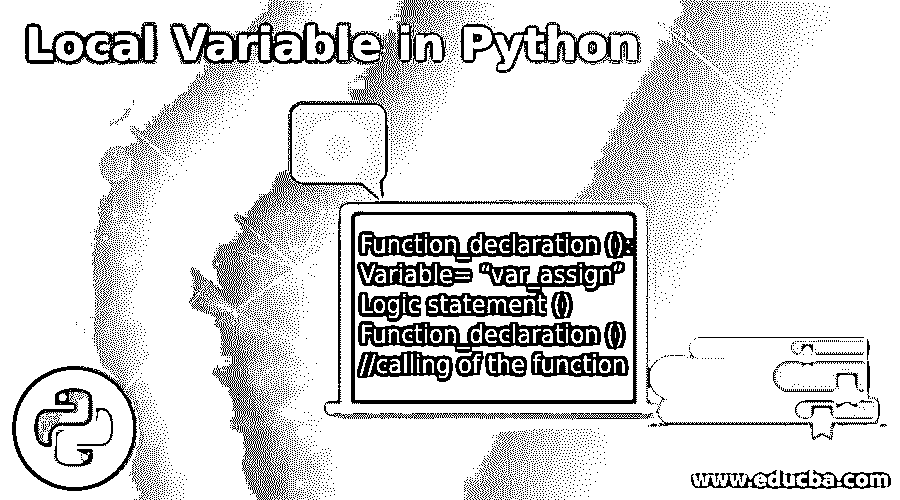
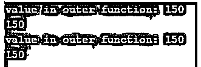
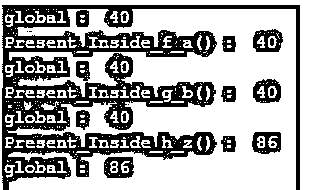

# Python 中的局部变量

> 原文：<https://www.educba.com/local-variable-in-python/>




## Python 中局部变量的介绍

Python 局部变量在整个 python 编程语言中起着重要的作用，因为它用于任何范围定义和操作。Python 中的局部变量总是在特定的范围内声明，就像它主要存在于其他成员可以访问它的任何函数体内一样。因此，局部变量出现在作用域之外或函数之外是非常困难和罕见的。如果一个变量出现在作用域之外，它被认为是一个全局变量，所有的成员对于一个局部变量来说都是不可访问的。

**Python 中局部变量的语法**

<small>网页开发、编程语言、软件测试&其他</small>

Python 函数中局部变量声明的语法流包括以下表示形式:

```
Function_declaration ():
Variable= “var_assign”
Logic statement ()
Function_declaration () //calling of the function
```

**说明:**

*   声明了一个函数，然后取变量，这就创建了内存，在它上面赋了一个变量，这就使它成为了一个局部变量，之后调用函数，然后调用下面的逻辑语句来执行大量的操作和工作。

### Python 中局部变量是如何工作的？

*   与其他变量不同，Python 中的局部变量也有很多定义和声明的区域，它们都有特定的作用域，这使得局部变量的工作成为可能。
*   当变量、方法和方法成员想要执行特定的语句或函数时，Python 中的局部变量非常重要，如果出现一些不需要的变量，就会引发一些错误。
*   局部变量大多在函数中定义，并且只在函数中使用；它们很少出现或出现在功能或范围之外。
*   全局变量的行为与局部变量的定义完全相反，它们可以出现在函数之外，如果函数内部没有局部变量，那么任何操作或逻辑实现都可以访问作为全局变量出现在函数外部的变量。
*   然后还有一些非局部变量，看起来是局部变量，但实际上不是。这种类型的变量作用域通常出现在嵌套函数或嵌套循环语句中。
*   如果任何一种非局部变量的值的变化是由外部变化引起的，那么它肯定会在局部变量中得到反映。
*   python 中的形参标识符的行为也类似于局部变量。
*   如果有人试图在作用域或函数之外获取局部变量，它将引发一个异常，称之为 NameError Exception。
*   Python 中局部变量的定义和声明也是根据需求以这种方式工作的。

### Python 中局部变量的示例

以下是 Python 中局部变量的示例:

#### 示例#1

这个程序演示了在函数中定义的局部变量，其中变量是在函数中声明的，然后是一条语句，后面是函数调用，如下面的输出所示。

**代码:**

```
def dinner_prep():
  dine = 'Pizza_with_extra_topping'
  print('Please have a pizza with extra_topping', dine)
dinner_prep()
```

**输出:**


#### 实施例 2

这个程序演示了一个场景，其中 pizza_name 是为 dine_time()函数定义的局部变量，并给出了一个错误消息，说明在所定义的函数之外不可访问。

**代码:**

```
dine_time()
  pizza
pizza_name
```

**输出:**


**说明:**

*   上面带有 pizza_name 的变量是在定义局部变量之后定义的，这不允许变量访问其他成员或功能，因此没有为变量提供适当的分配和工作。

#### 实施例 3

这个程序用两个场景演示了非局部变量，这两个场景描述了如果值位于范围或上下文中，或者如果值不在范围中，那么也会对值产生影响，这在下面的输出中表示出来。

**代码:**

```
def outer_def(no_local_val):
p_1=150
print ('value in outer function:',p_1)
def with_no_local_val():
nonlocal p_1
p_2=65
def without_no_local_val():
p_2=78
if no_local_val==True:
with_no_local_val()
else:
without_no_local_val()
return p_1
print (outer_def(True))
print (outer_def(False))
```

**输出:**




#### 实施例 4

这个程序演示了这样一个场景:如果在全局作用域中定义的值在局部作用域中定义，那么会发生什么？输出代表解决方案。

**代码:**

```
x_0=14
  def m_func():
  x_0=14
  x_0=x_0*4
print ('x_0 function scope comes as: ', x_0)
 m_func()
print ('x_0 function_scope_in_case_of_global_declr: ',x_0)
```

**输出:**


**说明:**

*   在这个程序中，我们可以看到，在函数的外部和内部定义了同一个变量，这使得先求解局部变量和变量逻辑，再从函数中出来，声明全局变量。有些人可以从另一个角度理解，因为声明的变量在范围之外，所以它会在后面出现。
*   因为这是两种类型变量之间的冲突，所以内部定义的变量将首先被排序，然后它将处理全局变量。

#### 实施例 5

这个程序演示了这样一个场景:全局变量和局部变量都在同一个代码段中定义，不同之处在于它们的声明中变量有自己的定义方式，然后进行解释和比较，如输出所示。

**代码:**

```
h_0 = 40
def f_a():
print('Present_Inside_f_a() : ', h_0)
def g_b():
h_0 = 40
print('Present_Inside_g_b() : ', h_0)
def h_p():
global h_0
h_0 = 86
print('Present_Inside_h_z() : ', h_0)
print('global : ',h_0)
f_a()
print('global : ',h_0)
g_b()
print('global : ',h_0)
h_p()
print('global : ',h_0)
```

**输出:**




**说明:**

*   这里，全局变量在作用域之外定义，后跟三个函数，其中局部变量与全局变量一起声明，并在其中嵌套出现，如输出所示。嵌套函数中的内部变量和局部变量总是优先，然后是外部变量。

### 结论

Python 中的局部变量起着非常重要的作用，因为它有助于使函数和代码片段通过简单的操作访问其他成员变量。此外，局部变量有助于使整个工作流与全局变量兼容，并降低复杂性。此外，嵌套函数或语句与局部变量很好地融合在一起。

### 推荐文章

这是 Python 中局部变量的指南。这里我们讨论一下导论，python 中的局部变量是如何工作的？和示例。您也可以看看以下文章，了解更多信息–

1.  [Python 中的 Shell 排序](https://www.educba.com/shell-sort-in-python/)
2.  [Python 中的插入排序](https://www.educba.com/insertion-sort-in-python/)
3.  [Python 中的烧瓶](https://www.educba.com/flask-in-python/)
4.  [Python 列表扩展](https://www.educba.com/python-list-extend/)


