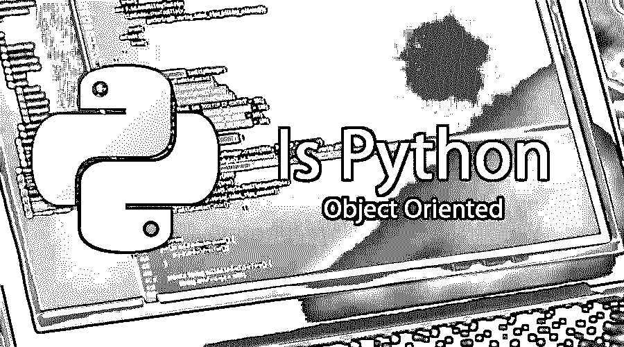

# Python 是面向对象的吗

> 原文：<https://www.educba.com/is-python-object-oriented/>

## Python 是面向对象的概述

是的，Python 是一种面向对象的编程语言。它是一种用于一般编程要求的解释型高级编程语言。它由吉多·范·罗苏姆设计和开发，并于 1991 年首次发布。它有一个动态类型的纪律，也很强。它的文件扩展名有不同的类型，如。py，。pyc，。pyd，。pyo。pyw，. pyz .它是面向对象的，函数式的，过程式的，反射式的，命令式的。它由 Python 软件基金会维护和开发。它主要受 CoffeeScript、JavaScript、Go、Ruby、Swift 和 Groovy 等语言的影响。它也是一种多范例编程语言。Lisp 编程语言激发了它的函数式编程特性。它还支持面向方面的编程。

### 面向对象编程

面向对象的编程模型通过在不同对象之间交互和调用不同对象的属性来工作。它有不同种类的概念，比如类、对象、多态、[封装](https://www.educba.com/encapsulation-in-python/)、继承和抽象。

<small>网页开发、编程语言、软件测试&其他</small>

面向对象编程的不同特性如下:

*   **类:**这是对象的蓝图，定义了真正功能所在的字段或属性和方法。这些属性和方法称为成员，在成员声明期间，可以根据定义的访问修饰符来访问这些成员。

*   **Object:** 一个对象被称为类的实例，可以通过调用类的构造函数来声明和实例化。对象将具有状态，状态将包含类的属性将保存的数据。

*   **传承:**这是第三步流程。通过减少无用信息并将其转化为重要信息集，从现有数据中获取有价值的信息，从而对数据进行可视化、清洗、转换和公开。

*   **多态性:**多态性定义为以不同的可能方式执行单一任务的过程。多态可以通过两种方式实现，即方法重载和方法重写。方法重载也称为编译时多态性，而方法重写也称为运行时多态性。

*   **封装:**这就是封装，意思是将代码隐藏或绑定或包装到单个单元或模块中，定义为类。面向对象编程的封装特性可以通过使用类来实现。当类成员是私有的(访问修饰符)时，一个对象被认为是封装的，它只能通过使用类中的 getters 和 setters 方法来访问。

*   **抽象:**面向对象的特性抽象可以定义为通过只暴露所需的接口或访问方法来调用实现类方法来隐藏功能实现的过程。抽象可以在编程语言中通过定义接口或抽象类来实现。

### 与其他不同的面向对象编程语言的比较

其他不同的面向对象编程语言包括 C++、Java、Objective C、Ruby、Smalltalk、Visual Basic.NET、Simula、JavaScript 等。;在 Python 中，self 相当于 Java 编程语言中的这个引用，用于引用对象，而这个引用也将在 JavaScript 编程语言中使用。在 Python 中，类用于定义类，这在其余的面向对象语言中也是类似的，例如 JavaScript，按照 ES6(ECMAScript-JavaScript 编程语言的标准)定义类。实例化对象时将调用的初始方法是 __init__ 而在 Java 的情况下将调用默认或声明的构造函数，而在 JavaScript 的情况下，它是基于原型的机制，其中根或父类对象机制将被调用或实现，因为它具有原型继承机制。

Python 中存在继承机制，类似于 C++、Java 等其他语言的继承机制。Python 通常比 Java 花费更多的时间，这导致 Python 程序的执行速度较慢。编写 Python 程序比其他面向对象的编程语言更容易，因为在程序中使用的语法更简单、更简短。Python 还可以与其他不同的面向对象编程语言(如 Java)集成，以开发两种语言的应用程序，这将有利于功能，并且两个程序可以在彼此内部调用来执行应用程序。

### 面向对象和非面向对象编程语言的区别

面向对象的语言具有开发真实世界场景应用程序的强大功能，而非面向对象的语言(如过程语言)具有与实时应用程序相关的有限功能。面向对象编程遵循自底向上的方法，而非面向对象编程模型遵循自顶向下的方法。编程特性将被分为方法或对象，而非面向对象的编程将函数定义为执行操作的一段代码。数据隐藏可以在面向对象的编程中完成，而数据隐藏在非面向对象的编程中是不可能的。继承和抽象是面向对象编程中的强大特性，而这些在非面向对象编程中并不存在。面向对象编程中允许运算符重载，而非面向对象编程中则不允许。非面向对象编程的例子有 Pascal、FORTRAN 等。

### 结论

编程语言的面向对象特性为开发更大更复杂的应用程序提供了丰富的特性，以便在当前数据和客户不断增加的数字世界中支持和运行更大的业务。在得出 python 是面向对象的结论时，我们需要告诉您，通过使用一个名为 Django 的框架，Python 可以用于开发 web 应用程序，该框架将提供大多数实现来简化 web 开发；所以没错，Python 是面向对象的编程语言。有几个其他框架可以与 Python 一起使用，为不同的基于场景的需求开发不同种类的应用程序。Python 还具有不同的其他特性，如函数性、过程性、反射性、命令性等。，而不是面向对象的功能。除了 OOP，Python 还提供了其他功能，如网络、Web 框架、图形用户界面、数据库、自动化等。

### 推荐文章

这是 Python 面向对象的指南。这里我们已经讨论了 Python 和面向对象的基本概念和特征。您也可以阅读以下文章了解更多信息:

1.  [Python 的用途](https://www.educba.com/uses-of-python/)
2.  [备忘单 Python](https://www.educba.com/cheat-sheet-python/)
3.  [c#中的方法重载](https://www.educba.com/method-overloading-in-c-sharp/)
4.  Java 中的[对象](https://www.educba.com/object-in-java/)

