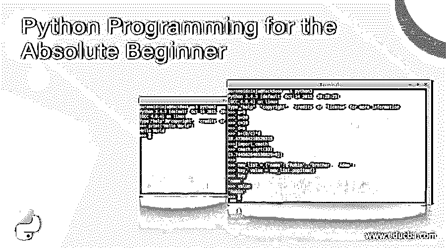
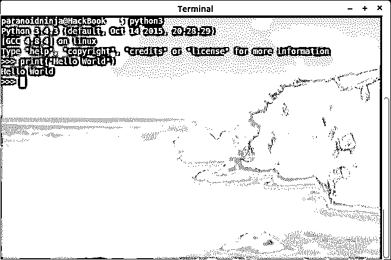
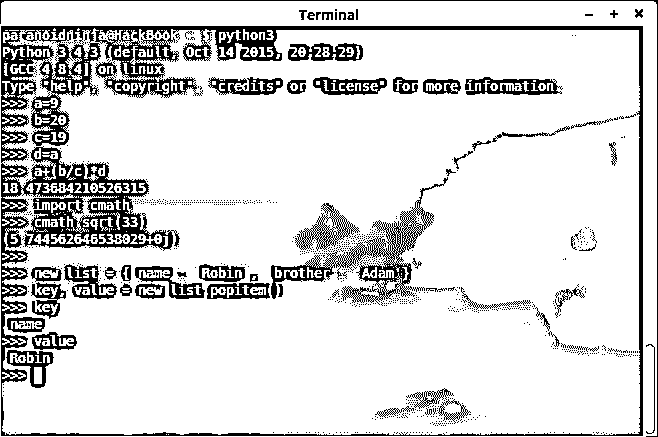
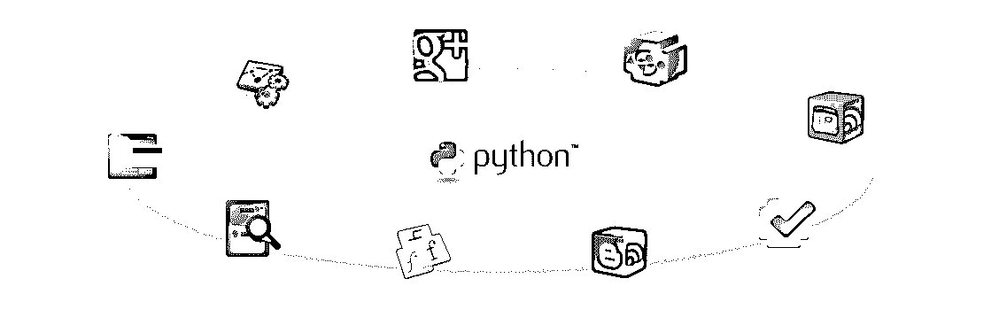

# 面向绝对初学者的 Python 编程

> 原文：<https://www.educba.com/python-programming-for-the-absolute-beginner/>




## 面向绝对初学者的 Python 编程介绍

所以，最近，我和我办公室的一个同事谈论了关于 Python 编程的问题。他是一名 C 和 Java 开发人员。他告诉我 Java 是如何占领世界的，它在任何地方都被使用。尽管我不是一个 python 狂热者，但我从心底里热爱 Python 编程，所以我只是告诉他 Python 编程的认证并不遥远。但是我完全被忽视了，因为 Java 现在更普遍了。

所以我对我的辩论不满意。我已经为 Python 开发程序很长时间了，我可以肯定的一件事是 Python 编程基础比 Java 简单“n”倍。然而，用 Java 编码的人显然会引发一场关于可移植性之类的争论。但是，我倾向于忽略它们。所以，我今天要讲的重点是 Python 编程语言如何更加有用和方便，尤其是对于初学者来说如何有用。因此，欢迎来到《Python 编程指南》(完全初学者)。

<small>网页开发、编程语言、软件测试&其他</small>

### 为什么应该为绝对初学者开始 Python 编程？

所以首先，为什么对于绝对初学者要从 Python 编程开始呢？Python 编程语言对初学者来说是个好的开始吗？你可能听说过有人以 C 语言为基础开始学习。c 不错。其实比 Python 好，但前提是你有很好的编程背景或者至少了解 Python 编程语言的基础。但是作为一个绝对的 python 编程初学者？我不这么认为。我自己也是从 C 开始学的，但是学了 15 天，而我说的 15 天，是指 1 天=16 个小时的练习。

所以，我开始学 C 的时候，卡住的部分是指针。(当时)太难理解了。我是硬件出身，相信我，这并不容易。因此，由于没有人指导，我开始学习 Java，这是我犯的另一个错误。我再次意识到 Java 甚至比 c 更难。所以，困惑和愤怒之余，我开始寻找在线社区的帮助，如 stackoverflow.com、GitHub，我意识到我没有合适的指南。我先从 C 开始，然后是 Java，因为很少有人学习 Java，C 给了我一个想法，说明 Java 和 C 使用得更广泛，它是最简单的编程语言之一。我希望我能见到那个人，向他展示这对 python 编程初学者来说到底意味着什么。

但是尽管如此，我还是从这些网络编程社区和 Ubuntu 论坛中获得了巨大的帮助，并意识到有一种语言叫做 Python 编程，而我实际上从未听说过这种语言。我在谷歌上搜索了 6-7 天，然后我意识到这就是我一直在寻找的东西。Python 编程语言有一个多样化的大型社区。它是完全开源的，这意味着任何人都可以用它做任何他们想做的事情。此外，我在这 15 天里学到的 C 语言知识，我在 3-4 天内就涵盖了《Python 编程基础入门》中的所有内容。此外，Python 编程基础作为一个初学者是如此有趣，以至于直到学习的第 10 天我才意识到我已经涵盖了这么多主题。

### Python 编程初学者代码——“Hello World”示例

以下是用 C、C++和 Java 打印“Hello World”的示例:

**C 代码:**

```
#include<stdio.h>
main()
{
printf(“Hello World”);
}
```

**C++代码:**

```
#include<iostream.h>
main()
{
cout << “Hello World”;
return 0;
}
```

**Java 编程:**

**代码:**

```
public class HelloWorld {
public static void main(String[] args) {
System.out.println("Hello World!");
}
}
```

**Python 编程语言:**

**代码:**

```
print(“Hello World”)
```

**输出:**

[

](https://cdn.educba.com/academy/wp-content/uploads/2016/01/Hello-World-in-Python.png) 

是的。我在这里编写了输出相同内容的命令，以便在屏幕上显示“Hello World ”,但是正如您所看到的，C、C++和 Java 中的语法(或者对于初学者来说更具体的命令)需要解释，而 Python 编程中的语法不需要解释。

即使是一个没有任何计算机基础知识的人，也能看懂它打印的是 Hello World。是的，python 编程培训就是这么简单。

### Python 编程基础

[

](https://cdn.educba.com/academy/wp-content/uploads/2016/01/Basic-Calculations-in-Python.png) 

因此，在我们继续学习更高的东西之前，让我们先了解一下 Python 编程对于绝对初学者的基础。作为一个初学者，你需要理解的第一件事，以及你开始 python 编程培训需要的心态是，无论你写什么，你永远不会有正确的答案。一旦你有了必要的知识，你可能会觉得有必要写一些自己的自动化程序，你也可能会成功。

然而，大多数时候，你可能会觉得写出来的程序并不比你用其他语言写出来的快或者慢。比如用 C 写的程序，会比 python 编程快 10 倍。但这并不意味着 python 编程语言很慢。这只是意味着你需要找到一种方法让它更快。显然，它永远不会像 C 一样快，但它显然会比编写和编译 C 或 Java 程序更耗时。此外，用 Python 调试别人的程序更容易，因为语法比用 C 或 Java 阅读没有注释的程序更容易理解。

另外，记住学习时不要比较两种不同的语言。你可能会说我在说反话，因为我自己比较了 C 编程和 Python 编程，但我确实说明了 Python 编程认证对绝对初学者是有好处的。当然，C 有它自己的一套优点和缺点，Python 编程也是如此。但是一个绝对的初学者，python 编程培训是选择。下面我们来看看 Python 的一些现实应用。

### Python 编程语言的基础用在哪里？

[

](https://cdn.educba.com/academy/wp-content/uploads/2016/01/img13.png) 

图片来源:pixabay.com

至于任何官方的回答，我建议你看一下官方的 [python 网站](https://www.python.org/about/apps/ "Python"):

简单地说，Python 编程语言几乎在任何地方都被使用。在转换到 c 之前，谷歌本身在数据库管理中使用了很长一段时间的 python 编程语言。Python 编程被大量用于自动化网络相关应用，尤其是在数学、科学和机器人领域。如果您对 python 编程培训有特殊兴趣，那么一旦您学习了它，我会建议您看看覆盆子 Pi 和 Arduino 芯片。这是一个非常强大的微处理器，可以与 Python 编程并行工作。

此外，更不用说 Python 的 Django 框架对于 web 开发来说是无可匹敌的了。对于绝对初学者的 python 编程方面的认证，一旦你获得了 Python 编程培训的基础，你甚至可以看看 Django，这是一个基于 Python 开发与 app 相关的 web 的框架。一些建立在 Django 上的著名网站可能是 Instagram 和 Pinterest 这样的社交网站，或者 Mozilla Support、Reddit gifts 这样的社区网站，以及 Chess.com 这样的游戏网站，它在国际象棋游戏方面有着悠久的历史。

除了 web 开发，python 编程语言的基础也用于嵌入式脚本、3D 软件，如 Maya、Quantum GIS 等等。这些事情证明，虽然 Python 编程培训并不被用于高端性能应用程序，因为它不是，但它仍然是人们做许多其他工作的选择。现在我们知道了 Python 编程培训的能力，

### Python 编程的绝对初学者-先决条件

坦率地说，Python 编程入门没有特定的前提条件。Python 是一种如此简单的语言，以至于它是大多数人学习的初级或初级选择，这使得它成为学习任何其他东西的先决条件。

但是这使得基本的 Python 编程培训有点太难了。假设你在学习的时候倾向于保持头脑清醒，这是很少发生的，那么学习 python 作为主要语言是没有问题的。我的意思是保持头脑清醒，因为通常情况下，当人们学习 python 时，他们太习惯于 python 的简单性，因为他们刚刚开始学习 python 编程语言。

Python 开发人员可以用相当简单的方式编写大量代码。但是如果你想超越 python 编程方面的认证，在此之后学习其他语言，比如 Java、C、Scala 或者 Haskell，那么这可能会成为一个障碍。主要原因是，一旦人们习惯了 python，C 和 Java 之类的编码和复杂性就会变得相当烦人。尤其是指针和庞大的库，对于初学者来说是难以理解的。

所以，我的观点是，如果你计划在 Python、Ruby 或 Perl 等语言上继续你的职业生涯，那么作为一个绝对的初学者，追求 Python 编程的认证是没有问题的。但是，如果你想成为一名多学科的编程忍者，那么我会建议你先学习 C 或 Java，然后再学习 python，因为那样的话，你会很难学习 C 和 Java，而且既然你知道如何编码，学习 Python 编程语言将只是小菜一碟。

### Python vs 世界

所以，现在我们聪明了，知道 python 和 C 是怎么工作的了。我们已经看到了 python 是如何在外部真实世界中使用的。但是让我们看看它是如何影响我们的日常生活的。谈到自动化，Python 非常有用。比如说你有很多社交账号，你有很多密码。由于我们程序员都是偏执狂，我们倾向于为我们拥有的每个其他网站帐户保留不同的密码。

但是谁有时间记住所有这些东西呢？即使我们试着去研究它，一旦我们更改了密码，我们仍然必须记住我们更改了哪些密码以及类似的东西。所以，通常人们把它写在一张纸上，或者至少是技术狂，像我这样的人在手机和笔记本电脑上使用记事本应用程序。但是，如果有人得到他们的手，这仍然是危险的。现在有其他方法可以买到密码保护程序，但是真的值得吗？是的，这就是 python 介于两者之间的地方。我也有类似的问题，实际上我是在学习 python 中的字典和条件时偶然发现的。

因为如果你是 python 编程认证的初学者，你很难理解，所以我在这里写伪代码，让你能理解。现在，python 有了字典和条件。条件使用 if、if 和 else 来完成一个语句。

事情是这样的:

**代码:**

```
if I don't go to work;
make me a coffee.
else
don't;
```

**输出:**

[

](https://cdn.educba.com/academy/wp-content/uploads/2016/01/If-else-conditions-in-Python.png) 

现在你明白我的意思了吧？是的，那是伪代码，这意味着我也可以这样做:

**代码:**

```
if password=iamsmart
proceed to step two
else
print “invalid password.”
```

当我启动 python 制作的记事本文件时，它会要求我输入密码；如果我输入它，它将允许访问，否则它不会。我把这个和字典结合起来。字典是可以用来调出储存在里面的其他东西的东西。一个很好的例子就是虚拟电话簿。例如，在一个伪世界中，它会是这样的:

**代码:**

```
Book = { Adam : { phone :1234, address: RoomNo.1},
Eve : { phone : 5678, address: RoomNo.2},
Smith : { phone : 9012, address: RoomNo.3} }
```

现在，这被称为伪词典。这本书就是这里的字典，它包含了亚当、夏娃和斯密的内容。现在，当我调用字典时，它会要求我输入一个名字。当我输入一个名字时，它会给我它的内容，即电话号码和地址。这就是 Python 编程培训中字典的工作方式。所以，我把名字改成了网站，把电话号码改成了密码。我不仅这样做了，而且还添加了 if-else 条件，之后看起来是这样的:

**代码:**

```
if password=iamsmart
proceed to step two
else
print “invalid password.”
LockBox = { Gmail : { Password@1 },
Facebook : { Password@2 },
Instagram : { Password@3 } }
```

我还做了一些修改，但就你而言，这对于一个 python 编程的绝对初学者来说是非常好的。现在，每当我想从别人的电脑或手机或我的工作场所登录时，我会在 py2exe 的帮助下将这个小 python 文件转换成可执行文件保存在我的 pen drive 上。所以，它首先要求输入密码；如果是正确的，它会问你要检查哪个密码，否则它会把我踢出去。

后来，我给这个东西添加了一些 PGP 加密，使它更加安全。但是现在你知道学 python 意味着什么了。这不仅是一门简单的语言，而且很有用。如果你想成为一名极限程序员，我建议你先学习 C 或 Java，然后再学习 Python 编程语言，否则如果你像我一样只是一名初学者，并且想把做一些很酷的自动化作为业余爱好，那么对于绝对初学者来说，没有什么比做 Python 编程更好的了。

### 推荐文章

这是一本针对绝对初学者的 Python 编程指南。这里我们讨论为什么你应该学习 python 编程，它的初学者代码，以及“hello world”的例子。您也可以看看以下文章，了解更多信息–

1.  [Python 面试问题](https://www.educba.com/python-interview-questions/)
2.  用于 Web 开发的 Python 和 Django
3.  [Python vs Ruby 性能](https://www.educba.com/python-vs-ruby-performance/)
4.  [Python 目录](https://www.educba.com/python-directories/)


