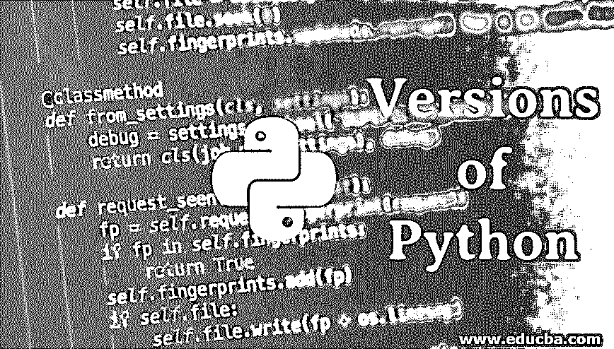

# Python 的版本

> 原文：<https://www.educba.com/versions-of-python/>

## Python 版本介绍

[Python](https://www.educba.com/what-is-python/) 是广泛使用的网站或基于 web 的应用程序开发过程，它以其面向对象的特性而闻名，如更高的效率、卓越的性能、可靠性等。自 1994 年以来，Python 已经发布了各种版本，如 Python 1.0、Python 1.5、Python 1.5.2、Python 1.6、Python 2.0、Python 2.0.1 等。Python 版本的最终版本列表是 2016 年 12 月 17 日发布的 Python 2.7.13、2017 年 1 月 17 日发布的 Python 3.5.3、2019 年 12 月 18 日发布的 Python 3.6.10 和 2020 年 2 月 24 日发布的 Python 3.8.2。

Guido Russom 发明了 python。Python 有无限的能力。如果我们看到 python 的代码，那就非常好理解了。它不会每次都使用花括号来定义特定的范围。相反，它使用了空格。通常，按照惯例，在 python 中使用四个空格来描述特定的[范围。我们一般指两个 python 版本，即 2.x 和 3.x，到 2020 年，python 2.x 就要过去了。不再提供所有支持。因此，从 3.x 版本开始是一个很好的做法。在我写这篇文章的时候，python 的当前版本是 3.7.3。3.8 正在开发中。](https://www.educba.com/scope-in-python/)

<small>网页开发、编程语言、软件测试&其他</small>

### Python 2 V/S Python 3

作为一个新人，每个人都会问一个问题，是学习 python 2 还是从 python 3 开始。答案是 Python 3。因为两者基本相同，所以 python 3 中只添加了一些新特性。如果你了解 Python 2，并且想得到 python 3，你可以很容易做到。

区别就像在 Python 2 中一样；您可以打印如下内容:

`print “Hello World!”`

但是在 Python 3 中，我们在 print 语句中添加了括号，如下所示:

`print(“Hello World!”)`

没有硬性的规则来选择其中之一，但是根据我的意见，你应该继续使用 Python 3。

### 如何安装 Python？

如果您使用的是 MAC/ Linux，那么您的机器上已经安装了 python。但是如果你在窗户上呢？对于 Windows 操作系统，需要安装 Python。

你可以访问 https://www.python.org 的官方网站。然后转到下载。并根据您的要求安装最新版本。

#### python3

Python 3 是一个改进版本。它支持 Unicode 字符。如果我们对某个整数进行分解，它会给出精确的输出。在 python 2 的早期，我们得到了相同的舍入值。大多数 IT 公司转向 python3。每一个更新的版本都会变得更快。另外，Python 对 python3 有很大的库支持。像脸书、Instagram 这样的公司正在使用 Python 3 作为他们的语言。需要注意的最重要的一点是，2020 年后将不再支持 Python 2.7。

那么 Python2 还有存在的必要吗？

*   是的，你不能说它完全消失了。一些公司仍然停留在 python 2.7 上。使用了一些 python 3 不完全支持的库。如果你使用 Python 3 进行编码，你需要学习 python 2.7。即使你用的是 2.7 版本，也不用担心。因为我们用 python 老版本写的所有代码都可以很容易的升级到 python 的新版本。
*   现在我们看到了很多与 python 版本相关的东西。现在你已经决定学 python 了。但下一个问题是从哪里开始。如何规划自己的 python 学习？今天不用担心；我将与你们分享一些学习材料。首先，网上有很多免费的东西。首先对于 python，你需要检查它是否在你的机器上。

您可以使用下面的命令来检查这一点。

*   如果您在 MAC 上，请转到您的命令提示符或终端。
*   写“Python”然后简单输入
*   您将得到包含 python 版本号和一些信息的消息。
*   假设它不在你的机器上。然后，您将得到一条消息，如“python”不被识别为内部或外部命令、可操作程序或批处理文件。
*   如果你还没有，用 python 官方网站上面提到的一些简单的安装步骤来安装它。

#### 版本 Python2 和 Python3 可以在同一台机器上使用？

是的，如果您对两者都有需求，那么您可以在同一个系统上使用两个版本。但是，每次你在那个时候处理一个特定的项目，你需要记住你正在处理的版本。如果你能避免两个版本之间的冲突，会有所帮助。

如果默认情况下，Python 2.7 已经存在，那么您需要显式地获得 python 3。

### Python 的未来范围

*   我们可以说 python 的范围是无限的，因为今天，在每个领域，Python 都是一个帮助中心。Python 在大数据、网页设计、自动化、人工智能、机器学习等领域无处不在。这些技术是 IT 的未来。
*   Python 有很多社区支持。许多程序员在这种支持下成长得非常快。如果你停留在某个地方，你可以通过这些社区找到出路。Python 的设计方式是将一些代码放在一行中。程序员喜欢这样写。

我们来看下面两个例子。

**Python 代码:**

`Print (“Hello World!!!”)`

**Java 代码:**

`class Abc{
public static void main(String[] args){
out.println(“Hello World!!!”);
}
}`

如您所见，Python 更便于编写代码。Python 是一种解释型语言，所以运行时间更短。Python 是所有程序员最喜欢的编程语言之一。Python 最受欢迎的一点是它可以很容易地与其他语言集成。为了让 Python 和 Java 一起工作，我们有了 Jython。

你可以在其官方网站上学习这种语言。此外，您可以在线注册学习不同的 python 教程。

### 结论

如果想开始编程生涯，可以从 Python 这样的语言开始。这是一种受到所有程序员极大喜爱的语言。使用 Python 你将获得光明的职业机会。

### 推荐文章

这是 Python 版本的指南。这里讨论一下入门，Python 2 V/S Python 3，如何安装 Python 等。您也可以浏览我们推荐的其他文章，了解更多信息——

1.  [Python 关键词](https://www.educba.com/python-keywords/)
2.  [PHP 关键字](https://www.educba.com/php-keywords/)
3.  [C++关键词](https://www.educba.com/c-plus-plus-keywords/)
4.  [Linux 上的顶级 Python IDE](https://www.educba.com/python-ide-on-linux/)

