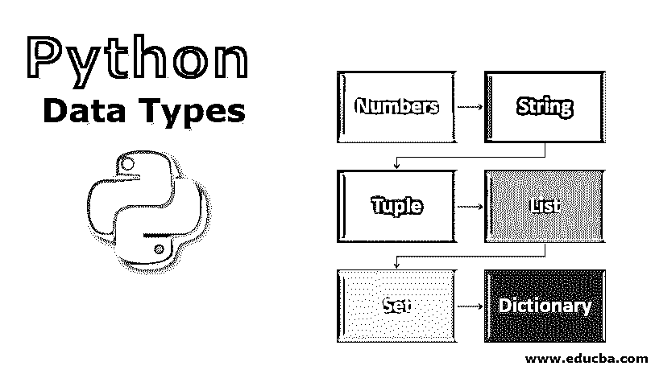
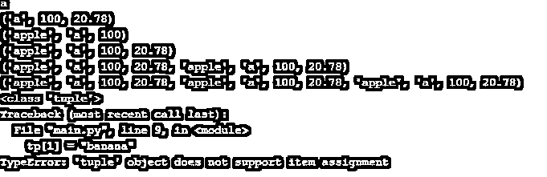
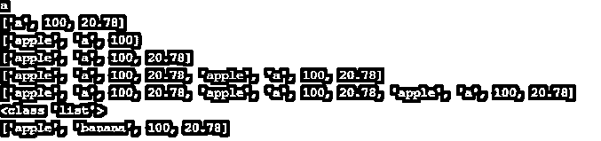
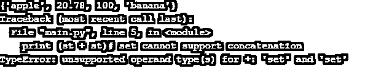
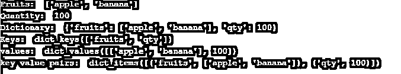

# Python 数据类型

> 原文：<https://www.educba.com/python-data-types/>




## Python 数据类型简介

数据类型只不过是编程语言接受的不同类型的输入数据，用于定义、声明、存储和执行数学和逻辑值/运算。例如，在 Python 中，许多数据类型用于处理对程序开发人员输入数据的一般操作。一些常用的[数据类型是数字值的 numbers](https://www.educba.com/sql-server-data-types/) ，单个或一系列字符的 String，不同数据类型组合的 Tuple，值集合的 List 等。

### Python 数据类型的示例

让我们看一下将不同数据类型的值存储到变量中并检查它们的类型的例子。

<small>网页开发、编程语言、软件测试&其他</small>

**代码**

```
var1 = 20
var2 = 20.65
var3 = "Hello!, World "
print( type(var1) );
print( type(var2) );
print( type(var3) );
```

**输出:**


**Note:** The Python language is case sensitive, which means that if we have the variable var1, then the same variable we can’t get be by Var1 or VAR1 etc.

### 前 6 大 Python 数据类型

python 的标准数据类型如下:

*   **数字:**数字数据类型用于存储数值。
*   **String:**String 数据类型用于存储字符序列。
*   **Tuple:** Tuple 数据类型用于存储不同数据类型元素的集合，不可变。
*   **List:** List 数据类型用于存储元素不同数据类型的集合，是可变的。
*   **Set:** Set 数据类型用于存储不同数据类型的元素；它是可变的，存储唯一的元素。
*   **Dictionary:** Dictionary 数据类型用于以键值对的形式存储元素的不同数据类型的集合；它是可变的，[存储唯一键](https://www.educba.com/unique-key-in-sql/)。

#### 1.数字

当一个数被分配给一个可变的数时，类对象被创建。

**考虑一个例子:** var a = 100，var b = 200 # var a 和 var b 编号被赋值，这些是编号的对象。

数字可以有 4 种类型的数值数据:

*   **int:** int 存储整数如 a=100，b=25，c=526 等。
*   **long:** long 存储更高范围的整数如 a=908090999L，b=-0x1990999L 等。
*   **float:** float 存储浮点数如 a=25.6，b=45.90，c=1.290 等。
*   **复数:**复数存储数字如 a=3 + 4j，b=2 + 3j，c =复数(4，6)等。

#### 2.线

字符串可以定义为引号中表示的字符序列。在 python 中，字符串可以用单引号、双引号或三引号括起来。在 python 中，可以使用各种内置运算符和函数轻松处理字符串数据类型。

以下示例显示了内置运算符和函数的字符串处理:

**代码:**

```
s = 'hello! how are you' # s is string variable
print (s[1]) # index operator - printing second character, character start storing from index 0
print (s[2:6]) # slice operator - printing 3rd character to 5th character of the string, the syntax of slice operator str[ start: end-1: increment] print (s*3) # printing the string three times
print (s[2:12:2])
s1 = 'hello world'
print (s + s1) # printing the concatenation of s and s1
```

**输出:**


#### 3.元组

元组还存储不同数据类型的[元素的集合。元组与列表相同，但元组是不可变的(不可编辑或不能修改大小和元素值)。创建元组使用()简单括号；在这个括号中，存储用逗号(，)分隔的所有元素。](https://www.educba.com/c-sharp-data-types/)

以下示例显示了元组处理:

**代码:**

```
tp  = ("apple", "a", 100, 20.78)
print (tp[1])
print (tp[1:])
print (tp[:3])
print (tp)
print (tp + tp)
print (tp * 3)
print (type(tp))
tp[1] = "banana"
print (tp)
```

**输出:**




#### 4.目录

List 存储不同类型元素的集合。该列表是可变的(可编辑的)。它与 C 中的数组相同，但列表存储不同数据类型的元素。创建列表使用[]方括号；在这些括号中，存储所有用逗号(，)分隔的元素。我们可以使用 index[i]、slice [:]运算符、串联运算符(+)、重复运算符(*)等。，可以像处理字符串一样处理列表。

以下示例显示了列表处理:

**代码:**

```
ls  = ["apple", "a", 100, 20.78]
print (ls[1])
print (ls[1:])
print (ls[:3])
print (ls)
print (ls + ls)
print (ls * 3)
print (type(ls))
ls[1] = "banana"
print (ls)
```

**输出:**




#### 5.一组

Set 还存储不同数据类型的元素的集合。集合与列表和元组相同，但是集合是不可变的(不可编辑或者不能修改大小和元素值)，不排序并且只存储唯一的元素。使用{}花括号创建一个集合，在这个括号内存储所有用逗号(，)分隔的元素。

以下示例显示了集合处理:

**代码:**

```
st  = {"apple", "banana", 100, 20.78}
# set cannot support indexing st[1]
# set cannot support slicing st[1:]
print (st)
print (st + st)# set cannot support concatenation
print (st * 2) # set cannot support repetition
print (type(st))
# set is immutable st[2] = "hi"
```

**输出:**




#### 6.词典

[Dictionary 也以键-值对的形式存储在](https://www.educba.com/dictionary-in-python/)[不同数据类型](https://www.educba.com/pl-sql-data-types/)元素的集合中。它是有序的、可变的，并将唯一的键存储为一个集合。创建集合使用与集合相同的{}花括号，在这个花括号中，括号存储所有用逗号(，)分隔的元素(键值对)。

以下示例显示了集合处理:

**代码:**

```
dc = {"fruits":["apple", "banana"],'qty':100}
print("Fruits: ",dc['fruits'])
print("Quantity: ", dc['qty'])
print ("Dictionary: ",dc)# print all elements of the dictionary
print ("Keys: ",dc.keys()) # print all the keys of the dictionary
print ("values: ",dc.values()) # print all the values of the dictionary
print ("key value pairs: ",dc.items()) # print all the key values pair elements of the dictionary
```

**输出:**




### 推荐文章

这是 Python 数据类型的指南。在这里，我们详细讨论 python 的前 6 种数据类型以及代码实现和输出。您也可以浏览我们推荐的其他文章，了解更多信息——

1.  [Python 中的抽象类](https://www.educba.com/abstract-class-in-python/)
2.  [终于在 Python 中](https://www.educba.com/finally-in-python/)
3.  [Python 的优势](https://www.educba.com/advantages-of-python/)
4.  [Python 中的布尔运算符](https://www.educba.com/boolean-operators-in-python/)


