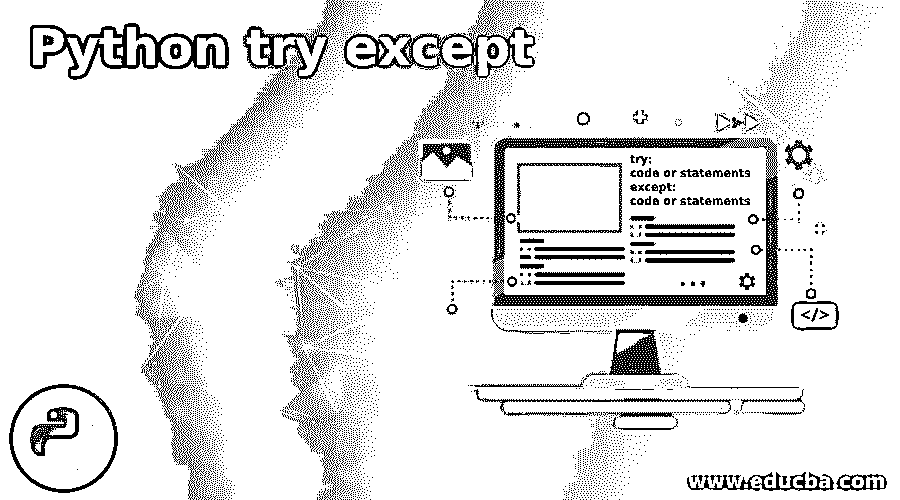
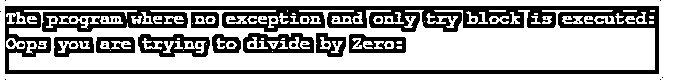
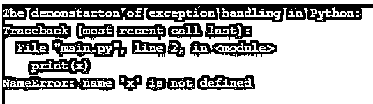

# Python 尝试例外

> 原文：<https://www.educba.com/python-try-except/>




## Python 介绍 try except

一般来说，异常是程序执行时发生的错误。我们可以通过使用 try 和 except 块来处理一些错误。每当出现错误时，程序的执行就会停止并生成异常，这些异常由 try 和 except 块处理，以避免程序崩溃。这些 try 和 except 块与其他编程语言一样，在 Python 编程语言中用于错误处理。因此，生成的异常或错误由 try 块捕获，并在 except 块中处理。

### 在 Python 中使用 try except 块

在 Python 程序中，有一个称为异常处理的概念，用于在错误发生时处理错误。因此，当异常发生时，程序停止运行并生成一些错误消息，这样 try 块就可以捕获这些消息。try 块用于测试代码块以检查错误。except 块用于处理程序执行期间出现的此类错误。

<small>网页开发、编程语言、软件测试&其他</small>

Python 中有两种错误:

*   一个是语法错误，当 Python 解析器无法理解任何一行代码时就会出现这种错误。
*   另一种类型的错误被称为异常，它发生在程序执行期间。

因此，我们将看到如何使用 try 和 except 块来处理这些异常。

让我们看几个使用 try 和 except 块处理的异常错误:

*   **IOError:** 文件无法打开时会出现这种情况。
*   **ValueError:** 当任何内置函数收到错误的参数时，就会出现这种类型的错误。
*   **EOFError:** 当到达文件末尾而没有读取任何数据时，会出现这种错误。
*   **ImportError:** 当我们没有导入所需的模块时，这种类型的错误就会发生，这意味着如果找不到该模块。

**语法:**

```
try:
    code or statements
except:
    code or statements
```

### try except()块如何与示例一起工作？

每当我们首先使用 try()和 except()块时，就会执行 try()块，也就是 try 和 except 子句之间的代码。try()块可以有多个 except 子句。只要没有异常发生，那么只有 try 块将运行，except 子句结束，如果发生异常，那么将跳过 try 子句并执行 except 子句。另一种特殊情况是，当异常发生时，except 子句中的代码无法处理它，然后它被传递给外部 try 语句，尽管如此，异常仍未处理，然后执行停止。

正如上面的陈述一样，下面我们将论证两种情况:

但是，首先，让我们看看什么时候没有异常，然后我们可以只运行 try 块。

#### 示例#1

**代码:**

```
print("The program where no exception and only try block is executed:")
def divide(a, b):
    try:
        r = a // b
        print("The result of the above expression is :", r)
    except ZeroDivisionError:
        print("Oops you are trying to divide by Zero:")
divide(3, 2)
```

**输出:**


在上面的程序中，我们可以看到我们试图将两个数相除。所以代码写在一个 try 块中，如果我们有第二个数把第一个数除以零，那么就会出现错误；因此，该异常由 except 块处理。但在此，当我们用适当的数来调用函数进行除法时，则不会出现错误；因此，只执行 try 块。

现在我们将看到发生异常的另一种情况，我们将看到上面的例子只是为了演示。那么这个错误发生是因为我们试图用零除这个数。所以发生了一个错误，由 except 块处理，所以只执行 except 块。

#### 实施例 2

**代码:**

```
print("The program where no exception and only try block is executed:")
def divide(a, b):
    try:
        r = a // b
        print("The result of the above expression is :", r)
    except ZeroDivisionError:
        print("Oops you are trying to divide by Zero:")
divide(3, 0)
```

**输出:**




现在让我们看一个简单的例子，其中没有定义变量，我们使用 except 子句和 try 语句处理 NameError。

#### 实施例 3

现在让我们看看下面发生错误的例子。

**代码:**

```
print("The demonstarton of exception handling in Python:")
print(x)
```

**输出:**




在上面的程序中，我们可以看到我们试图打印变量“x ”,它没有被定义，因此它抛出了一个名为 NameError 的错误，这个错误由下面的代码处理。

**代码:**

```
print("The demonstarton of exception handling in Python:")
try:
    print(x)
except NameError:
    print("An exception occurred due to variable x is not defined")
```

**输出:**


在上面的程序中，我们可以看到我们试图在 try 块中打印变量“x”，因为我们不知道是否会发生错误，因为我们没有定义变量“x”；因此，使用 except 块来处理这个错误，如果出现这个错误，except 块会将其标识为“NameError ”,然后我们会打印一条消息，说明该变量未定义。因此，我们编写了在 try 块中抛出错误的代码。

#### 实施例 4

现在让我们看看如何用许多 except 块来尝试块示例:

**代码:**

```
print("Program to demonstrate single try and many except block:")
try:
    print(x)
except NameError:
    print("Variable x is not defined")
except:
    print("Something else went wrong")
```

**输出:**


在上面的程序中，我们可以看到 NameError 的发生是因为没有定义一个变量“x”，如果这个错误没有发生，就会显示 except 块的另一条消息。

### 结论

本文的结论是，程序执行期间发生的错误是使用 Python 中的异常处理概念来处理的。在 Python 中，我们上面看到了不同类型的错误，我们还看到了发生了哪些错误或异常，以及它们是什么。我们还看到了如何尝试块工程和例子。我们还看到了一个简单的 NameError 例子，它发生在没有定义任何东西的时候。最后，我们还通过一个例子看到了“一次尝试，多次尝试，除了块”是如何工作的。

### 推荐文章

这是一个 Python 尝试的指南，除了。这里我们分别举例讨论 python 中 try except 块的介绍和工作原理。您也可以看看以下文章，了解更多信息–

1.  [Python pip](https://www.educba.com/python-pip/)
2.  [Python 键盘中断](https://www.educba.com/python-keyboardinterrupt/)
3.  [Python 异步](https://www.educba.com/python-async/)
4.  [Python wait()](https://www.educba.com/python-wait/)


