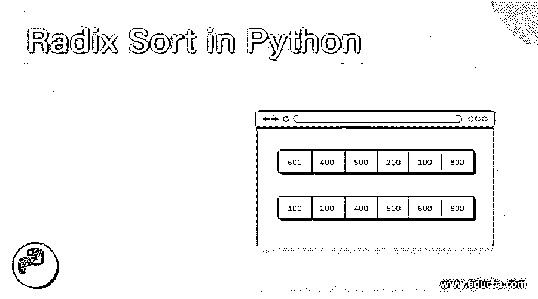
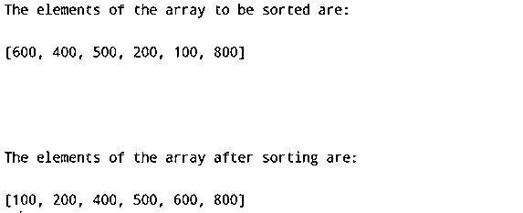
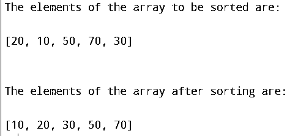

# Python 中的基数排序

> 原文：<https://www.educba.com/radix-sort-in-python/>




## Python 中基数排序的介绍

这种排序技术在 Python 中称为基数排序，在这种技术中，要排序的给定数组的元素根据位置值分组为单个数字，然后按升序或降序排序， 其时间复杂度为 O(nk)其中 n 是要排序的输入数组的大小，k 是要排序的数组中数字的长度，Python 中的基数排序包括一个称为计数排序的中间排序，基数排序用于实现 DC3 算法和涉及大数的地方。

**执行基数排序的功能如下:**

<small>网页开发、编程语言、软件测试&其他</small>

```
def radixSort(array):
maximum_value = max(array)
place_value = 1
while maximum_value // place_value > 0:
countingSort(array, place_value)
place_value *= 10
```

其中该数组是要使用基数排序技术排序的输入数组，

最大值是给定数组中的最大值

place_value 表示数字中各个数字的位置值

countingSort 是执行中间排序的 countingSort 函数。

### 基数排序算法在 Python 中的实现

*   基数排序算法的第一步是使用 python 中的 max()函数找到数组中的最大元素，并确定最大数字的位数。
*   然后考虑最大数的最高有效位值，并使用计数排序算法对数组中每个元素的最高有效位进行排序。
*   然后，使用 countingSort 算法再次对数组中每个元素的下一个有效数字位值进行排序，并且重复该过程，直到其位值中的所有数字都被排序。

### python 中基数排序的例子

下面提到了不同的例子:

#### 示例#1

Python 程序通过实现基数排序算法对给定数组的元素进行排序，然后将排序后的数组元素作为输出显示在屏幕上:

**代码:**

```
#defining countingsort function to sort the given elements based on their significant digits place value
def countingSort(input_array, place_value):
arraysize = len(input_array)
output = [0] * arraysize
count = [0] * 10
#determining the count of the elements in the array
for a in range(0, arraysize):
arrayindex = input_array[a] // place_value
count[arrayindex % 10] += 1
#determining the cumulative count of the elements in the array
for b in range(1, 10):
count[b] += count[b - 1]
#placing the elements of the array in sorted order
a = arraysize - 1
while a >= 0:
arrayindex = input_array[a] // place_value
output[count[arrayindex % 10] - 1] = input_array[a]
count[arrayindex % 10] -= 1
a -= 1
for a in range(0, arraysize):
input_array[a] = output[a]
#defining radix sort function to sort the elements of the array using countingsort function
def radixSort(input_array):
maximum_value = max(input_array)
place_value = 1
while maximum_value // place_value > 0:
countingSort(input_array, place_value)
place_value *= 10
input_data = [600, 400, 500, 200, 100, 800]
print("The elements of the array to be sorted are:\n")
print(input_data)
print("\n")
radixSort(input_data)
print("\n")
print("The elements of the array after sorting are:\n")
print(input_data)
```

上面程序的输出显示在下面的快照中:




在上面的程序中，我们定义了 countingsort 函数，根据给定元素的有效数字位置值对它们进行排序。然后我们确定数组中元素的数量。然后，我们确定数组中元素的累积计数。然后，我们将数组的元素按排序顺序放置。然后，我们定义基数排序函数，使用 countingsort 函数对数组元素进行排序，然后将排序后的数组元素作为输出显示在屏幕上。

#### 实施例 2

Python 程序通过实现基数排序算法对给定数组的元素进行排序，然后将排序后的数组元素作为输出显示在屏幕上:

**代码:**

```
#defining countingsort function to sort the given elements based on their significant digits place value
def countingSort(input_array, place_value):
arraysize = len(input_array)
output = [0] * arraysize
count = [0] * 10
#determining the count of the elements in the array
for a in range(0, arraysize):
arrayindex = input_array[a] // place_value
count[arrayindex % 10] += 1
#determining the cumulative count of the elements in the array
for b in range(1, 10):
count[b] += count[b - 1]
#placing the elements of the array in sorted order
a = arraysize - 1
while a >= 0:
arrayindex = input_array[a] // place_value
output[count[arrayindex % 10] - 1] = input_array[a]
count[arrayindex % 10] -= 1
a -= 1
for a in range(0, arraysize):
input_array[a] = output[a]
#defining radix sort function to sort the elements of the array using countingsort function
def radixSort(input_array):
maximum_value = max(input_array)
place_value = 1
while maximum_value // place_value > 0:
countingSort(input_array, place_value)
place_value *= 10
input_data = [20, 10, 50, 70, 30]
print("The elements of the array to be sorted are:\n")
print(input_data)
print("\n")
radixSort(input_data)
print("\n")
print("The elements of the array after sorting are:\n")
print(input_data)
```

上面程序的输出显示在下面的快照中:




在上面的程序中，我们定义了 countingsort 函数，根据给定元素的有效数字位置值对它们进行排序。然后我们确定数组中元素的数量。然后，我们确定数组中元素的累积计数。然后，我们将数组的元素按排序顺序放置。然后，我们定义基数排序函数，使用 countingsort 函数对数组元素进行排序，然后将排序后的数组元素作为输出显示在屏幕上。

### 推荐文章

这是 python 中基数排序的指南。在这里，我们讨论 Python 中基数排序的概念，并给出相应的编程示例和输出来演示它们。您也可以看看以下文章，了解更多信息–

1.  [Python 测试框架](https://www.educba.com/python-testing-framework/)
2.  [Python 列表扩展](https://www.educba.com/python-list-extend/)
3.  [Python 中的排序字符串](https://www.educba.com/sort-string-in-python/)
4.  [Python 初始化列表](https://www.educba.com/python-initialize-list/)


