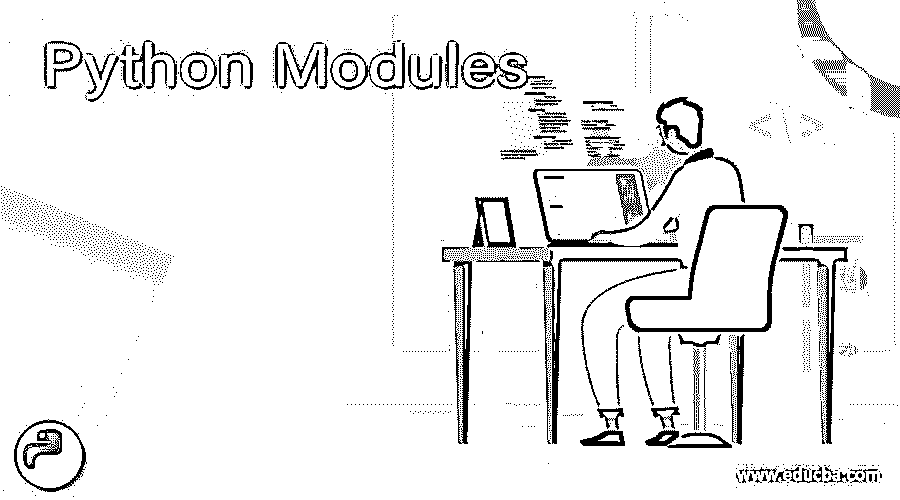
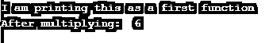
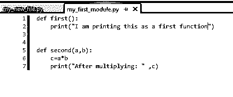
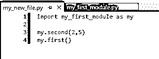
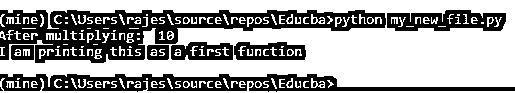
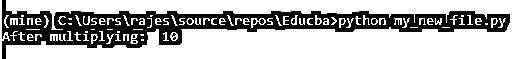
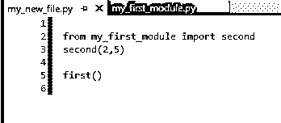
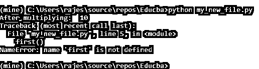
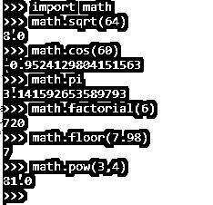
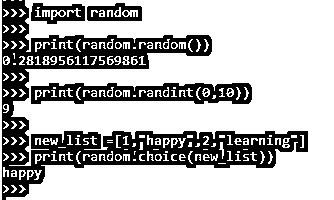

# Python 模块

> 原文：<https://www.educba.com/python-modules/>




## Python 模块简介

模块是对代码进行逻辑组织和特定分组的地方，这使得代码更容易理解。那么，什么内容被组织或分组呢？答案是。任何可运行的代码，包括不同的函数、类和变量。在这里，我们可以在一个模块中定义所有需要的代码，并且我们可以在任何需要的地方导入相同的代码。让我们看看如何定义和使用它们。在这个主题中，我们将学习 Python 模块。

### 不同的 Python 模块

基本上，我们可以有两种不同类型的模块。一个是默认，另一个是；用户定义的。顾名思义，默认模块是 python 中已经内置的模块。

对于用户定义的模块，下面是一些例子以及如何使用它们。

假设我们编写了一个包含两个不同函数的 python 代码，一个用于打印语句，另一个用于将两个不同的数字相乘，比如:

```
def first():
print("I am printing this as a first function")
def second(a,b):
c=a*b;
print("After multiplying: " ,c)
first()
second(2,3)
```

调用这些函数后，我们得到的输出是:




并将该文件保存为 my_first_module.py(不调用函数)




现在，我们创建一个名为 my_new_file.py 的新文件，并导入我们的模块。

```
import my_first_module as my
my.second(2,5)
```

然后去了我的 python 命令提示符，执行了 my _ new _ file.pypython 文件。找到如下输出:


现在，让我们也调用第一个函数并查看输出。在 python 文件中进行所需的更改后，保存它，然后运行它以获得更新的输出。




输出为:




通过这种方式，我们可以创建我们的函数，并将它们导入到任何其他文件中，以便重用它们，并使我们的工作更容易。

如果我不得不重用这些函数中的任何一个，我们可以简单地将这个模块导入到我们的程序中，并使用这些函数中的任何一个。现在，如何在 python 中导入？

我们对此有不同的方法，显然，每种方法都有其优点。我们可以使用，

*   导入模块 _1
*   从模块 1 导入函数 1
*   从模块 1 导入*

我们可以通过第二种导入模块的方式从特定的模块中导入特定的函数。而通过最后一种方法，我们可以完全导入整个模块。如果我们导入整个模块，我们可以用 dir 命令知道该模块下定义的函数列表。

现在，我们可以尝试使用上面第二点中提到的语句导入我们的模块。

```
from my_first_module import second
second(2,5)
```

保存并运行以找到如下输出:




如果我们试着调用第一个函数。我们能得到输出吗？下面我们来看看:




输出将是:




作为一个练习，你能尝试使用第三种形式的导入并检查输出吗？

现在，让我们看看 python 中不同的内置模块。

*   **数学**

这是最常用的模块之一，这些模块处理所有的数学函数和计算。让我们检查一下可以使用这些模块编写的不同函数。

```
Import  math
math.sqrt(64)
math.cos(60)
math.pi
math.factorial(6)
math.floor(7.98)
math.pow(3,4)
```

所有这些的输出可以如下获得:




*   **随机**

Random 是另一个我们可以获取和分配随机值的模块。下面是一些我们可以使用随机函数的例子。

```
import  random
print(random.random())
print(random.randint(0,10))
new_list = [1, “happy” ,2, “learning”]
print(random.choice(new_list)
```

输出为:




这里，在第一个例子中，random 模块中的 random 函数给出了 0 到 1 之间的任意随机浮点数。

第二个示例给出了 0 到 10 之间的任意随机整数。

作为第三个例子，我们创建了一个包含不同条目的列表。因此，使用 choice 函数将从给定的列表中随机选取一个值。

如果我们需要生成一些模糊的数据用于测试或教学目的，则主要使用这个随机函数。

*   熊猫

这也是 python 最常用也是最重要的模块之一。这一般用于数据清理和数据分析平台。主要功能是读取 csv 或任何类型的我们可以通过这个模块对未知数据生成预测。

*   **NumPy**

顾名思义，可以用多维数组进行复杂的数学运算。这里可以使用许多与数组相关的函数，像切片、数组索引和矩阵中的许多基本操作都可以很容易地完成。

*   **轨道**轨道

这是用于机器学习的 NumPy 模块和[的扩展，可以求解线性代数表达式，执行微分和积分等。](https://www.educba.com/what-is-machine-learning/)

*   **Matplotlib**

这个模块可以帮助我们以图表的形式表示分析的数据。我们可以创建条形图、历史图或散点图来直观地显示我们的数据。

我们还要注意到，有些模块像上面提到的熊猫、SciPy 等。，在 python 中默认不存在。我们首先需要安装它们，然后才能导入和使用它们。我们可以根据所使用的 python 版本，使用 pip 或 pip3 命令来安装它们。

不仅如此，我们还有许多其他模块，如 io、itertools、sqllite3、string、symbol、time 等等。

### 结论

Python 现在是一种广泛使用的编程语言，用于数据清理和数据分析过程。模块在这里的用途是，它内置了许多预定义的功能，以减少我们的工作，简化许多操作的评估，并维护数据。我们甚至可以创建自己的模块，并轻松地导入它们。所以，继续玩这些不同的模块，享受学习 python 的乐趣。

### 推荐文章

这是 Python 模块的指南。这里我们讨论一个模块中所有必需代码的定义和两种不同类型的 Python 模块。您也可以看看以下文章，了解更多信息–

1.  [Python 过滤函数](https://www.educba.com/python-filter-function/)
2.  [Python 结束于](https://www.educba.com/python-endswith/)
3.  [Python 异步](https://www.educba.com/python-async/)
4.  [Python 系统退出](https://www.educba.com/python-systemexit/)


