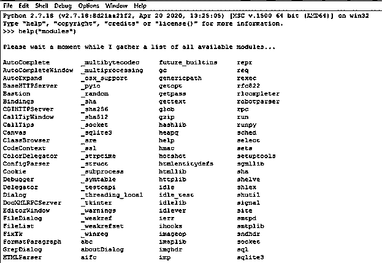
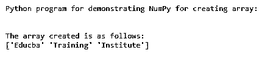
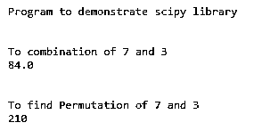
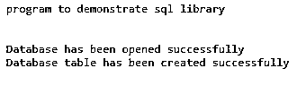

# Python 库列表

> 原文：<https://www.educba.com/python-libraries-list/>


## Python 库列表简介

在 Python 中，库被定义为各种模块的包或集合，其中包括模块中的各种函数或方法，这些模块被导入到程序中以执行某些任务，而无需在程序中编写大量代码片段。程序使用这些库来使代码更小，因为这些库是可重用的代码片段。在 Python 中，包和库之间的差别非常小，因为包包含一组可以使用 Python 中的包管理器安装的模块，而库包含一组 Python 函数。有各种现代解决方案的 Python 库列表。

### Python 库的详细信息

在 Python 中，标准库在许多不同的技术领域都非常重要。在 Python 中，库是一种文件，其中包含 1000 个内置模块或函数，为 Python 程序提供各种功能，这将有助于轻松访问系统。当我们安装 Python 软件时，我们已经有了软件自带的各种库或包，它们存储在一个名为“lib”的文件中。

<small>网页开发、编程语言、软件测试&其他</small>

让我们看看如何在我们的电脑上检查 Python 软件中已安装的库:

首先，我们必须在 Python IDE 中编写以下语句

```
help (“modules”)
```

**输出:**




在上面的截图中，我们可以看到已经可用的 Python 模块或库的列表，这些都是 Python 软件附带的。如果我们需要一些其他的库，那么我们需要使用 pip 命令来安装这些库，或者我们可以直接下载模块或包，并将它们保存在 Python 软件文件夹中，以匹配执行结果时的路径。

### Python 库列表

现在让我们列出几个重要的 Python 库:

Python 中有许多不同的库，对于数据科学、机器学习、深度学习等最新技术非常重要和有用。让我们看看下面的列表:

#### 1.熊猫

这是一个开源 Python 库，主要用于数据科学和机器学习领域。这个库主要提供数据操作和分析工具，这些工具使用其强大的数据结构来操作数值表和时间序列分析。

要将这个库导入到我们的 Python 程序中，我们必须在开始任何程序之前编写以下代码。

```
import pandas as pd
```

从上面的语句中，我们将 pandas 库导入到程序中，只要程序中需要调用 pandas 的属性或方法，我们就可以通过引用“pd”作为 pandas 的别名来访问这个库。

**代码:**

```
import pandas as sn
x = sn.DataFrame()
print("The dataframe without passing any data is as follows:")
print(x)
print("\n")
l = ['Educba', 'Training', 'Institue']
print("The given list is ")
print(l)
print("\n")
x = sn.DataFrame(l)
print("The dataframe after passing the data is as follows:")
print(x)
```

**输出:**


#### 2.Numpy

在 Python 中，NumPy 是另一个用于数学函数的库。NumPy 库是使用一组数学函数进行数组和矩阵处理的常用库。这个库主要用于机器学习计算。我们必须按如下方式导入 NumPy:

```
import NumPy as np
```

让我们看下面一个简单的例子

**代码:**

```
import numpy as yn
print("Python program for demonstrating NumPy for creating array:")
print("\n")
a = yn.array(['Educba', 'Training', 'Institute'])
print("The array created is as follows:")
print(a)
```

**输出:**




#### 3.要求

这是 Python 中的另一个不同的库模块，用于发送 HTTP 请求，并支持添加标题、数据格式和访问响应数据对象等功能，这些对象包括内容数据、编码数据、状态等。我们首先需要导入这个模块，如下所示:

```
import requests
```

让我们看看下面的例子；

**代码:**

```
import requests
print("Program to demonstrate requests library;")
print("\n")
x = requests.get('https://elearningindustry.com/directory/elearning-companies/educba')
print("The given http address is as follows:")
print(x)
print("\n")
print("The content of given http request is as follows:")
print(x.content)
```

**输出:**


#### 4.我的天啊

在 Python 中，scipy 库是主要用于数学和科学计算、技术和工程计算的开源库之一。它主要建立在 NumPy 上。下面让我们举一个简单的例子:

**代码:**

```
from scipy.special import comb, perm
print("Program to demonstrate scipy library")
print("\n")
print("To combination of 7 and 3 ")
c = comb(7, 3, exact = False, repetition=True)
print(c)
print("\n")
print("To find Permutation of 7 and 3")
p = perm(7, 3, exact = True)
print(p)
```

**输出:**




#### 5.Sqllite3

Python 编程语言为数据库操作提供了一个库。这个库主要用于使用 sql 查询的数据库操作。让我们看下面一个例子:

**代码:**

```
import sqlite3
print("program to demonstrate sql library")
print("\n")
conn = sqlite3.connect('test.db')
print("Database has been opened successfully")
conn.execute('''CREATE TABLE school
(ID INT PRIMARY KEY     NOT NULL,
NAME           TEXT    NOT NULL,
AGE            INT     NOT NULL,
ADDRESS        CHAR(50),
SALARY         REAL);''')
print("Database table has been created successfully")
conn.close()
```

**输出:**




在上面的程序中，我们可以看到我们正在导入 sqllite3 库来执行数据库操作，如创建数据库和表。我们可以在屏幕截图中看到，我们收到的输出显示数据库和表都已成功创建。

### 结论

在本文中，我们得出结论，Python 编程语言提供了各种库。在本文中，我们看到了 Python 中几个重要且最受欢迎的库，它们被用于数据科学、机器学习、深度学习、数据挖掘等最新技术中。在 Python 中，有各种免费的开源库。我们还看到了如何检查已安装的库。

### 推荐文章

这是 Python 库列表的指南。在这里，我们讨论在最新技术中使用的 Python 中最重要和最流行的库。您也可以看看以下文章，了解更多信息–

1.  [Python json.dumps](https://www.educba.com/python-json-dumps/)
2.  [Python 缓冲器](https://www.educba.com/python-bufferedreader/)
3.  [Python 解析器](https://www.educba.com/python-parser/)
4.  [Python 时区](https://www.educba.com/python-timezone/)


