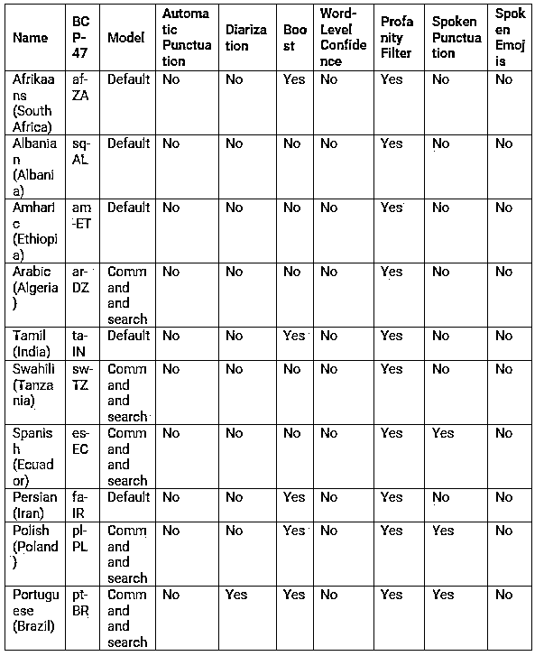

# Python 中的文本到语音转换

> 原文：<https://www.educba.com/text-to-speech-in-python/>


## Python 中的文本到语音转换简介

下面的文章提供了 Python 中文本到语音转换的概要。最受欢迎的交流方式是演讲。即使在这个科技时代，除了我们周围的科技元素，最主要的是语音，它允许不同来源之间的交流。因此，从技术角度来看，有必要将语音元素转换成文本。为了实现从语音元素到文本元素的转换过程，需要考虑的方面是语音识别技术。语音识别技术允许识别语音项目的能力。与语音识别系统相对应的多种方式和技术在市场上是可用的，此外，与语音识别相对应的几种类似真实的应用也是存在的。

**语法:**

<small>网页开发、编程语言、软件测试&其他</small>

`Object_name = SpeechRecogonition.Recognizer()`

上面的代码是要被超越的关键语法位置。它解释了通过语音识别对象的 Recognizer 类创建对象的过程。

### 如何在 Python 中实现文本到语音的转换？

python 中的语音识别方法如下。方法是语音识别转换可能涉及的步骤或技术算法。而且，这些都是语音识别的循序渐进的过程。这些步骤有助于设置语音识别过程。

*   导入相应库的过程是一个非常关键的方面。这里导入了语音识别库。此语音识别导入在设置与语音识别过程相关的相应方法时非常有用。市场上一些著名的语音识别库是 pyspace 库的 speech recognition 库。这些库为在 python 代码中设置语音识别设置了操作的其余部分。
*   接下来是最重要的一步。这一步负责设置 python 对象，以帮助进行识别过程。这个步骤被称为对象级初始化过程。这里使用的类是语音识别过程中的识别器类。因此，该过程是初始化识别器类，以使重新克隆过程发生。我们这里用的语音识别库是 google 语音识别。
*   让我们看看语音识别过程支持的各种文件格式。所以谷歌图书馆支持各种语音输入格式。这些格式如下所述。Wav 格式无损音频格式，AIFF，AIFF-C，标志。这些是支持语音识别过程的主要类型。
*   必须验证音频剪辑，以确定语音中使用的单词类型，从而确认转换是否完全按照需要进行。
*   语音识别软件的默认识别语言是英语。由于英语是默认使用的语言，它也支持各种其他语言的语音识别。下表列出了语音识别软件支持的一些最著名的语言。下表只提到了其中的一些语言，但谷歌搜索识别软件支持其他几种语言。




### Python 中文本到语音转换的示例

下面是提到的例子:

**代码:**

```
#import library
import speech_recognition as Speech_item
# The recogonizer class is initialized at the below code.
recogonizer_class = Speech_item.Recognizer()
#the audio file is mentioned here in the below location

with Speech_item.AudioFile('input.wav') as input_source:
    retrived_audio = recogonizer_class.listen(input_source)

# The method of recogonize will involve an error item when the expected value in the audio file is not found
        # using google speech recognition
        Extracted_text_value = recogonizer_class.recognize_google(retrived_audio)
        print('Audi converion')
        print('Extracted_text_value')
    except:
         print('Exception occured') 
```

**输出:**


**说明:**

*   上面给出的代码中的第一项是声明相应库的过程。这是最重要的一步。在这个问题的情况下，谷歌的语音识别库被宣布。这是最重要也是最关键的一步。接下来，使用识别的方法为该项声明一个对象。在上面给出的例子中，被识别的类是由 recogonizer_class 这个名字声明的。接下来要注意的是音频样本被收集到一个变量中。音频样本是通过侦听识别器类中的方法来收集的。
*   listen 方法有助于将语音项转换为 python 可理解的变量项。在我们的示例中，这些值存储在检索到的音频变量中。因此检索到的音频变量保存了预期的值。然后，这个变量被传递给已识别的 google 类。
*   这是最重要的部分。识别器 google 又是一个语音识别类的方法。可以通过声明的对象项再次从语音识别类中检索它。在这种情况下，对象项是名为 recognizer class 的 recognizer 对象。作为该操作的结果，输出文本值被填充到提取的文本值变量中。现在这个变量保存了输出。现在剩下的最后一个过程是打印提取输出的过程。这是下一步要做的。这是将提取的输出打印到控制台上的最后一个过程。我们可以注意到输出部分截图中的输出。

### 结论

上面给出的文章清楚地解释了在 google 识别系统中执行语音识别的各种方法。还共享了一个合适的示例，其中附有输出快照。

### 推荐文章

这是 Python 中文本到语音的指南。这里我们讨论一下入门，如何在 Python 中实现文本到语音的转换？还有一个例子。您也可以看看以下文章，了解更多信息–

1.  [执行 Python](https://www.educba.com/exec-python/)
2.  [Python 对象序列化](https://www.educba.com/python-object-serialization/)
3.  [背包问题 Python](https://www.educba.com/knapsack-problem-python/)
4.  [Python 中的字符串数组](https://www.educba.com/string-array-in-python/)


