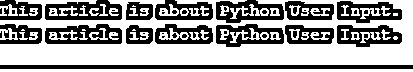
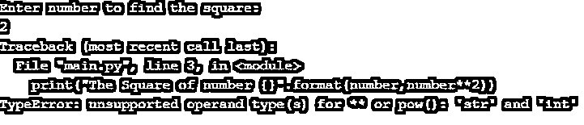
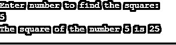
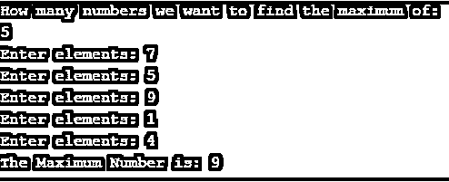
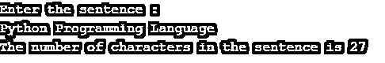

# Python 用户输入

> 原文：<https://www.educba.com/python-user-input/>


## Python 用户输入简介

在编程的时候，我们经常需要接受用户的输入，以便操作数据并在之后进行处理。这确保了程序的动态性和健壮性，因为它不是硬编码的，可以在用户给定的任何随机值下成功执行。在本主题中，我们将学习 Python 用户输入。

在今天的文章中，我们将了解在 Python 编程语言的程序运行时接受用户输入并处理数据的概念。这确保了程序和外部世界之间的适当通信。

<small>网页开发、编程语言、软件测试&其他</small>

### 输入数据的方法

以下是用户输入数据的方式:–

*   输入()
*   原始输入()

两者基本上完成相同的任务，唯一的区别是支持这两个函数的 Python 版本。

raw_input 在 Python 的旧版本中使用，在最近的 Python 版本中被 input()取代。

在本文中，我们将讨论在 Python 的最新版本中使用的 input()。

### Python 输入的工作原理()

当我们在程序中使用 input()函数时，执行流程会暂停，直到用户输入数据并单击 Enter 按钮。之后，用户输入的值以字符串的形式存储在某个变量中。无论用户希望他们的数据是什么数据类型，都只能以字符串的形式存储。它需要在使用前显式地转换成所需的格式。稍后我们将看到这样一个例子，如果我们不对数据进行类型转换，就会导致错误。

现在让我们看看 input()的语法

**语法**

```
input([<prompt from user>])
```

现在让我们看一些例子，并讨论如何使用 input()在不同的场景中接受来自用户的数据。

### Python 用户输入的示例

下面举几个例子:

#### 示例#1

从键盘输入普通文本

**代码:**

```
string1 = input()
print(string1)
```

**输出**




**解释**

在第一行中，我们使用 input()函数从用户处获取输入，并将其存储在名为 string1 的变量中。按下 Enter 按钮后，会出现一个空白输入框，光标闪烁，提示我们输入内容。当我们提供输入并按下 Enter 按钮时，该值被存储在名为 string1 的变量中。在下一行中，当我们打印变量时，我们实际上看到我们提供的输入实际上是在控制台中打印的。

#### 实施例 2

从控制台输入数字并找到它的平方

**代码:**

```
print("Enter number to find the square:")
number = input()
print("The Square of number {}".format(number,number**2))
```

**输出**




**解释**

这里我们遇到了一个 TypeError，如果我们阅读 errorMessage，它会提示我们第一个参数，即数字变量字符串数据类型。正因为如此，它无法对其执行电源操作。这里需要注意的一点是，输入数据类型总是被当作字符串，所以在处理它之前，必须将其类型转换为所需的数据类型。

让我们更正代码，看看输出。

**代码**

```
print("Enter number to find the square:")
number = input()
number = int(number)
print("The square of the number {} is {}".format(number,number**2))
```

**输出**




#### 实施例 3

输入多个数字并从中找出最大值

**代码:**

```
import numpy as np
print("How many numbers we want to find the maximum of:")
n=int(input())
numbers = [] 
for i in range(0, n):
    ele = int(input("Enter elements: "))
numbers.append(ele)
print("The Maximum Number is:", max(numbers))
```

**输出**




#### 实施例 4

输入句子并计算其中的字符数

**代码:**

```
print("Enter the sentence :")
sentence = input()
length = len(sentence)
print("The number of characters in the sentence is {}".format(length))
```

**输出**




### 结论

最后，是时候结束这篇文章了。在今天的文章中，我们学习了 Python 的 input()函数。我们看了语法，讨论了不同的例子和用例。因此，下次编写 Python 程序时，一定要记住使用 input()的概念，并在许多随机的用户输入数据上测试您的程序。

### 推荐文章

这是 Python 用户输入的指南。在这里，我们将讨论 Python 用户输入的方法、工作原理和示例，以及相应的语法。您也可以看看以下文章，了解更多信息–

1.  [巨蟒屈服](https://www.educba.com/python-yield/)
2.  [Python 开关案例](https://www.educba.com/python-switch-case/)
3.  [Python 切片字符串](https://www.educba.com/python-slice-string/)
4.  [Python 常量](https://www.educba.com/python-constants/)


