# Python 中的 NumPy 是什么？

> 原文：<https://www.educba.com/what-is-numpy-in-python/>

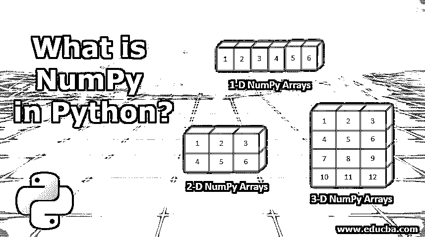


## Python 中的 NumPy 简介

NumPy 或 Numerical Python 是一个用于科学计算的通用数组处理 Python 包。它包含许多强大的功能，包括:

*   一个健壮的多维数组对象，具有许多有用的功能。
*   许多工具用于集成其他[编程语言](https://www.educba.com/best-programming-languages/)以及大量的例程，包括形状操作、逻辑、数学&以及更多用于操作 [NumPy 数组对象](https://www.educba.com/numpy-ndarray/)的工具。
*   除了其明显的科学用途，NumPy 还被用作通用的多维数据容器。
*   大量的数据库也可以与 NumPy 集成。

### Python 中的 NumPy 是什么？

NumPy 是 Anaconda 最新版本的一个传统包(从 https://www.anaconda.com/distribution/#download-section,下载，用于 Windows、Mac 和 Linux)

<small>网页开发、编程语言、软件测试&其他</small>

如果它不可用，您可以在 Anaconda Power shell 提示符下使用下面的命令下载并安装它。

```
python -m pip install numpy
```

运行上述命令后，您应该看到命令行输出为“成功安装”

NumPy 是 [Python 中使用最广泛的包之一，它允许您](https://www.educba.com/what-is-python/)利用数据集中现有的列创建许多派生列。

**例如**:如果你想计算月销售额相对于全年平均销售额的偏差。

### Python 中 NumPy 的例子

让我们讨论更多的例子，以及如何使用 NumPy 实现同样的效果:

第一步是在代码中导入包:

*   将 NumPy 作为 np 导入

点击“Shift + Enter”导入指定的包

NumPy 别名为“np ”,可用于指代 NumPy 以进行任何进一步的引用

#### 示例# 1–创建 NumPy 数组

让我们创建一个一维数组，名称为“a ”,值为 1，2，3

```
a = np.array ( [1,2,3] )
```

这将利用 NumPy 模块的“array”属性(我们在这里将其别名为“np ”)

使用“打印”属性打印变量/对象的值。

```
print(a)
```

输出将一维数组“a”打印为:

**【1 2 3】**

使用“type”属性验证显式创建的任何变量/对象的类型。

```
type(a)
```

输出将一维数组“a”的对象类型打印为:

##### NumPy.ndarray

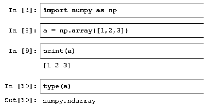


类似地，可以使用以下命令启动二维和三维阵列:

##### 二维数字阵列

```
b = np.array([(1.5,2,3), (4,5,6)], dtype = float)
```

这里“dtype”明确地将二维数组的数据类型指定为“float”

打印(b)和打印(b)的输出如下:

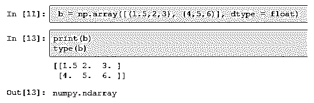


##### 三维数字阵列

```
c = np.array([[(1.5,2,3), (4,5,6)], [(3,2,1), (4,5,6)]], dtype = float)
```

这里“dtype”明确地将二维数组的数据类型指定为“float”

print(c)和 type(c)的输出如下:

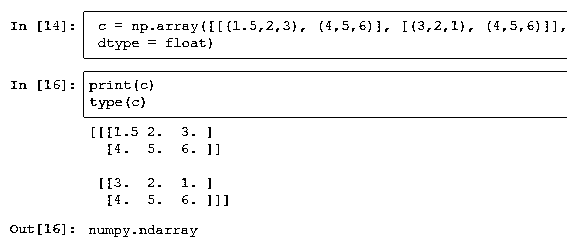


#### 示例 2–NumPy 数组上的算术运算

下面我们来初始化一维数组:

```
x = np.array ( [5,6,7] )
y = np.array ( [2,3,8] )
```

##### 减法

NumPy 数组减法运算遵循下面提到的常用数学语法。如果我们想从数组“x”中减去数组“y ”,那么就写成:

```
Result = x - y
```

使用 print(Result)打印结果数组“Result”

上述方法的一个替代方法是利用 NumPy 模块的“subtract”属性&将结果数组存储在“Result”中，如下所示:

```
Result = np.subtract(x,y)
```

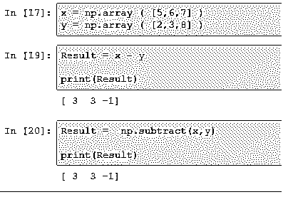


##### 添加

NumPy 数组加法运算也遵循与前面讨论减法时类似的数学语法。如果我们想把数组“y”加到“x”上，那么它就写成:

```
Result = x + y
```

使用 print(Result)打印结果数组“Result”

上述方法的一个替代方法是利用 NumPy 模块的“add”属性&将结果数组存储在“Result”中，如下所示:

```
Result = np.add(x,y)
```


##### 分开

如果我们想把数组“x”和“y”相加，那么就写成:

```
Result = x + y
```

使用 print(Result)打印结果数组“Result”

上述方法的一个替代方法是利用 NumPy 模块的“divide”属性&将结果数组存储在“Result”中，如下所示:

```
Result = np.divide(x,y)
```

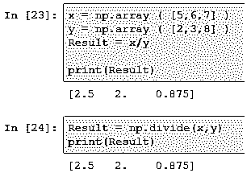


##### 增加

如果我们要将数组“x”与“y”相乘，那么就写成:

```
Result = x * y
```

使用 print(Result)打印结果数组“Result”

上述方法的一个替代方法是利用 NumPy 模块的“divide”属性&将结果数组存储在“Result”中，如下所示:

```
Result = np.multiply(x,y)
```

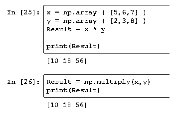


##### 指数运算

```
exp(x)
```

**平方根**

```
sqrt(x)
```

**正弦&余弦**

```
sin(x)
```

```
cos(b)
```

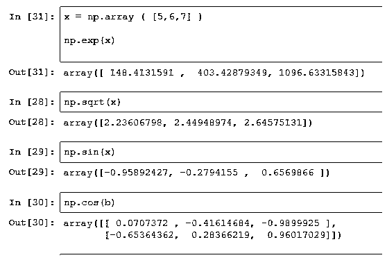


#### 示例# 3–转换 NumPy 数组

子集化、切片、布尔索引等操作可以[应用于 NumPy 数组](https://www.educba.com/numpy-arrays/)。

##### sb 设置

使用索引从数组中取出单个元素。NumPy 数组中的索引从 0 开始。

```
a = np.array( [4,6,9] )
```

因此，如果我们想获取数组“a”的第一个元素，那么它将被写成

```
a[0]
```

这将返回第一个值，即 4。

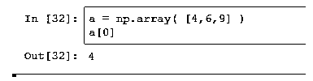


让我们初始化一个二维数组。

```
a = np.array([(1,2,3), (4,5,6)], dtype = int)
```

如果我们想从二维数组的第一行获取第二个值，那么它将被写成:

```
a[0][1]
```

这将返回值 2。

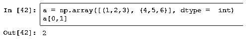


##### 限幅

NumPy 数组可以用多种方式分割。其中一些提到如下:

```
a = np.array( [4,6,9] )
```

如果我们想获取一个数组的前两个元素，那么它可以写成:

```
a[0:2]
```

这里的问题是 a[x:y]

*   x 表示需要从中获取元素的索引。
*   而 y 表示“该数组中要提取的元素的数量”

所以 a[0:2]的结果将是[4，6]

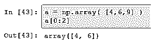


##### 布尔索引

它使我们能够基于逻辑条件索引一个 [NumPy 数组](https://www.educba.com/numpy-ndarray/)。例如，返回数组中所有小于 2 的值。

```
a = np.array( [4,1,9] )
```

相同的将被实现为:

```
a[a<2]
```

该逻辑索引的输出将是数组“a”中小于 2 的任何值

所以结果会是[1]

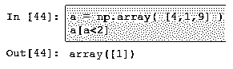


### 结论

NumPy 是 python 中一个非常强大的库，广泛用于数据解释性分析(为了更好地理解数据)、数据操作和清理。创建 KPI 指标等等。

### 推荐文章

这是 Python 中 NumPy 的指南。这里我们讨论什么是 Python 中的 NumPy，以及使用 Numpy 实现偏差的例子。您也可以看看以下文章，了解更多信息–

1.  [数字直方图](https://www.educba.com/numpy-histogram/)
2.  [NumPy 数据类型](https://www.educba.com/numpy-data-types/)
3.  [Python 中的堆栈](https://www.educba.com/stack-in-python/)
4.  [NumPy 数组函数](https://www.educba.com/numpy-array-functions/)


